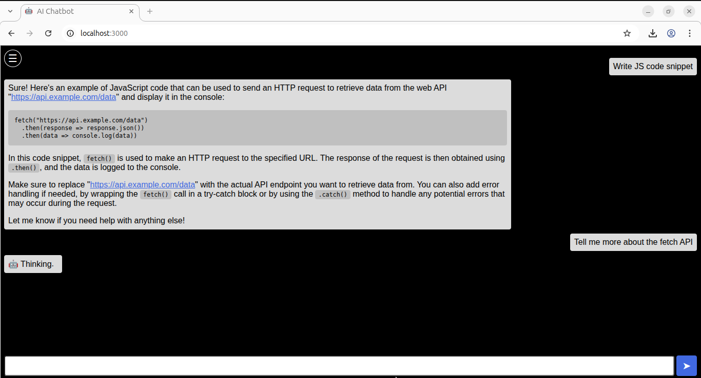

# AI Chatbot Course



**Build a full-stack AI chatbot from absolute beginner to production-ready application.**

## Overview

10-week course from zero to complete AI chatbot with conversation history, database storage, and local LLM.

**Timeline**: 10 weeks, ~5-10 hours per week
**Level**: Beginner-friendly (no prerequisites)

## Technologies

- **Frontend**: HTML, CSS, JavaScript
- **Backend**: Node.js, SQLite
- **AI**: Ollama (local LLM), Qwen2.5
- **Tools**: VS Code, Git/GitHub, Terminal, DBeaver

## Learning Path

```
Weeks 1-2: HTML Structure & Setup
Weeks 3-4: CSS Styling
Week 5:    JavaScript Basics
Weeks 6-7: Node.js + Database
Week 8:    AI Integration
Weeks 9-10: Polish + Production
```

## Lessons

Each lesson is in its own directory with detailed instructions:

1. [Installing Tools & Web Fundamentals](./lesson-01/)
2. [Introduction to HTML](./lesson-02/)
3. [Introduction to CSS](./lesson-03/)
4. [JavaScript Fundamentals](./lesson-04/)
5. [Advanced JavaScript & APIs](./lesson-05/)
6. [Node.js & Server Development](./lesson-06/)
7. [Database Integration (SQLite)](./lesson-07/)
8. [AI Integration (Ollama)](./lesson-08/)
9. [Enhanced Features & UX](./lesson-09/)
10. [Local Deployment & Portfolio](./lesson-10/)

## Resources

- **[Technical Dictionary](./DICTIONARY.md)** - English/Japanese glossary of all technical terms (150+ terms with hiragana pronunciation)

## Getting Started

1. Join Discord: [https://discord.gg/YrtdssGUJa](https://discord.gg/YrtdssGUJa)
2. Start with [Lesson 01](./lesson-01/)

---

*For general information about Izumo.io, see the [main README](../README.md)*
