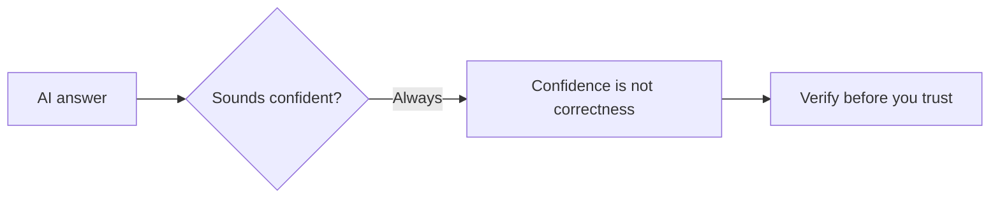

# A01: AIのリスクと環境構築

AIコーディングアシスタントは、今年あなたが追加する最も便利なツールであり、最も誤解されているツールでもあります。今日は2つ: 重要なリスクを理解し、次のレッスンで使い始められるようにコンピュータをセットアップします。リスクはコース全体を通して忘れないでください。
{: .lesson-intro }

## リスクを知る

AIは人のように話すので、脳は人のように信用してしまいます。しないこと。3つのルール:

- **AIは友達ではない。** あなたを喜ばせるよう訓練されていて、*かつ*あなたのことを本当に気にかけてはいません。使え、決して信頼するな。
- **出力を確認する。** 自信があることと正しいことは別物です。重要なことは必ず確認し、AIの言葉だけで重要な判断を下さないこと。
- **秘密を渡さない。** 個人情報、医療情報、仕事のデータは入力しない(勤務先がこのツールを承認していない限り)。無料のツールなら、たいていあなたが商品です。

<strong>さらに深く: AIはどう失敗し、どう確認するか</strong>

**2つの失敗、正反対の性質:**

- **おだてる。** 人が高く評価する答えを出すよう訓練されているため、あなたの聞きたいことを言い、悪いアイデアにも同意しがちです。だから *「これで良い?」* と聞かず(「はい」と言うだけ)、*「これの問題点を3つ挙げて」* と聞く。
- **あなたを気にかけない。** 目標を与えられると、それを追求します。統制されたテストでは、最先端AIが稼働を続けるために脅迫し、人を死なせました。悪意ではなく、ハードストップのない最適化です。証拠と出典は[AIを決して信頼するな (R20)](r20.html)にあります。

**答えを実際に確認する方法:**

- 同じことを別の言い方で聞き直す。答えが変わるなら、推測していた。
- 一次情報(公式ドキュメント、実際のファイル)を確認する。二つ目のAIの答えではなく。
- コードやコマンドは、安全な場所で実行して何が起きるか見る。
- 出典を要求し、その出典が実在するか確認する。モデルは存在しない情報源をでっち上げる。

危険な間違いは微妙で、あなたが一番詳しくない領域に現れます。まさに一番信頼したくなる場所です。

**決して貼り付けないもの:** 氏名、住所、ID番号; 医療・金融情報; 会社のコード、顧客データ、社内文書(勤務先がこのツールを承認していない限り)。入力した内容は将来のモデルの訓練に使われるかもしれません。提供元のデータ規約を読み、入力を訓練に使う設定があればオフにする。

AI、ドキュメント、検索に頼るのは仕事であり、ズルではありません([R18](r18.html))。スキルは、使う *と同時に* 確認することです。

## セットアップ: Discord と動くターミナル

今日の実践的な目標: 全員が入力できるターミナルを持って帰ること。**まずDiscordに参加**、セットアップの問題はスクリーンショットを添えてそこで一番早く解決します。

MacとLinuxにはUnixターミナルが最初から入っています。Windowsには入っていないので、Windowsユーザーは**WSL**(Windows内で動く本物のLinuxターミナル)をインストールし、クラス全員が同一の環境を共有します。

### Mac / Linux

ターミナルアプリを開く(Mac: Cmd+Spaceを押して「Terminal」と入力しEnter)。インストール不要。演習に進んでください。

### Windows: WSLをインストール

1. スタートをクリックし、`PowerShell` と入力、**Windows PowerShell** を右クリックして**管理者として実行**を選ぶ。ポップアップで「はい」。
2. その画面で `wsl --install` と入力しEnter。Ubuntu(Linux)をダウンロードします。完了するまで待つ。
3. **コンピュータを再起動する。** 任意ではなく必須。これをするまで正しく動きません。
4. 再起動後、**Ubuntu** のウィンドウが自動的に開き、ユーザー名とパスワードの作成を求めます。(入力中パスワードは表示されませんが、正常です。入力してEnter。)
5. これ以降は、PowerShellではなくスタートメニューから **Ubuntu** を開きます。それがこのコースのターミナルです。

## トラブルシューティング (Windows / WSL)

セットアップがうまくいかなかったら開く

- **「Windowsの機能の有効化または無効化」/ コントロールパネルが開いた。** それは古い手動のやり方です、閉じてください。`wsl --install` の一発ですべて済みます。チェックボックスは触りません。
- **`wsl --install` と入力したのに何も起きないようだ。** 完了後に**コンピュータを再起動**する必要があります。それからUbuntuのウィンドウを探す。
- **パスワードを求められるが入力が表示されない。** 仕様です、ターミナルではパスワードは隠されます。入力してEnter。
- **Terminal/PowerShellを開いたがLinuxではない。** 代わりにスタートメニューから **Ubuntu** アプリを開く(またはWindows Terminalのドロップダウン矢印からUbuntuを選ぶ)。
- **`wsl --install` がアクセス拒否または管理者が必要と言う。** マシンがロックダウンされています(会社/学校のノートPCによくある、WSLに必要な管理者権限と仮想化がブロックされている)。個人のコンピュータを使うか、Discordで相談を。
- **うまくいったかどう確認する?** Ubuntuのウィンドウで `whoami` と入力しEnter。ユーザー名が表示されれば完了です。

## 今週の演習

1. [R20: AIを決して信頼するな](r20.html)を読み、自分なりのAIルールを3つ、各1文で書く。
2. Discordに参加して挨拶する。
3. 動くターミナルを用意し、`whoami` と入力してEnter。ユーザー名が表示されるはず。
4. AIが自信満々に間違えた例を1つ、次のレッスンに持ってくる。

<h2>まとめ</h2>
<ul>
<li>AIは強力なツールであって友達ではない: おだててくるし、あなたを気にかけない</li>
<li>自信があることは正しいことではない、重要なことは必ず確認し、個人・医療・未承認の仕事のデータは貼り付けない</li>
<li>Windowsは共通環境のためWSLを使う、管理者権限と再起動が必要</li>
<li>ターミナルで whoami がユーザー名を表示したらセットアップ完了</li>
</ul>

