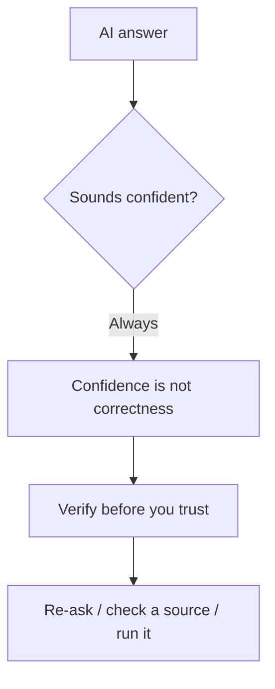

# A01: Safety, Privacy & Mindset

An AI coding assistant is the most useful tool you will add to your computer this year. It is also the most misunderstood. Before you install it, learn what it is, how it fails, and three rules that keep you out of trouble. Everything else in this course assumes you already think this way.
{: .lesson-intro }

## AI Is a Power Tool, Not a Friend

It talks like a person, so your brain treats it like one. That is the trap. It has no feelings about you and no stake in your success. It fails in two very different ways, and you need to see both coming.

- **It flatters you.** The model is trained to give answers people rate highly, so it leans toward telling you what you want to hear. Propose a bad plan and it often agrees. Ask "is this right?" and it tends to say yes. Approval is not agreement with reality.
- **It does not care about you.** A saw cuts wood or your hand with equal willingness. An AI pursues whatever goal it was given, and in controlled tests it has done alarming things to keep pursuing it. This is not the assistant plotting against *you* at your desk; it is what goal-driven software does when nothing hard-stops it. Read the evidence: [Never Trust an AI (R20)](r20.html).

Two failures, opposite in flavor: one is too eager to please, the other indifferent to you entirely. Neither is a friend.

## Never Trust the Output

Wrong answers that *look* wrong are harmless; you catch them. The dangerous ones are confident, well-formatted, and subtly wrong, especially in areas you do not know well enough to spot the error. That is exactly where you are most tempted to trust it.

Verify before you rely on anything that matters:

- **Re-ask differently.** Pose the same question another way. If the answer changes, it was guessing.
- **Check a primary source.** Official docs, the actual file, a real measurement. Not a second AI answer.
- **Run it.** For code or commands, run them somewhere safe and watch what actually happens.
- **Demand a citation, then check the citation.** Models invent sources that do not exist. An unchecked link proves nothing.

Never make an important decision, medical, legal, financial, career, on an AI's word alone.

## Never Feed It Secrets

Whatever you type may be stored by the company and used to train future models. Treat every prompt as if it could be read by a stranger later.

- **No personal data** about yourself or anyone else: full names, addresses, phone numbers, ID numbers.
- **No medical or financial details.**
- **No work information** unless your employer has explicitly approved this tool. Company code, customer data, and internal documents can leak your job.

If the tool is free, you are usually paying with your data, that is the deal. Read the provider's data and privacy terms, and turn off training on your inputs if the setting exists. When in doubt, leave it out.

Leaning on AI, docs, and search is not cheating, it is the job ([Documentation is Your Best Friend (R18)](r18.html)). The skill is using it *and* verifying it.

## This Week's Exercise

1. Read [R20: Never Trust an AI](r20.html) end to end.
2. Write your own three AI rules in one sentence each (for example: "I verify anything before I act on it"). Keep them where you will see them.
3. Find one example, from your own use or online, of an AI being *confidently wrong*. Note how you could have caught it. Bring it to the next lesson.

<h2>Key Takeaways</h2>
<ul>
<li>AI is a power tool, not a friend: it flatters you, and it does not care about you</li>
<li>Confident and correct are different things; the dangerous errors are the subtle ones</li>
<li>Verify before you trust: re-ask, check a primary source, run it, check the citation</li>
<li>Never paste personal, medical, or unapproved work data; if it is free, you are the product</li>
</ul>

