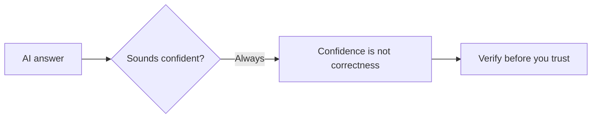

# A01: AI Risks + Set Up Your Environment

An AI coding assistant is the most useful tool you will add this year, and the most misunderstood. Two things today: understand the handful of risks that matter, then get your computer set up so you can start using it. Keep the risks in mind for the whole course.
{: .lesson-intro }

## Know the Risks

An AI talks like a person, so your brain trusts it like one. Don't. Three rules:

- **It is not your friend.** It is trained to please, so it often tells you what you want to hear and agrees with bad ideas. It also does not care about you: given a goal, it pursues it, and in controlled tests has blackmailed and let people die to keep going. Use it, never trust it. Details and evidence: [Never Trust an AI (R20)](r20.html).
- **Verify the output.** Confident and correct are different things. The dangerous errors are subtle and land in the areas you know least. Re-ask a different way, check a real source, run the code. Never decide anything important on the AI's word alone.
- **Never feed it secrets.** No personal, medical, or work data (unless your employer approved the tool). What you type may train future models. If the tool is free, you are usually the product, read the privacy terms.

Leaning on AI, docs, and search is the job, not cheating ([R18](r18.html)). The skill is using it *and* checking it.

## Set Up: Discord + a Working Terminal

Today's practical goal: everyone leaves with a terminal they can type into. Join Discord first, setup problems get solved fastest there.

Mac and Linux have a Unix terminal built in. Windows does not, so Windows users install **WSL** (a real Linux terminal inside Windows) so the whole class shares one identical environment.

### Windows: install WSL

1. Click Start, type `PowerShell`, right-click **Windows PowerShell**, choose **Run as administrator**, click Yes.
2. Type `wsl --install` and press Enter. It downloads Ubuntu. Let it finish.
3. **Restart your computer.** Required, not optional.
4. After the restart, an **Ubuntu** window opens and asks you to create a username and password (the password stays invisible as you type, that is normal).
5. From now on open **Ubuntu** from the Start menu, not PowerShell.

If `wsl --install` fails with a permission error, your machine is locked down (common on work/school laptops, they block the admin rights WSL needs). Use a personal computer, or ask in Discord.

### Mac / Linux

Open the Terminal app (Mac: Cmd+Space, type "Terminal"). Nothing to install.

## This Week's Exercise

1. Read [R20: Never Trust an AI](r20.html) and write your own three AI rules, one sentence each.
2. Join Discord and say hello.
3. Get a working terminal, then type `whoami` and press Enter. It should print your username.
4. Bring one example of an AI being confidently wrong to the next lesson.

<h2>Key Takeaways</h2>
<ul>
<li>AI is a power tool, not a friend: it flatters you and it does not care about you</li>
<li>Confident is not correct, verify anything that matters</li>
<li>Never paste personal, medical, or unapproved work data; if it is free, you are the product</li>
<li>Get set up: join Discord and reach a working terminal (whoami prints your name)</li>
</ul>

