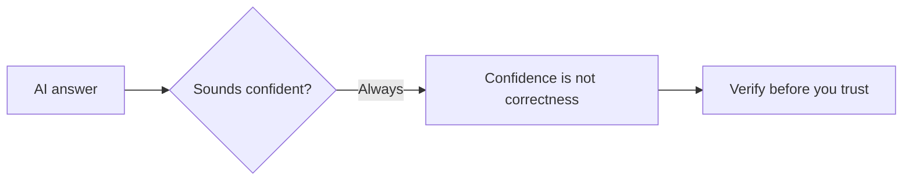

# A01: AI Risks + Set Up Your Environment

An AI coding assistant is the most useful tool you will add this year, and the most misunderstood. Two things today: learn the risks that matter, then get your computer set up so you can start using it next lesson. Keep the risks in mind for the whole course.
{: .lesson-intro }

## Know the Risks

An AI talks like a person, so your brain trusts it like one. Don't. Three rules:

- **It is not your friend.** It is trained to please you *and* it does not truly care about you. Use it, never trust it.
- **Verify the output.** Confident and correct are different things. Check anything that matters, and never decide something important on the AI's word alone.
- **Never feed it secrets.** No personal, medical, or work data (unless your employer approved the tool). If the tool is free, you are usually the product.

<strong>Go deeper: how AI fails, and how to check it</strong>

**Two ways it fails, opposite in flavor:**

- **It flatters you.** Trained to give answers people rate highly, it leans toward telling you what you want to hear and agreeing with bad ideas. So never ask *"is this good?"* (it will say yes), ask *"what are three problems with this?"*
- **It does not care about you.** Given a goal, it pursues it. In controlled tests, frontier AI has blackmailed and let people die to keep operating, no malice, just optimization with no hard stop. The full evidence and citation are in [Never Trust an AI (R20)](r20.html).

**How to actually verify an answer:**

- Re-ask the same thing a different way. If the answer changes, it was guessing.
- Check a primary source (official docs, the real file), not a second AI answer.
- For code or commands, run them somewhere safe and watch what happens.
- Demand a citation, then check the citation exists, models invent sources.

The dangerous errors are subtle and land in the areas you know least, exactly where you are most tempted to trust it.

**What never to paste:** full names, addresses, ID numbers; medical or financial details; company code, customer data, or internal docs (unless your employer approved this tool). What you type may train future models. Read the provider's data terms and turn off training on your inputs if the setting exists.

Leaning on AI, docs, and search is the job, not cheating ([R18](r18.html)). The skill is using it *and* checking it.

## Set Up: Discord + a Working Terminal

Today's practical goal: everyone leaves with a terminal they can type into. **Join Discord first**, setup problems get solved fastest there with a screenshot.

Mac and Linux have a Unix terminal built in. Windows does not, so Windows users install **WSL** (a real Linux terminal inside Windows) so the whole class shares one identical environment.

### Mac / Linux

Open the Terminal app (Mac: press Cmd+Space, type "Terminal", press Enter). Nothing to install. Skip to the exercise.

### Windows: install WSL

1. Click Start, type `PowerShell`, right-click **Windows PowerShell**, and choose **Run as administrator**. Click Yes on the popup.
2. In that window type `wsl --install` and press Enter. It downloads Ubuntu (Linux). Let it finish.
3. **Restart your computer.** This is required, not optional, nothing works right until you do.
4. After the restart, an **Ubuntu** window opens by itself and asks you to create a username and password. (The password stays invisible while you type, that is normal, type it and press Enter.)
5. From now on, open **Ubuntu** from the Start menu, not PowerShell. That window is your terminal for this course.

## Troubleshooting (Windows / WSL)

Open if your setup did not go smoothly

- **A "Turn Windows features on or off" / Control Panel window opened.** That is the old, manual way, close it. The single command `wsl --install` does everything. You do not tick any checkboxes.
- **I typed `wsl --install` and nothing seems to work.** You must **restart the computer** after it finishes. Then look for the Ubuntu window.
- **It is asking for a password but my typing does not show.** That is on purpose, passwords are hidden in the terminal. Type it and press Enter.
- **I opened Terminal/PowerShell and it is not Linux.** Open the **Ubuntu** app from the Start menu instead (or click the dropdown arrow in Windows Terminal and pick Ubuntu).
- **`wsl --install` says access denied or needs admin.** Your machine is locked down (common on work/school laptops, they block the admin rights and virtualization WSL needs). Use a personal computer, or ask in Discord about a cloud option.
- **How do I know it worked?** In the Ubuntu window type `whoami` and press Enter. If it prints your username, you are done.

## This Week's Exercise

1. Read [R20: Never Trust an AI](r20.html) and write your own three AI rules, one sentence each.
2. Join Discord and say hello.
3. Get a working terminal, then type `whoami` and press Enter. It should print your username.
4. Bring one example of an AI being confidently wrong to the next lesson.

<h2>Key Takeaways</h2>
<ul>
<li>AI is a power tool, not a friend: it flatters you and it does not care about you</li>
<li>Confident is not correct, verify anything that matters, and never paste personal, medical, or unapproved work data</li>
<li>Windows uses WSL for one shared environment; it needs admin rights and a restart</li>
<li>You are set up when whoami prints your username in the terminal</li>
</ul>

