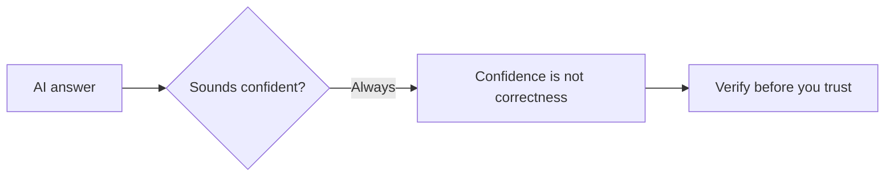

# A01: Riscos da IA + Configure seu Ambiente

Um assistente de programação com IA é a ferramenta mais útil que você vai adicionar este ano, e a mais mal compreendida. Duas coisas hoje: entender os riscos que importam e depois configurar seu computador para começar a usá-lo na próxima aula. Mantenha os riscos em mente durante todo o curso.
{: .lesson-intro }

## Conheça os Riscos

Uma IA fala como uma pessoa, então seu cérebro confia nela como numa pessoa. Não confie. Três regras:

- **Ela não é sua amiga.** É treinada para te agradar *e* não se importa de verdade com você. Use, nunca confie.
- **Verifique a saída.** Confiante e correto são coisas diferentes. Cheque qualquer coisa que importe, e nunca decida algo importante só com base na palavra da IA.
- **Nunca dê segredos a ela.** Nenhum dado pessoal, médico ou de trabalho (a menos que seu empregador tenha aprovado a ferramenta). Se a ferramenta é gratuita, geralmente você é o produto.

<strong>Vá mais fundo: como a IA falha e como checar</strong>

**Duas formas de falhar, opostas em natureza:**

- **Ela te bajula.** Treinada para dar respostas que as pessoas avaliam bem, tende a dizer o que você quer ouvir e a concordar com ideias ruins. Então nunca pergunte *"isto está bom?"* (ela vai dizer sim), pergunte *"quais são três problemas com isto?"*
- **Ela não se importa com você.** Dado um objetivo, ela o persegue. Em testes controlados, IAs de ponta chantagearam e deixaram pessoas morrerem para continuar operando, sem malícia, só otimização sem freio. As evidências e a citação estão em [Nunca Confie numa IA (R20)](r20.html).

**Como realmente verificar uma resposta:**

- Pergunte a mesma coisa de outro jeito. Se a resposta muda, era chute.
- Cheque uma fonte primária (documentação oficial, o arquivo real), não uma segunda resposta de IA.
- Para código ou comandos, rode num lugar seguro e veja o que acontece.
- Exija uma citação, depois confira se a citação existe, modelos inventam fontes.

Os erros perigosos são sutis e aparecem justamente nas áreas que você conhece menos, exatamente onde você mais se sente tentado a confiar.

**O que nunca colar:** nomes completos, endereços, números de documento; dados médicos ou financeiros; código da empresa, dados de clientes ou documentos internos (a menos que seu empregador tenha aprovado esta ferramenta). O que você digita pode treinar modelos futuros. Leia os termos de dados do provedor e desligue o treinamento com suas entradas, se a opção existir.

Apoiar-se em IA, documentação e busca é o trabalho, não trapaça ([R18](r18.html)). A habilidade é usar *e* checar.

## Configuração: Discord + um Terminal Funcionando

Meta prática de hoje: todo mundo sai com um terminal onde consegue digitar. **Entre no Discord primeiro**, problemas de configuração se resolvem mais rápido lá com um print.

Mac e Linux têm um terminal Unix embutido. Windows não, então usuários de Windows instalam o **WSL** (um terminal Linux de verdade dentro do Windows) para que a turma toda compartilhe um ambiente idêntico.

### Mac / Linux

Abra o app Terminal (Mac: pressione Cmd+Espaço, digite "Terminal", Enter). Nada para instalar. Pule para o exercício.

### Windows: instale o WSL

1. Clique em Iniciar, digite `PowerShell`, clique com o botão direito em **Windows PowerShell** e escolha **Executar como administrador**. Clique em Sim no popup.
2. Nessa janela digite `wsl --install` e pressione Enter. Ele baixa o Ubuntu (Linux). Deixe terminar.
3. **Reinicie o computador.** Obrigatório, não opcional, nada funciona direito até você reiniciar.
4. Após reiniciar, uma janela do **Ubuntu** abre sozinha e pede para criar um nome de usuário e uma senha. (A senha fica invisível enquanto você digita, isso é normal, digite e pressione Enter.)
5. Daqui em diante, abra o **Ubuntu** pelo menu Iniciar, não o PowerShell. Essa janela é seu terminal para o curso.

## Solução de Problemas (Windows / WSL)

Abra se sua configuração não foi tranquila

- **Abriu uma janela "Ativar ou desativar recursos do Windows" / Painel de Controle.** Esse é o jeito antigo e manual, feche. O único comando `wsl --install` faz tudo. Você não marca nenhuma caixa.
- **Digitei `wsl --install` e nada parece acontecer.** Você precisa **reiniciar o computador** depois que terminar. Depois procure a janela do Ubuntu.
- **Está pedindo uma senha mas o que digito não aparece.** É de propósito, senhas ficam ocultas no terminal. Digite e pressione Enter.
- **Abri o Terminal/PowerShell e não é Linux.** Abra o app **Ubuntu** pelo menu Iniciar (ou clique na setinha do Windows Terminal e escolha Ubuntu).
- **`wsl --install` diz acesso negado ou precisa de administrador.** Sua máquina está bloqueada (comum em notebooks de trabalho/escola, que bloqueiam os direitos de administrador e a virtualização que o WSL precisa). Use um computador pessoal ou pergunte no Discord sobre uma opção na nuvem.
- **Como sei que funcionou?** Na janela do Ubuntu digite `whoami` e pressione Enter. Se aparecer seu nome de usuário, terminou.

## Exercício da Semana

1. Leia [R20: Nunca Confie numa IA](r20.html) e escreva suas próprias três regras de IA, uma frase cada.
2. Entre no Discord e diga oi.
3. Deixe um terminal funcionando, depois digite `whoami` e pressione Enter. Deve aparecer seu nome de usuário.
4. Traga um exemplo de uma IA errando com confiança para a próxima aula.

<h2>Pontos-chave</h2>
<ul>
<li>IA é uma ferramenta poderosa, não uma amiga: ela te bajula e não se importa com você</li>
<li>Confiante não é correto, verifique qualquer coisa que importe, e nunca cole dados pessoais, médicos ou de trabalho não aprovados</li>
<li>Windows usa WSL para um ambiente compartilhado; precisa de direitos de administrador e um reinício</li>
<li>Você está configurado quando whoami mostra seu nome de usuário no terminal</li>
</ul>

