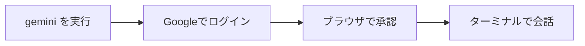

# A02: ターミナル早見表とGeminiのインストール

ターミナルはあります([A01](a01.html))。使いこなす必要はなく、いくつかのコマンドと、残りは調べればいいという自信があれば十分です。ここに早見表、それからAIをインストールして話し始めます。
{: .lesson-intro }

## ターミナル早見表

手元に置いておくこと。これで使うことの90%です。

| コマンド | 何をするか |
|---|---|
| `pwd` | 今どこ? 現在のフォルダを表示 |
| `ls` | 何がある? ファイルとフォルダを一覧 |
| `cd name` | フォルダに入る |
| `cd ..` | 一つ上のフォルダに戻る |
| `cd ~` | ホームフォルダに移動 |
| **Tab** | 名前を自動補完(入力が減り、打ち間違いも減る) |
| **上矢印** | 直前のコマンドを繰り返す |
| **Ctrl+C** | 固まったコマンドを中止 |

パスは住所です: `~/projects/notes.txt` は「ホームの中のprojectsの中のnotes.txt」。始めるにはこれで十分。残りは出くわしたときに調べる。

じっくり学ぶなら[ターミナルの基礎](t02.html)へ。

## Node.jsをインストール

Gemini CLIはNode.jsで動きます。権限の面倒を避ける**nvm**でインストールします:

1. 公式のnvmページ(`github.com/nvm-sh/nvm`)からインストールコマンドを取得して貼り付ける。最新版が手に入るよう公式ソースを使います。
2. ターミナルを閉じて開き直す。
3. `nvm install --lts` を実行し、`node -v` で確認(v20以上が欲しい)。

## Gemini CLIのインストールとログイン

```
npm install -g @google/gemini-cli
```

次に起動:

```
gemini
```

初回起動でサインイン方法を聞かれるので、**Login with Google** を選ぶ。ブラウザが開くので、アカウントを選んで承認。ターミナルに戻れば完了。これが無料枠です: クレジットカード不要、APIキー不要、寛大な1日あたりの上限。(ずっと後で、自動化スクリプトには別のキーが必要、[A07](a07.html)参照。今は無視。)



## 初めての会話

普通の言葉で質問を入力しEnter、答えを読む。会話を覚えているので、続けて聞けます。よく使う操作:

- `/help` はコマンド一覧。
- `/quit` で終了(またはCtrl+Cを2回)。
- 上矢印で直前のメッセージを呼び戻す。

入力し、読み、**確認し**、繰り返す。人が飛ばすのは確認の部分、A01がその理由を伝えました。

## 今週の演習

1. Nodeをインストールし、次にGemini CLI、Googleでログイン。
2. 今週あなたが本当に知りたい質問を5つする。
3. 1つの答えを実際の情報源と照合し、間違っている・でっち上げた点を1つ見つける。どう気づいたか書き留める。

<div class="takeaways">
<h2>まとめ</h2>
<ul>
<li>ターミナルのコマンドはいくつか知っていれば十分、残りは必要に応じて調べる</li>
<li>Nodeはnvmでインストール(node -vがv20以上)、次に npm install -g @google/gemini-cli</li>
<li>Googleでログイン: 無料枠、クレジットカード不要、APIキー不要</li>
<li>ループはシンプル: 入力し、読み、確認し、繰り返す</li>
</ul>
</div>
