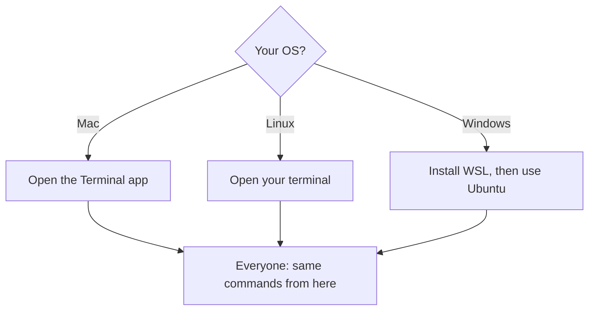

# A02: Terminal Survival + Install the Environment

The AI assistant lives in the terminal, a window where you type commands instead of clicking. It looks intimidating and it is not. This lesson gives you the handful of commands you actually need, then sets up the same environment for everyone so every later instruction works the same on your machine as on your neighbour's.
{: .lesson-intro }

## The Terminal Is Just Typed Directions

Clicking a folder is pointing at it. The terminal is giving directions by name. Same computer, same files, different way to talk to it. You need six things:

- `pwd` - "where am I?" Prints your current folder.
- `ls` - "what is here?" Lists files and folders.
- `cd foldername` - "go into that folder." `cd ..` goes back up. `cd ~` goes home.
- `~` - shorthand for your home folder, your starting point.
- **Tab** - autocomplete. Type a few letters of a name and press Tab. Less typing, fewer typos.
- **Up arrow** - repeat your last command. **Ctrl+C** - cancel a stuck command.

A path is an address. `~/projects/notes.txt` means "the file notes.txt, inside projects, inside home." That is all a path is.

## One Environment for Everyone

Mac and Linux already have a Unix terminal built in, so their commands match. Windows does not, so Windows users install **WSL** (Windows Subsystem for Linux): a real Linux terminal inside Windows. After that, everyone in this course types the exact same commands. That is why we require it.

### Windows: install WSL

Do this **before class if possible**, it needs a restart and can be slow.

1. Click Start, type `PowerShell`, right-click **Windows PowerShell**, choose **Run as administrator**. Click Yes.
2. In that window type `wsl --install` and press Enter. It downloads Ubuntu (Linux). Wait for it to finish.
3. **Restart your computer.** This is required, not optional.
4. After restart, an **Ubuntu** window opens by itself. It asks you to create a UNIX username and password. The password stays invisible while you type, that is normal, just type it and press Enter.
5. From now on, open **Ubuntu** from the Start menu, not PowerShell. That black window is your terminal for this course.

If `wsl --install` fails saying you lack permission, your machine is locked down (common on work or school laptops). WSL needs administrator rights. Use a personal computer for this course, or ask us about a cloud option.

### Mac / Linux

Open the Terminal app (Mac: press Cmd+Space, type "Terminal"). You are ready. No install needed.

## Install Node.js

Gemini CLI runs on Node.js, so install it. The clean way that avoids permission headaches later is **nvm** (Node Version Manager):

1. Get the install command from the official nvm page (`github.com/nvm-sh/nvm`) and paste it into your terminal. We use the official source so you always get the current version, tools change.
2. Close and reopen the terminal.
3. Run `nvm install --lts` to install the latest long-term-support Node.
4. Verify: `node -v`. You should see `v20` or higher. If you do, you are done.

## This Week's Exercise

1. Get to a working terminal (Ubuntu on Windows, Terminal on Mac/Linux).
2. Practice moving around: `pwd`, `ls`, `cd` into a folder and back out with `cd ..`, then `cd ~`.
3. Make a folder called `ai-course`, rename it, then delete it. Ask a search engine for the commands (`mkdir`, `mv`, `rm`) and verify each did what you expected with `ls`.
4. Install Node and confirm `node -v` shows v20 or higher. Bring the version number to class.

<h2>Key Takeaways</h2>
<ul>
<li>The terminal is just giving your computer directions by name instead of clicking</li>
<li>Six basics carry you far: pwd, ls, cd, ~, Tab, Ctrl+C</li>
<li>Windows uses WSL so everyone shares one identical Linux environment</li>
<li>Install Node via nvm and confirm node -v is v20+; locked-down laptops cannot install WSL</li>
</ul>

