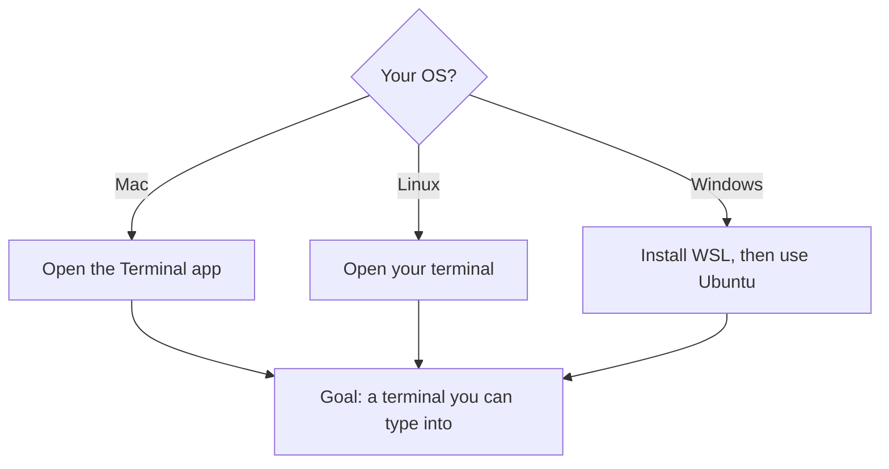

# A02: Join Discord + Install Your Environment

Today has one goal: everyone leaves with a working terminal. On Windows that means installing WSL, which needs a restart and often a little troubleshooting, so we do it together with the Discord open for help. We do not touch Node or the AI yet; that is next lesson, once your terminal works.
{: .lesson-intro }

## First, Join Discord

This is where you ask for help between lessons and where setup problems get solved fast. Join before anything else, most install issues are quicker to fix with someone looking at your screenshot than alone.

## One Environment for Everyone

Mac and Linux already have a Unix terminal built in. Windows does not, so Windows users install **WSL** (Windows Subsystem for Linux): a real Linux terminal inside Windows. After that, everyone in this course types the exact same commands and sees the same folders. That uniformity is the whole reason we require it, one set of instructions that works for the entire group.

### Windows: install WSL

1. Click Start, type `PowerShell`, right-click **Windows PowerShell**, and choose **Run as administrator**. Click Yes on the popup.
2. In that blue window, type `wsl --install` and press Enter. It downloads Ubuntu (Linux). Let it finish.
3. **Restart your computer.** Required, not optional. Nothing works right until you do.
4. After the restart, an **Ubuntu** window opens on its own and asks you to create a UNIX username and password. The password stays invisible as you type, that is normal. Type it, press Enter, confirm it.
5. From now on, open **Ubuntu** from the Start menu, not PowerShell. That is your terminal for this course.

If `wsl --install` fails with a permission error, your machine is locked down (common on work or school laptops, they block the admin rights WSL needs). Use a personal computer for this course, or ask in Discord about a cloud option.

### Mac / Linux

Open the Terminal app (Mac: press Cmd+Space, type "Terminal", press Enter). You already have everything. Nothing to install.

## This Week's Exercise

1. Join the Discord and say hello.
2. Get to a working terminal: install WSL and open **Ubuntu** (Windows), or open **Terminal** (Mac/Linux).
3. Prove it works: type `whoami` and press Enter. It should print your username. If it does, you are ready for next lesson.
4. If anything breaks, post a screenshot in Discord. Fixing setup is part of the work, not a sign you did it wrong.

<h2>Key Takeaways</h2>
<ul>
<li>Join Discord first, setup problems get solved fastest there</li>
<li>Windows uses WSL so the whole group shares one identical Linux terminal</li>
<li>WSL needs administrator rights and a restart; locked-down laptops cannot install it</li>
<li>Today's only goal: a terminal that prints your name when you type whoami</li>
</ul>

