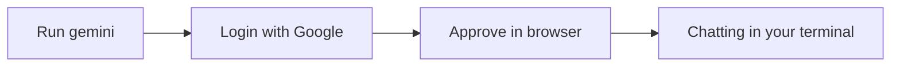

# A02: Terminal Cheat Sheet + Install Gemini

You have a terminal ([A01](a01.html)). You do not need to master it, you need a handful of commands and the confidence to look up the rest. Here is your cheat sheet, then we install the AI and start talking to it.
{: .lesson-intro }

## Terminal Cheat Sheet

Keep this nearby. It is 90% of what you will use.

| Command | What it does |
|---|---|
| `pwd` | Where am I? Prints the current folder |
| `ls` | What is here? Lists files and folders |
| `cd name` | Go into a folder |
| `cd ..` | Go back up one folder |
| `cd ~` | Go to your home folder |
| **Tab** | Autocomplete a name (less typing, fewer typos) |
| **Up arrow** | Repeat your last command |
| **Ctrl+C** | Cancel a stuck command |

A path is an address: `~/projects/notes.txt` is "notes.txt, inside projects, inside home." That is all you need to start. Look up the rest when you hit it.

## Install Node.js

Gemini CLI runs on Node.js. Install it with **nvm**, which avoids permission headaches:

1. Get the install command from the official nvm page (`github.com/nvm-sh/nvm`) and paste it in. We use the official source so you get the current version.
2. Close and reopen the terminal.
3. Run `nvm install --lts`, then check with `node -v` (want v20 or higher).

## Install & Log In to Gemini CLI

```
npm install -g @google/gemini-cli
```

Then start it:

```
gemini
```

The first run asks how to sign in, choose **Login with Google**. Your browser opens; pick your account and approve. Back in the terminal, you are in. This is the free tier: no credit card, no API key, generous daily limits. (Much later, automated scripts need a different key, see [A07](a07.html). Ignore that for now.)



## Your First Conversation

Type a question in plain English, press Enter, read the answer. It remembers the conversation, so you can follow up. Controls you will use constantly:

- `/help` lists commands.
- `/quit` leaves (or Ctrl+C twice).
- Up arrow brings back your last message.

Type, read, **verify**, repeat. The verifying is the part people skip, A01 told you why not to.

## This Week's Exercise

1. Install Node, then Gemini CLI, and log in with Google.
2. Ask five real questions you actually care about this week.
3. Verify one answer against a real source and find one thing it got wrong or made up. Write down how you caught it.

<div class="takeaways">
<h2>Key Takeaways</h2>
<ul>
<li>You only need a handful of terminal commands; look up the rest as needed</li>
<li>Install Node with nvm (node -v shows v20+), then npm install -g @google/gemini-cli</li>
<li>Log in with Google: free tier, no credit card, no API key</li>
<li>The loop is simple: type, read, verify, repeat</li>
</ul>
</div>
