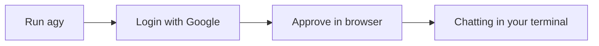

# A02: Terminal Cheat Sheet + Install Antigravity

You have a terminal ([A01](a01.html)). You do not need to master it, you need a handful of commands and the confidence to look up the rest. Here is your cheat sheet, then we install the AI and start talking to it.
{: .lesson-intro }

## Terminal Cheat Sheet

Keep this nearby. It is 90% of what you will use.

| Command | What it does |
|---|---|
| `pwd` | Where am I? Prints the current folder |
| `ls` | What is here? Lists files and folders |
| `cd name` | Go into a folder |
| `cd ..` | Go back up one folder |
| `cd ~` | Go to your home folder |
| `nano file` | Open a file to edit (Ctrl+O saves, Ctrl+X exits) |
| **Tab** | Autocomplete a name (less typing, fewer typos) |
| **Up arrow** | Repeat your last command |
| **Ctrl+C** | Cancel a stuck command |

A path is an address: `~/projects/notes.txt` is "notes.txt, inside projects, inside home." That is all you need to start. Look up the rest when you hit it.

To edit a file, `nano` is the gentlest option, `nano notes.txt`, change it, then save and exit with the shortcuts above. Skip vim for now, it is a deeper rabbit hole than you need. Or let the AI do it, ask agy to create or change a file for you. On Windows, if you would rather point and click, run `explorer.exe .` to open the current folder, or make a Desktop shortcut to `\\wsl.localhost\<distro>\home\<you>` and edit there in any text editor.

Want the full tour? See [Terminal Basics](t02.html).

## Install & Log In to Antigravity CLI

Antigravity ships as a single command, `agy`. Install it with the official one-liner (one line, straight from Google's own site, so you get the current version):

```
curl -fsSL https://antigravity.google/cli/install.sh | bash
```

Close and reopen the terminal, then check it landed:

```
agy --version
```

Now start it:

```
agy
```

The first run asks how to sign in, choose **Login with Google**. Your browser opens; pick your account and approve. Back in the terminal, you are in. This is the free tier: no credit card, no API key. The limits are tighter than the paid plans, but plenty to learn on. (Later you can run `agy` non-interactively inside scripts, see [A07](a07.html). Ignore that for now.)



## Your First Conversation

Type a question in plain English, press Enter, read the answer. It remembers the conversation, so you can follow up. Controls you will use constantly:

- `/help` lists commands.
- `/quit` leaves (or Ctrl+C twice).
- Up arrow brings back your last message.

Type, read, **verify**, repeat. The verifying is the part people skip, A01 told you why not to.

## This Week's Exercise

1. Install the Antigravity CLI and log in with Google.
2. Ask five real questions you actually care about this week.
3. Verify one answer against a real source and find one thing it got wrong or made up. Write down how you caught it.

<div class="takeaways">
<h2>Key Takeaways</h2>
<ul>
<li>You only need a handful of terminal commands; look up the rest as needed</li>
<li>Install the Antigravity CLI with one command, then confirm it with agy --version</li>
<li>Log in with Google: free tier, no credit card, no API key</li>
<li>The loop is simple: type, read, verify, repeat</li>
</ul>
</div>
