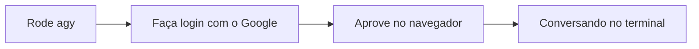

# A02: Guia Rápido do Terminal + Instalar o Antigravity

Você já tem um terminal ([A01](a01.html)). Não precisa dominá-lo, precisa de um punhado de comandos e da confiança de procurar o resto. Aqui está seu guia rápido, depois instalamos a IA e começamos a conversar.
{: .lesson-intro }

## Guia Rápido do Terminal

Deixe por perto. É 90% do que você vai usar.

| Comando | O que faz |
|---|---|
| `pwd` | Onde estou? Mostra a pasta atual |
| `ls` | O que tem aqui? Lista arquivos e pastas |
| `cd name` | Entra numa pasta |
| `cd ..` | Volta uma pasta |
| `cd ~` | Vai para sua pasta home |
| `nano file` | Abre um arquivo para editar (Ctrl+O salva, Ctrl+X sai) |
| **Tab** | Completa um nome (menos digitação, menos erros) |
| **Seta para cima** | Repete o último comando |
| **Ctrl+C** | Cancela um comando travado |

Um caminho é um endereço: `~/projects/notes.txt` é "notes.txt, dentro de projects, dentro da home". É o suficiente para começar. Procure o resto quando precisar.

Para editar um arquivo no terminal, rode `nano notes.txt`, altere, depois salve e saia com os atalhos acima. Ou deixe a IA fazer, peça ao agy para criar ou mudar um arquivo. No Windows, se você preferir clicar, rode `explorer.exe .` para abrir a pasta atual, ou faça um atalho na Área de Trabalho para `\\wsl.localhost\<distro>\home\<you>` e edite ali em qualquer editor de texto.

Quer o tour completo? Veja [Terminal do Zero](t02.html).

## Instale e Faça Login na CLI do Antigravity

O Antigravity vem como um único comando, `agy`. Instale com a linha oficial (uma linha, direto do site do Google, para você ter a versão atual):

```
curl -fsSL https://antigravity.google/cli/install.sh | bash
```

Feche e reabra o terminal, depois cheque se instalou:

```
agy --version
```

Depois inicie:

```
agy
```

A primeira execução pergunta como entrar, escolha **Login with Google**. O navegador abre; escolha sua conta e aprove. De volta ao terminal, você está dentro. Este é o plano gratuito: sem cartão de crédito, sem chave de API. Os limites são mais apertados que os planos pagos, mas dão de sobra para aprender. (Mais tarde você pode rodar o `agy` de forma não-interativa dentro de scripts, veja [A07](a07.html). Ignore por enquanto.)



## Sua Primeira Conversa

Digite uma pergunta em linguagem simples, pressione Enter, leia a resposta. Ela lembra da conversa, então você pode continuar. Controles que você vai usar sempre:

- `/help` lista os comandos.
- `/quit` sai (ou Ctrl+C duas vezes).
- Seta para cima traz de volta sua última mensagem.

Digite, leia, **verifique**, repita. A parte que as pessoas pulam é verificar, a A01 disse por que não pular.

## Exercício da Semana

1. Instale a CLI do Antigravity e faça login com o Google.
2. Faça cinco perguntas reais que você realmente quer saber esta semana.
3. Verifique uma resposta contra uma fonte real e ache uma coisa que ela errou ou inventou. Anote como você percebeu.

<div class="takeaways">
<h2>Pontos-chave</h2>
<ul>
<li>Você só precisa de um punhado de comandos do terminal; procure o resto quando precisar</li>
<li>Instale a CLI do Antigravity com um comando, depois confirme com agy --version</li>
<li>Faça login com o Google: plano gratuito, sem cartão de crédito, sem chave de API</li>
<li>O ciclo é simples: digite, leia, verifique, repita</li>
</ul>
</div>
