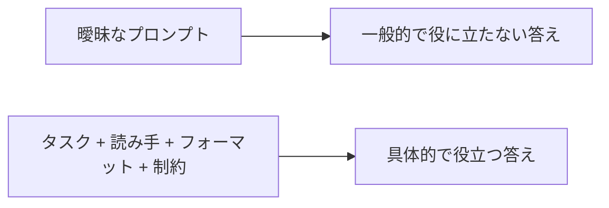

# A03: AIへの聞き方: プロンプト

AIから素晴らしい結果を得る人とゴミを得る人の最大の差は、ツールではなく聞き方です。プロンプトは指示書。曖昧な指示は曖昧な仕事を生む。このレッスンで指示を鋭くします。
{: .lesson-intro }

## 曖昧な入力、曖昧な出力

比べてみましょう:

- 弱い: *「犬について書いて。」*
- 強い: *「初めて犬を飼う人向けに、子犬のトイレトレーニングのコツを3つ、各1文で、わかりやすい言葉で書いて。」*

2つ目はトピック、読み手、フォーマット、長さを伝えています。モデルはもう推測しなくてよいので、推測をやめて助け始めます。

## 4つのレバー

ほぼどのプロンプトでも、4つを制御できます:

- **タスク** - 何をしてほしい? 「要約」「比較」「修正」「説明」。
- **読み手/レベル** - 「完全な初心者に説明して」「コードは何も知らない前提で」。
- **フォーマット** - 箇条書き、表、番号付きの手順、1行。頼めば返ってくる。
- **制約** - 長さ、言語、トーン、避けること。「100語以内」「専門用語なし」。

できるときは、良いものの **例** を添える。説明より提示。

## 最初の答えは下書き

返ってきたもので終わりではありません。押し返す:

- *「もっと短く。」* / *「具体例を1つ。」* / *「Windows前提だったけど、私はMac。」*
- *「そのリンク、本当に存在する? 出典を見せて。」*

そしてA01の罠を避ける: *「これで良い?」* と聞かない、モデルは「はい」と言うようにできています。*「これの問題点を3つ挙げて」* と聞く。承認を求めるより、批判を招くほうがずっと多くを得られます。

## 今週の演習

1. 今週の本物の質問を1つ選ぶ。一番手抜きの1行版を書く。
2. 3通りに書き直す: **フォーマット** を足す、**読み手/レベル** を足す、**制約** を足す。
3. 4つのプロンプトを全部実行する。答えがどう変わったか記録する。
4. 一番良い答えを選び、もう一度押す(「短く」/「例を1つ」/「これの問題点は?」)。ビフォーアフターを授業に持ってくる。

<h2>まとめ</h2>
<ul>
<li>プロンプトは指示書、曖昧な指示は曖昧な仕事を生む</li>
<li>4つのレバーを制御: タスク、読み手/レベル、フォーマット、制約、できれば例を見せる</li>
<li>最初の答えは下書き、追加の質問で磨く</li>
<li>「これで良い?」と聞かない、「これの問題点を3つ挙げて」と聞く</li>
</ul>

