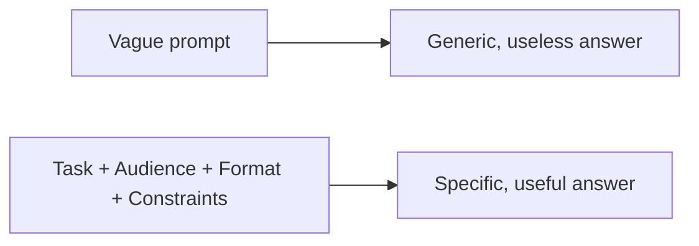

# A03: How to Ask: Prompting

The single biggest difference between people who get great results from AI and people who get junk is not the tool, it is how they ask. A prompt is a brief. A vague brief gets vague work. This lesson makes your briefs sharp.
{: .lesson-intro }

## Vague In, Vague Out

Compare:

- Weak: *"Write about dogs."*
- Strong: *"Write three short tips for a first-time dog owner on house-training a puppy, one sentence each, plain language."*

The second one says the topic, the audience, the format, and the length. The model no longer has to guess, so it stops guessing and starts helping.

## The Four Levers

You control four things in almost every prompt:

- **Task** - what exactly do you want done? "Summarize," "compare," "fix," "explain."
- **Audience / level** - "explain to a complete beginner," "assume I know nothing about code."
- **Format** - a list, a table, numbered steps, one line. Ask for it and you get it.
- **Constraints** - length, language, tone, what to avoid. "Under 100 words." "No jargon."

Add an **example** of what good looks like when you can. Showing beats describing.

## The First Answer Is a Draft

You are not stuck with what comes back. Push on it:

- *"Shorter."* / *"Give me a concrete example."* / *"You assumed I use Windows, I use a Mac."*
- *"That link, does it actually exist? Show me the source."*

And avoid the trap from A01: do not ask *"is this good?"*, the model is built to say yes. Ask *"what are three problems with this?"* You get far more by inviting criticism than by fishing for approval.

## This Week's Exercise

1. Take a real question you have this week. Write the laziest one-line version of it.
2. Rewrite it three ways: once adding **format**, once adding **audience/level**, once adding **constraints**.
3. Run all four prompts. Note how the answer changed each time.
4. Pick the best answer, then push on it once more ("shorter" / "with an example" / "what's wrong with this?"). Bring the before-and-after to class.

<h2>Key Takeaways</h2>
<ul>
<li>A prompt is a brief; vague briefs get vague work</li>
<li>Control four levers: task, audience/level, format, constraints, and show an example when you can</li>
<li>The first answer is a draft, refine it with follow-ups</li>
<li>Never ask "is this good?"; ask "what are three problems with this?"</li>
</ul>

