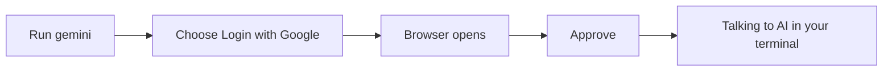

# A03: Install & Authenticate Gemini CLI

You have a terminal and Node.js. Now install the assistant itself, Gemini CLI, log in for free, and talk to it. By the end of this lesson you have a working AI in your terminal and you have already caught it being wrong once.
{: .lesson-intro }

## Install It

In your terminal, run:

```
npm install -g @google/gemini-cli
```

The `-g` means "install globally" so you can run it from anywhere. If you set up Node with nvm in [A02](a02.html), this just works. If you instead see a long red permission error (`EACCES`), that is the classic reason we recommended nvm, going back and installing Node through nvm fixes it.

When it finishes, start it:

```
gemini
```

## Log In for Free

The first time you run `gemini`, it asks how you want to sign in. Choose **Login with Google**.

1. Your web browser opens automatically.
2. Pick your Google account and approve access.
3. Return to the terminal, you are now logged in.

This uses Google's free tier: no credit card, no API key, generous daily limits. If you ever hit the limit, the tool tells you, just wait a bit or continue tomorrow. (Later, in [A08](a08.html), automated scripts need a different kind of key. Ignore that for now.)



## Your First Conversation

You are now at the Gemini prompt. Type a question in plain English and press Enter. It answers. Ask a follow-up, it remembers the conversation.

A few controls you will use constantly:

- `/help` - list available commands.
- `/quit` - leave. (Or press Ctrl+C twice.)
- Up arrow - bring back your last message.

That is the whole interface: type, read, verify, repeat. The verifying is the part most people skip, and A01 told you why not to.

## This Week's Exercise

1. Install Gemini CLI and log in with Google.
2. Ask it five real questions, things you actually want to know this week.
3. For at least one answer, verify it against a real source (official docs, run the command, check a fact). Find **one** thing it got wrong, incomplete, or made up.
4. Write down the wrong answer and how you caught it. Bring it to class. If you could not find a single error, you were not checking hard enough, keep going.

<div class="takeaways">
<h2>Key Takeaways</h2>
<ul>
<li>Install with npm install -g @google/gemini-cli, then run gemini</li>
<li>Log in with a Google account: free tier, no credit card, no API key</li>
<li>The interface is simple: type a question, read, verify, repeat</li>
<li>/help lists commands, /quit leaves; the free tier has generous daily limits</li>
</ul>
</div>
