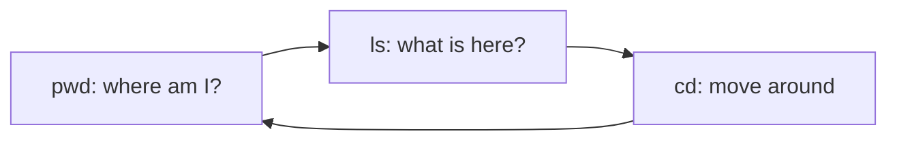

# A03: Terminal Survival + Install Node.js

You have a terminal ([A02](a02.html)). It looks intimidating and it is not, you only need a handful of commands. This lesson makes you comfortable moving around, then installs Node.js, the engine the AI assistant runs on.
{: .lesson-intro }

## The Terminal Is Just Typed Directions

Clicking a folder is pointing at it. The terminal is giving directions by name. Same computer, same files, different way to talk to it. Six things carry you far:

- `pwd` - "where am I?" Prints your current folder.
- `ls` - "what is here?" Lists files and folders.
- `cd foldername` - "go into that folder." `cd ..` goes back up. `cd ~` goes home.
- `~` - shorthand for your home folder, your starting point.
- **Tab** - autocomplete. Type a few letters of a name and press Tab. Less typing, fewer typos.
- **Up arrow** - repeat your last command. **Ctrl+C** - cancel a stuck command.

A path is an address. `~/projects/notes.txt` means "the file notes.txt, inside projects, inside home." That is all a path is.

## Install Node.js

Gemini CLI runs on Node.js, so install it. The clean way that avoids permission headaches later is **nvm** (Node Version Manager):

1. Get the install command from the official nvm page (`github.com/nvm-sh/nvm`) and paste it into your terminal. We use the official source so you always get the current version, tools change.
2. Close and reopen the terminal.
3. Run `nvm install --lts` to install the latest long-term-support Node.
4. Verify: `node -v`. You should see `v20` or higher. If you do, you are done.

If a command errors, copy the exact message into Discord. Reading error text is a skill you will use for the rest of the course.

## This Week's Exercise

1. Practice moving around: `pwd`, `ls`, `cd` into a folder and back out with `cd ..`, then `cd ~`.
2. Make a folder called `ai-course`, rename it, then delete it. Look up the commands (`mkdir`, `mv`, `rm`) and check each worked with `ls`.
3. Install Node and confirm `node -v` shows v20 or higher. Bring the version number to class.

<h2>Key Takeaways</h2>
<ul>
<li>The terminal is just giving your computer directions by name instead of clicking</li>
<li>Six basics carry you far: pwd, ls, cd, ~, Tab, Ctrl+C</li>
<li>A path is an address; ~ is your home folder</li>
<li>Install Node via nvm and confirm node -v is v20 or higher</li>
</ul>

