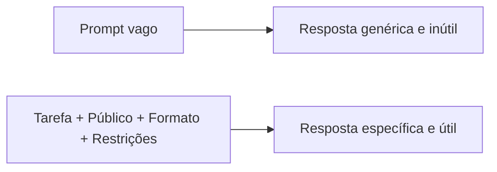

# A03: Como Perguntar: Prompts

A maior diferença entre quem tira ótimos resultados de uma IA e quem tira lixo não é a ferramenta, é como pergunta. Um prompt é um briefing. Briefing vago gera trabalho vago. Esta aula deixa seus briefings afiados.
{: .lesson-intro }

## Entra Vago, Sai Vago

Compare:

- Fraco: *"Escreva sobre cachorros."*
- Forte: *"Escreva três dicas curtas para quem tem cachorro pela primeira vez sobre ensinar um filhote a fazer as necessidades no lugar certo, uma frase cada, linguagem simples."*

O segundo diz o tema, o público, o formato e o tamanho. O modelo não precisa mais adivinhar, então para de adivinhar e começa a ajudar.

## As Quatro Alavancas

Em quase todo prompt, você controla quatro coisas:

- **Tarefa** - o que exatamente você quer feito? "Resuma", "compare", "corrija", "explique".
- **Público / nível** - "explique para um iniciante total", "assuma que não sei nada de código".
- **Formato** - uma lista, uma tabela, passos numerados, uma linha. Peça e você recebe.
- **Restrições** - tamanho, idioma, tom, o que evitar. "Menos de 100 palavras." "Sem jargão."

Quando puder, adicione um **exemplo** do que é bom. Mostrar vence descrever.

## A Primeira Resposta é um Rascunho

Você não está preso ao que voltou. Insista:

- *"Mais curto."* / *"Dê um exemplo concreto."* / *"Você assumiu que uso Windows, eu uso Mac."*
- *"Aquele link existe mesmo? Mostre a fonte."*

E evite a armadilha da A01: não pergunte *"isto está bom?"*, o modelo é feito para dizer sim. Pergunte *"quais são três problemas com isto?"* Você ganha muito mais convidando a crítica do que pescando aprovação.

## Exercício da Semana

1. Pegue uma pergunta real desta semana. Escreva a versão mais preguiçosa, de uma linha.
2. Reescreva de três jeitos: adicionando **formato**, adicionando **público/nível**, adicionando **restrições**.
3. Rode os quatro prompts. Anote como a resposta mudou em cada um.
4. Escolha a melhor resposta e insista mais uma vez ("mais curto" / "com um exemplo" / "o que há de errado nisto?"). Traga o antes e depois para a aula.

<h2>Pontos-chave</h2>
<ul>
<li>Um prompt é um briefing; briefings vagos geram trabalho vago</li>
<li>Controle quatro alavancas: tarefa, público/nível, formato, restrições, e mostre um exemplo quando puder</li>
<li>A primeira resposta é um rascunho, refine com perguntas de acompanhamento</li>
<li>Nunca pergunte "isto está bom?"; pergunte "quais são três problemas com isto?"</li>
</ul>

