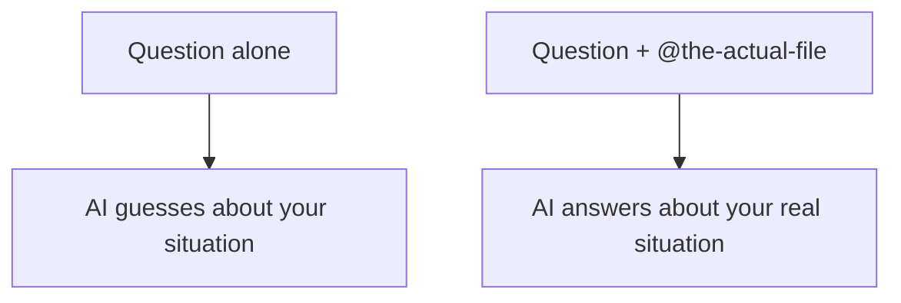

# A04: コンテキストエンジニアリング

アシスタントは優秀ですが、あなたの具体的な状況については記憶喪失です。訓練から一般的なことは知っていても、*あなたの*ファイル、*あなたの*エラー、*あなたの*フォルダは、見せない限り知りません。正しい情報を目の前に置くことをコンテキストエンジニアリングと呼び、推測と答えの分かれ目になります。
{: .lesson-intro }

## 説明せず、見せる

ファイルをAIに説明するのは、電話で書類を読み上げるようなもの: 遅くて抜け落ちます。代わりにファイルを渡す。Gemini CLIでは `@` で行います:

```
@notes.txt の内容を2文で説明して
```

`@notes.txt` はそのファイルの実際の中身をメッセージに引き込みます。本物を指す、`@report.md`、`@script.js` とすれば、AIはあなたの要約に頼らず直接読みます。Gemini CLIはフォルダの中で動くので、起動したフォルダのファイルも見えます。

## 絞るほうが勝つ

コンテキストは多ければ良いわけではありません。ちょうど良い量があります:

- **少なすぎ** - コードなしでエラーだけ貼ると、推測する。
- **多すぎ** - 20個のファイルを投げ込むと、溺れて、遅くなり、無関係なものを混ぜ、無料枠の1日の上限を早く食う。

*この*質問に関係するものだけを、それ以上でなく渡す。エラーを貼るときは、**正確に**、一字一句貼る。「モジュールが何とかと言ってた」ではなく。正確なテキストが手がかりです。



## 話題を変えたら新しく始める

長い会話は、前に言ったことすべてをコンテキストとして引きずります。関連していれば助けになり、新しい話題に飛ぶと古い詳細が混ざって混乱します。話題を変えるときは、新しい会話を始めて、AIが前の話をまだ考えないようにする。

## 今週の演習

1. `gemini` を実行するフォルダに、短いテキストファイル(メモ、レシピ、何でも)を作る。
2. `@` **なし**で、言葉で説明して質問する。答えを記録する。
3. `@yourfile` **あり**で同じ質問をする。比べる、どちらがファイルの中身を本当に知っていたか?
4. 今週出くわした本物のエラーメッセージ(正確なテキスト)を貼り、意味を聞く。比較を授業に持ってくる。

<div class="takeaways">
<h2>まとめ</h2>
<ul>
<li>AIは目の前に置いたものしか知らない、実際のファイルを見せる、説明しない</li>
<li>@filename でファイルの実際の中身をメッセージに引き込む</li>
<li>絞ったコンテキストが勝つ: 少なすぎると推測し、多すぎると溺れて上限を食う</li>
<li>エラーは正確に貼り、話題を変えたら新しい会話を始める</li>
</ul>
</div>
