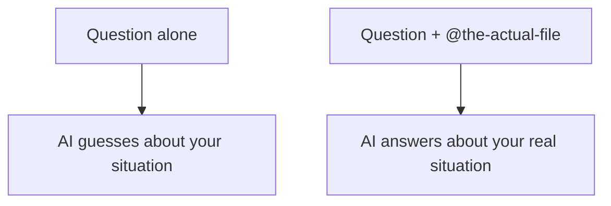

# A04: Context Engineering

The assistant is brilliant and has amnesia about your specific situation. It knows general things from training, but it does not know *your* file, *your* error, *your* folder, unless you show it. Putting the right information in front of it is called context engineering, and it is the difference between a guess and an answer.
{: .lesson-intro }

## Show, Don't Describe

Describing a file to the AI is like reading a document aloud over the phone: slow and lossy. Instead, hand it the file. In Antigravity CLI you do this with `@`:

```
Explain what @notes.txt is about in two sentences.
```

The `@notes.txt` pulls that file's actual contents into your message. Point at the real thing, `@report.md`, `@script.js`, or a whole folder with `@src/`, and the AI reads it directly instead of relying on your summary. Because Antigravity CLI runs in a folder, it can also see the files in the folder you started it from.

## Focused Beats Everything

More context is not better. There is a sweet spot:

- **Too little** - you paste an error with no code, and it guesses.
- **Too much** - you dump twenty files, and it drowns, gets slower, mixes unrelated things together, and eats through your daily free-tier limit faster.

Give what is relevant to *this* question and no more. When you paste an error, paste it **exactly**, word for word, not "it said something about a module." The exact text is the clue.



## Start Fresh When You Switch Topics

A long conversation carries everything you said earlier as context. Helpful when it is related; confusing when you jump to a new topic and old details bleed in. When you change subject, start a new conversation so the AI is not still thinking about the last one.

## This Week's Exercise

1. Create a short text file (some notes, a recipe, anything) in the folder where you run `agy`.
2. Ask a question about it **without** `@`, describing it in words. Note the answer.
3. Ask the same question **with** `@yourfile`. Compare, which answer actually knew what was in the file?
4. Now paste a real error message you hit this week (exact text) and ask what it means. Bring the comparison to class.

<div class="takeaways">
<h2>Key Takeaways</h2>
<ul>
<li>The AI only knows what you put in front of it, show the real file, don't describe it</li>
<li>Use @filename to pull a file's actual contents into your message</li>
<li>Focused context wins: too little makes it guess, too much makes it drown and costs quota</li>
<li>Paste errors exactly, and start a fresh conversation when you change topics</li>
</ul>
</div>
