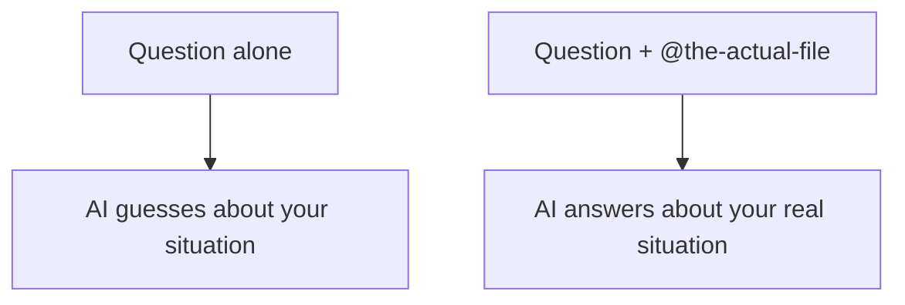

# A04: Engenharia de Contexto

O assistente é brilhante e tem amnésia sobre a sua situação específica. Ele sabe coisas gerais do treinamento, mas não conhece o *seu* arquivo, o *seu* erro, a *sua* pasta, a menos que você mostre. Colocar a informação certa na frente dele se chama engenharia de contexto, e é a diferença entre um chute e uma resposta.
{: .lesson-intro }

## Mostre, Não Descreva

Descrever um arquivo para a IA é como ler um documento em voz alta pelo telefone: lento e com perdas. Em vez disso, entregue o arquivo. No Gemini CLI você faz isso com `@`:

```
Explique em duas frases sobre o que é @notes.txt
```

O `@notes.txt` puxa o conteúdo real daquele arquivo para sua mensagem. Aponte para a coisa real, `@report.md`, `@script.js`, e a IA lê direto em vez de depender do seu resumo. Como o Gemini CLI roda dentro de uma pasta, ele também vê os arquivos da pasta de onde você o iniciou.

## Focado Vence Tudo

Mais contexto não é melhor. Existe um ponto ideal:

- **Pouco demais** - você cola um erro sem o código, e ela chuta.
- **Demais** - você despeja vinte arquivos, e ela se afoga, fica mais lenta, mistura coisas sem relação e consome mais rápido seu limite diário do plano gratuito.

Dê o que é relevante para *esta* pergunta e nada mais. Quando colar um erro, cole **exatamente**, palavra por palavra, não "disse algo sobre um módulo". O texto exato é a pista.



## Comece do Zero ao Trocar de Assunto

Uma conversa longa carrega tudo o que você disse antes como contexto. Útil quando é relacionado; confuso quando você pula para um assunto novo e detalhes antigos se misturam. Ao mudar de assunto, comece uma nova conversa para a IA não continuar pensando na anterior.

## Exercício da Semana

1. Crie um arquivo de texto curto (anotações, uma receita, qualquer coisa) na pasta onde você roda o `gemini`.
2. Faça uma pergunta sobre ele **sem** `@`, descrevendo em palavras. Anote a resposta.
3. Faça a mesma pergunta **com** `@seuarquivo`. Compare, qual resposta realmente sabia o que estava no arquivo?
4. Agora cole uma mensagem de erro real que você viu esta semana (texto exato) e pergunte o que significa. Traga a comparação para a aula.

<div class="takeaways">
<h2>Pontos-chave</h2>
<ul>
<li>A IA só sabe o que você coloca na frente dela, mostre o arquivo real, não descreva</li>
<li>Use @arquivo para puxar o conteúdo real do arquivo para sua mensagem</li>
<li>Contexto focado vence: pouco demais faz ela chutar, demais a afoga e consome o limite</li>
<li>Cole erros exatamente, e comece uma conversa nova ao trocar de assunto</li>
</ul>
</div>
