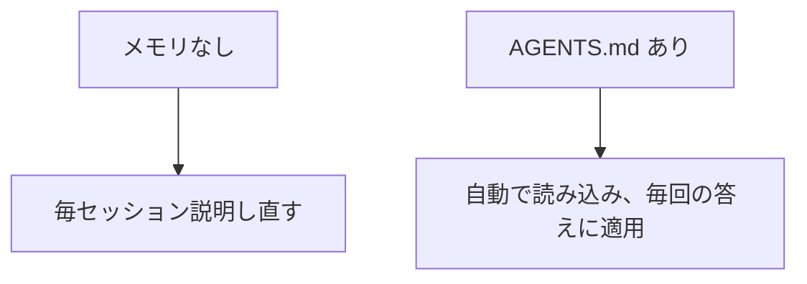

# A05: AGENTS.mdでメモリを持たせる

今ごろ、毎回同じことを打ち直しているはず: 「初心者です」「簡潔に答えて」「Macを使ってます」。それは無駄です。メモリファイルにそれを一度伝えれば、そのフォルダで作業するたび自動で読みます。
{: .lesson-intro }

## AGENTS.md: あなたの常設指示

`AGENTS.md` は、作業するフォルダに置く普通のテキストファイルです。Antigravity CLIはそこで `agy` を起動すると読み込み、指示として扱います。書いたことは、繰り返さなくても毎回の答えに反映されます。

短く個人的に保つ: 自分が誰か、どう答えてほしいか、環境の安定した事実。

```
# 自分について
コードを学習中。専門用語なしで、わかりやすく説明して。
必ず具体例を1つ。
答えは短く。
Macを使っています。
```



## 読み込んだ内容を確認する

`agy inspect` を実行すると、`agy` が拾った指示ファイル(あなたの `AGENTS.md` を含む)が正確にわかります。ファイルが読まれているか確認するのに使う。編集は次のメッセージから効くので、再起動するものはありません、保存して続けるだけ。

## そこに置くもの(と置かないもの)

良い: あなたのレベルと好み、答えのフォーマットの好み、環境の安定した事実、プロジェクトの規約。

置かない: **秘密**。`AGENTS.md` はAIに送られる普通のファイルなので、A01のルールは有効、パスワードなし、個人データなし、未承認の仕事の詳細なし。

毎朝基本を説明し直さなくて済むように業務委託に渡すオンボーディングメモだと思ってください。

## 今週の演習

1. `agy` を実行するフォルダに `AGENTS.md` を作り(`touch AGENTS.md`、またはエディタで開く)、AIにどう答えてほしいかのルールを3〜4個書く(レベル、長さ、「必ず例を1つ」、言語)。
2. `agy` を起動し `agy inspect` を実行。ルールが読み込まれているか確認。
3. 質問して、答えが実際にルールに従っているか確認。従っていなければ、言い回しを鋭くし、保存してもう一度。
4. あなたの `AGENTS.md` とビフォーアフターの答えを1つ授業に持ってくる。

<div class="takeaways">
<h2>まとめ</h2>
<ul>
<li>AGENTS.mdは毎セッション自動で読み込まれるので、繰り返さなくて済む</li>
<li>作業するフォルダに置く、そこで起動すると agy が読む</li>
<li>agy inspect で読み込み内容を確認、編集は次のメッセージから効く</li>
<li>好みとプロジェクトのルールを置く、秘密は決して置かない</li>
</ul>
</div>
