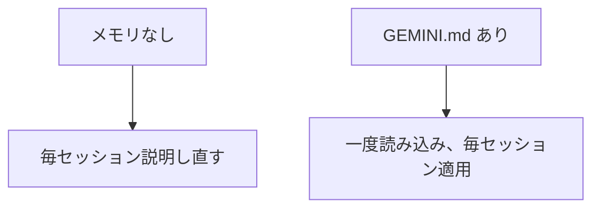

# A05: GEMINI.mdでメモリを持たせる

今ごろ、毎回同じことを打ち直しているはず: 「初心者です」「簡潔に答えて」「Macを使ってます」。それは無駄です。メモリファイルにそれを一度伝えれば、毎セッションの最初に自動で読みます。
{: .lesson-intro }

## GEMINI.md: あなたの常設指示

`GEMINI.md` は、Gemini CLIが起動時に読み込み、指示として扱う普通のテキストファイルです。そこに書いたことは、繰り返さなくても毎回の答えに反映されます。2つのレベルがあります:

- **グローバル** - ホームフォルダの `~/.gemini/GEMINI.md`。どこでも、すべてのプロジェクトに適用。
- **プロジェクト** - `gemini` を起動するフォルダの `GEMINI.md`。そこだけに適用。1つの作業に固有のルールに良い。

グローバルの好み(「学習中です、簡潔に説明し、必ず例を1つ、答えは短く」)を上に、プロジェクトの事実をプロジェクトファイルに置く。

## 読み込んだ内容を確認する

よく使う2つのコマンド:

- `/memory show` - 今読み込まれている指示を正確に表示。ファイルが読まれているか確認するのに使う。
- `/memory refresh` - 編集後にファイルを再読み込みする。再起動しなくてよい。

## そこに置くもの(と置かないもの)

良い: あなたのレベルと好み、答えのフォーマットの好み、環境の安定した事実、プロジェクトの規約。

置かない: **秘密**。`GEMINI.md` はAIに送られる普通のファイルなので、A01のルールは有効、パスワードなし、個人データなし、未承認の仕事の詳細なし。

毎朝基本を説明し直さなくて済むように業務委託に渡すオンボーディングメモだと思ってください。

## 今週の演習

1. `~/.gemini/GEMINI.md` を作り、AIにどう答えてほしいかのルールを3〜4個書く(レベル、長さ、「必ず例を1つ」、言語)。
2. `gemini` を起動し `/memory show` を実行。ルールが読み込まれているか確認。
3. 質問して、答えが実際にルールに従っているか確認。従っていなければ、言い回しを鋭くし、`/memory refresh` してもう一度。
4. あなたの `GEMINI.md` とビフォーアフターの答えを1つ授業に持ってくる。

<h2>まとめ</h2>
<ul>
<li>GEMINI.mdは毎セッション自動で読み込まれるので、繰り返さなくて済む</li>
<li>グローバル(~/.gemini/GEMINI.md)はどこでも、プロジェクトのGEMINI.mdはそのフォルダに適用</li>
<li>/memory show で読み込み内容を確認、/memory refresh で編集後に再読み込み</li>
<li>好みとプロジェクトのルールを置く、秘密は決して置かない</li>
</ul>

