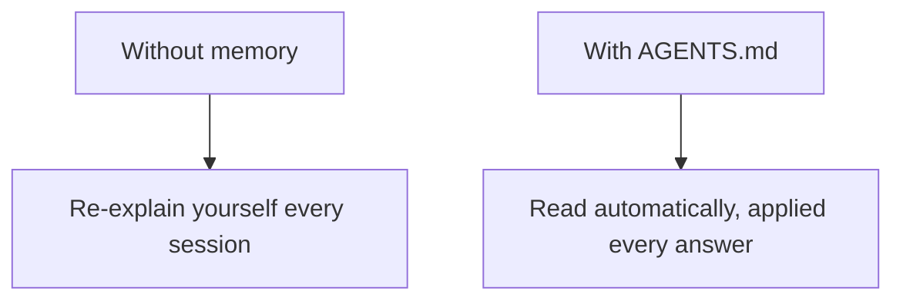

# A05: Memories with AGENTS.md

By now you are probably retyping the same things every conversation: "I'm a beginner," "answer concisely," "I use a Mac." That is wasted effort. A memory file tells the assistant those things once, and it reads them automatically every time you work in that folder.
{: .lesson-intro }

## AGENTS.md: Your Standing Instructions

`AGENTS.md` is an ordinary text file you put in the folder you work in. Antigravity CLI reads it when you run `agy` there and treats it as instructions. Whatever you write shapes every answer, without you repeating it.

Keep it short and personal: who you are, how you want answers, stable facts about your setup.

```
# About me
I'm learning to code. Explain simply and assume no jargon.
Always give one concrete example.
Keep answers short.
I'm on a Mac.
```



## Check What It Loaded

Run `agy inspect` to see exactly which instruction files `agy` picked up, including your `AGENTS.md`. Use it to confirm your file is being read. Edits take effect on your next message, so there is nothing to restart, just save and keep going.

## What Belongs There (and What Doesn't)

Good: your level and preferences, how you like answers formatted, stable facts about your setup, project conventions.

Not there: **secrets**. An `AGENTS.md` is a plain file that gets sent to the AI, so the A01 rule still holds, no passwords, no personal data, no unapproved work details.

Think of it as the onboarding note you hand a contractor so you never have to re-explain the basics each morning.

## This Week's Exercise

1. In the folder where you run `agy`, create an `AGENTS.md` with three or four rules for how you want the AI to answer you (level, length, "always show an example," language).
2. Start `agy` and run `agy inspect`. Confirm your rules are loaded.
3. Ask a question and check whether the answer actually follows your rules. If not, sharpen the wording, save, and try again.
4. Bring your `AGENTS.md` and one before/after answer to class.

<div class="takeaways">
<h2>Key Takeaways</h2>
<ul>
<li>AGENTS.md is read automatically every session, so you stop repeating yourself</li>
<li>Put it in the folder you work in; agy reads it when you start there</li>
<li>agy inspect confirms what is loaded; edits take effect on your next message</li>
<li>Put preferences and project rules there, never secrets</li>
</ul>
</div>
