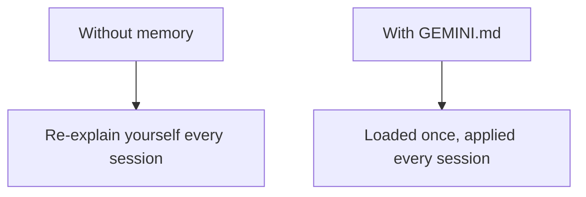

# A05: Memories with GEMINI.md

By now you are probably retyping the same things every conversation: "I'm a beginner," "answer concisely," "I use a Mac." That is wasted effort. A memory file tells the assistant those things once, and it reads them at the start of every session automatically.
{: .lesson-intro }

## GEMINI.md: Your Standing Instructions

`GEMINI.md` is an ordinary text file that Gemini CLI loads on startup and treats as instructions. Whatever you write there shapes every answer, without you repeating it. There are two levels:

- **Global** - `~/.gemini/GEMINI.md` in your home folder. Applies everywhere, to every project.
- **Project** - a `GEMINI.md` in the folder you launch `gemini` from. Applies only there. Good for rules specific to one piece of work.

Put your global preferences up top ("I'm learning; explain simply, always give one example, keep answers short"), and project facts in the project file.

## Check What It Loaded

Two commands you will use:

- `/memory show` - prints exactly what instructions are currently loaded. Use it to confirm your file is being read.
- `/memory refresh` - reloads the files after you edit them, so you do not have to restart.

## What Belongs There (and What Doesn't)

Good: your level and preferences, how you like answers formatted, stable facts about your setup, project conventions.

Not there: **secrets**. A `GEMINI.md` is a plain file that gets sent to the AI, so the A01 rule still holds, no passwords, no personal data, no unapproved work details.

Think of it as the onboarding note you hand a contractor so you never have to re-explain the basics each morning.

## This Week's Exercise

1. Create `~/.gemini/GEMINI.md` with three or four rules for how you want the AI to answer you (level, length, "always show an example," language).
2. Start `gemini` and run `/memory show`. Confirm your rules are loaded.
3. Ask a question and check whether the answer actually follows your rules. If not, sharpen the wording, run `/memory refresh`, and try again.
4. Bring your `GEMINI.md` and one before/after answer to class.

<h2>Key Takeaways</h2>
<ul>
<li>GEMINI.md is loaded automatically every session, so you stop repeating yourself</li>
<li>Global (~/.gemini/GEMINI.md) applies everywhere; a project GEMINI.md applies to that folder</li>
<li>/memory show confirms what is loaded; /memory refresh reloads after edits</li>
<li>Put preferences and project rules there, never secrets</li>
</ul>

