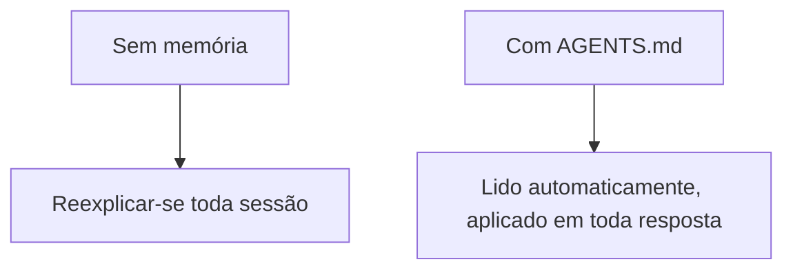

# A05: Memória com AGENTS.md

A esta altura você provavelmente redigita as mesmas coisas toda conversa: "sou iniciante", "responda de forma concisa", "uso Mac". Isso é esforço desperdiçado. Um arquivo de memória diz isso uma vez, e ele o lê automaticamente toda vez que você trabalha naquela pasta.
{: .lesson-intro }

## AGENTS.md: Suas Instruções Permanentes

`AGENTS.md` é um arquivo de texto comum que você coloca na pasta onde trabalha. A CLI do Antigravity o lê quando você roda o `agy` ali e o trata como instruções. O que você escreve molda toda resposta, sem você repetir.

Mantenha curto e pessoal: quem você é, como quer as respostas, fatos estáveis do seu ambiente.

```
# Sobre mim
Estou aprendendo a programar. Explique de forma simples, sem jargão.
Sempre dê um exemplo concreto.
Respostas curtas.
Uso Mac.
```



## Cheque o Que Foi Carregado

Rode `agy inspect` para ver exatamente quais arquivos de instrução o `agy` pegou, incluindo seu `AGENTS.md`. Use para confirmar que seu arquivo está sendo lido. As edições valem a partir da sua próxima mensagem, então não há nada para reiniciar, é só salvar e seguir.

## O Que Vai Ali (e o Que Não Vai)

Bom: seu nível e preferências, como você gosta das respostas formatadas, fatos estáveis do seu ambiente, convenções do projeto.

Não ali: **segredos**. Um `AGENTS.md` é um arquivo comum que é enviado à IA, então a regra da A01 continua valendo, sem senhas, sem dados pessoais, sem detalhes de trabalho não aprovados.

Pense nele como a nota de integração que você entrega a um prestador para nunca ter que reexplicar o básico toda manhã.

## Exercício da Semana

1. Na pasta onde você roda o `agy`, crie um `AGENTS.md` (`touch AGENTS.md`, ou só abra no seu editor) com três ou quatro regras de como você quer que a IA te responda (nível, tamanho, "sempre dê um exemplo", idioma).
2. Inicie o `agy` e rode `agy inspect`. Confirme que suas regras foram carregadas.
3. Faça uma pergunta e veja se a resposta realmente segue suas regras. Se não, afie o texto, salve e tente de novo.
4. Traga seu `AGENTS.md` e uma resposta antes/depois para a aula.

<div class="takeaways">
<h2>Pontos-chave</h2>
<ul>
<li>AGENTS.md é lido automaticamente toda sessão, então você para de repetir</li>
<li>Coloque na pasta onde você trabalha; o agy o lê quando você inicia ali</li>
<li>agy inspect confirma o que foi carregado; edições valem na próxima mensagem</li>
<li>Coloque preferências e regras de projeto ali, nunca segredos</li>
</ul>
</div>
