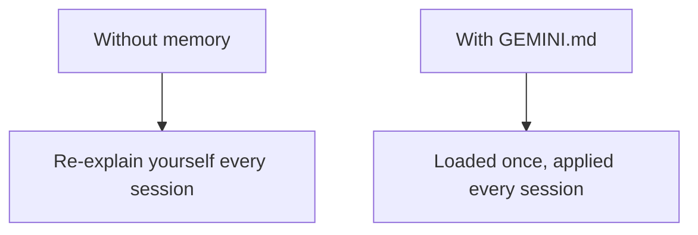

# A05: Memória com GEMINI.md

A esta altura você provavelmente redigita as mesmas coisas toda conversa: "sou iniciante", "responda de forma concisa", "uso Mac". Isso é esforço desperdiçado. Um arquivo de memória diz isso uma vez, e ele o lê no início de toda sessão automaticamente.
{: .lesson-intro }

## GEMINI.md: Suas Instruções Permanentes

`GEMINI.md` é um arquivo de texto comum que o Gemini CLI carrega ao iniciar e trata como instruções. O que você escreve ali molda toda resposta, sem você repetir. Há dois níveis:

- **Global** - `~/.gemini/GEMINI.md` na sua pasta home. Vale em todo lugar, em todo projeto.
- **Projeto** - um `GEMINI.md` na pasta de onde você inicia o `gemini`. Vale só ali. Bom para regras específicas de um trabalho.

Coloque suas preferências globais no topo ("estou aprendendo; explique de forma simples, sempre dê um exemplo, respostas curtas") e os fatos do projeto no arquivo do projeto.

## Cheque o Que Foi Carregado

Dois comandos que você vai usar:

- `/memory show` - mostra exatamente quais instruções estão carregadas agora. Use para confirmar que seu arquivo está sendo lido.
- `/memory refresh` - recarrega os arquivos depois de você editá-los, sem precisar reiniciar.

## O Que Vai Ali (e o Que Não Vai)

Bom: seu nível e preferências, como você gosta das respostas formatadas, fatos estáveis do seu ambiente, convenções do projeto.

Não ali: **segredos**. Um `GEMINI.md` é um arquivo comum que é enviado à IA, então a regra da A01 continua valendo, sem senhas, sem dados pessoais, sem detalhes de trabalho não aprovados.

Pense nele como a nota de integração que você entrega a um prestador para nunca ter que reexplicar o básico toda manhã.

## Exercício da Semana

1. Crie `~/.gemini/GEMINI.md` com três ou quatro regras de como você quer que a IA te responda (nível, tamanho, "sempre dê um exemplo", idioma).
2. Inicie o `gemini` e rode `/memory show`. Confirme que suas regras foram carregadas.
3. Faça uma pergunta e veja se a resposta realmente segue suas regras. Se não, afie o texto, rode `/memory refresh` e tente de novo.
4. Traga seu `GEMINI.md` e uma resposta antes/depois para a aula.

<h2>Pontos-chave</h2>
<ul>
<li>GEMINI.md é carregado automaticamente toda sessão, então você para de repetir</li>
<li>Global (~/.gemini/GEMINI.md) vale em todo lugar; um GEMINI.md de projeto vale naquela pasta</li>
<li>/memory show confirma o que foi carregado; /memory refresh recarrega após editar</li>
<li>Coloque preferências e regras de projeto ali, nunca segredos</li>
</ul>

