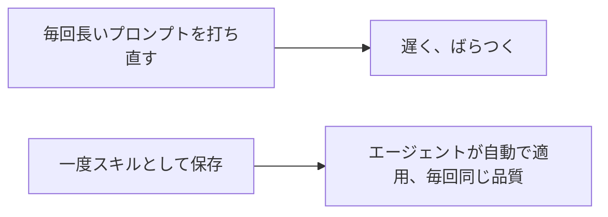

# A06: エージェントスキル

何度も打ち直しているプロンプトがいくつかあるはず、「これを初心者向けに3つの箇条書きで要約して」「このエラーをわかりやすく説明して」。スキルはそのプロンプトを一度保存し、あなたの依頼に合うたびエージェントが自分で手に取る能力にします。(他のツールではカスタムコマンドやエージェントと呼びます。Antigravityではスキルです。)
{: .lesson-intro }

## スキルは保存した能力

スキルは、中に `SKILL.md` ファイルを持つ小さなフォルダです。作業するフォルダの `.agents/skills/` に置きます:

```
.agents/skills/explain-simply/SKILL.md
```

`SKILL.md` は短いヘッダーから始まり、それから指示。重要なのは **description(説明)** で、このスキルを*いつ*手に取るかをエージェントに伝えます:

```
---
name: explain-simply
description: コード、エラー、考えを、完全な初心者にわかりやすい言葉で具体例を1つ添えて説明する。説明や簡単にするよう頼まれたときに使う。
---
対象を完全な初心者に、わかりやすい言葉で説明する。
3つの箇条書きの要約、それから具体例を1つ。
```

あとは普通に「このエラーを説明して」と頼むと、エージェントが依頼をスキルの説明と照合し、それに従います。特別なコマンドは打ちません。再利用可能な能力を作り、合うときにエージェントが使うのです。

これはあなたの `AGENTS.md`(A05)とは違います: あれはここでやること全部に常に効きます。スキルは、エージェントが関連すると判断したときだけ読み込まれるので、毎回の答えを散らかさずに専門的なスキルの小さなライブラリを作れます。



## もう一歩: MCP(存在だけ知っておく)

スキルは*プロンプトや指示*を再利用します。もしAIに本物の外部*ツール*(データベースを読む、Webサービスを呼ぶ)を使わせたくなったら、Antigravityは**MCP**(Model Context Protocol)、追加の能力を差し込む仕組みをサポートします。これはこのコースの範囲を大きく超えます。今は、後で謎にならないよう言葉が存在することだけ知っておいてください。

## 今週の演習

1. `agy` を実行するフォルダに、スキルフォルダを作る: `mkdir -p .agents/skills/explain-simply`(名前は自分のものに)。
2. その中に `SKILL.md` を作り、あなたの本物の不満を1つ解決するスキルにする(「3つの箇条書きで要約」や、上のような「わかりやすく説明」)。エージェントがいつ使うか分かるよう、説明を明確に書く。
3. 今週、それが手に取られるべき本物の依頼を3回する。`agy inspect` でスキルが読み込まれているか確認し、出力が安定して良くなるまで言い回しを磨く。
4. あなたの `SKILL.md` と実行例を1つ授業に持ってくる。

<div class="takeaways">
<h2>まとめ</h2>
<ul>
<li>スキルは保存された再利用可能な能力: .agents/skills/ の下のフォルダにある SKILL.md</li>
<li>descriptionがエージェントにいつ使うかを伝えるので、明確に書く</li>
<li>依頼が合うとエージェントが自動でスキルを読み込む、打つコマンドはない</li>
<li>MCPはAIに外部ツールを使わせる、存在を知っておき、後回しにする</li>
</ul>
</div>
