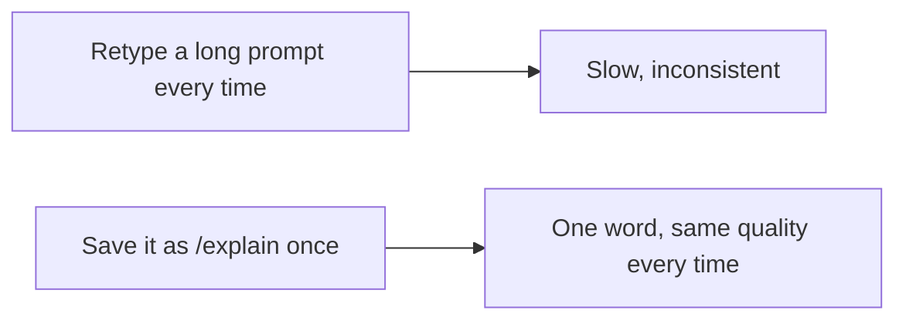

# A06: カスタムコマンド

何度も打ち直しているプロンプトがいくつかあるはず、「これを初心者向けに3つの箇条書きで要約して」「このエラーをわかりやすく説明して」。カスタムコマンドはそのプロンプトを一度保存し、いつでも呼べる短い名前を与えます。(他のツールでは「スキル」や「エージェント」と呼ぶかもしれません。Gemini CLIではカスタムコマンドです。)
{: .lesson-intro }

## コマンドは保存したプロンプト

Gemini CLIは `commands` フォルダからコマンドファイルを読みます:

- **グローバル** - `~/.gemini/commands/`(どこでも使える)。
- **プロジェクト** - `.gemini/commands/`(そのプロジェクトだけ)。

各コマンドは小さな `.toml` ファイル。**ファイル名がコマンド名になる**: `explain.toml` なら `/explain`。中身で重要なのは `prompt` フィールドです。

`~/.gemini/commands/explain.toml` を作る:

```
description = "初心者に何かを説明する"
prompt = """
次のことを、完全な初心者に、わかりやすい言葉で、
具体例を1つ添えて説明して:

{{args}}
"""
```

Gemini CLIでこう打つ:

```
/explain DNSはどう動くの
```

コマンドの後に打ったものが、保存したプロンプトの `{{args}}` に置き換わります。丁寧で再利用可能なプロンプトを一語のショートカットに変えたのです。これを少しずつ増やせば、良いプロンプトが記憶ではなくツールの中に住み始めます。



## もう一歩: MCP(存在だけ知っておく)

カスタムコマンドは*プロンプト*を再利用します。もしAIに本物の外部*ツール*(データベースを読む、Webサービスを呼ぶ)を使わせたくなったら、Gemini CLIは**MCP**(Model Context Protocol)、追加の能力を差し込む仕組みをサポートします。これはこのコースの範囲を大きく超えます。今は、後で謎にならないよう言葉が存在することだけ知っておいてください。

## 今週の演習

1. `~/.gemini/commands/` がなければ作る。
2. あなたの本物の不満を1つ解決するコマンドを作る。例えば `/summarize`(貼ったテキストを3つの箇条書きで要約)や `/explain`(上のように)。
3. 今週、本物の入力で少なくとも3回使う。出力が安定して良くなるまで保存したプロンプトを磨く。
4. あなたの `.toml` ファイルと実行例を1つ授業に持ってくる。

<div class="takeaways">
<h2>まとめ</h2>
<ul>
<li>カスタムコマンドは、短い名前を持つ、保存された再利用可能なプロンプト</li>
<li>.toml ファイルを ~/.gemini/commands/ に置く、ファイル名がコマンドになる(explain.toml → /explain)</li>
<li>{{args}} はコマンドの後に打ったものを保存プロンプトに挿入する</li>
<li>MCPはAIに外部ツールを使わせる、存在を知っておき、後回しにする</li>
</ul>
</div>
