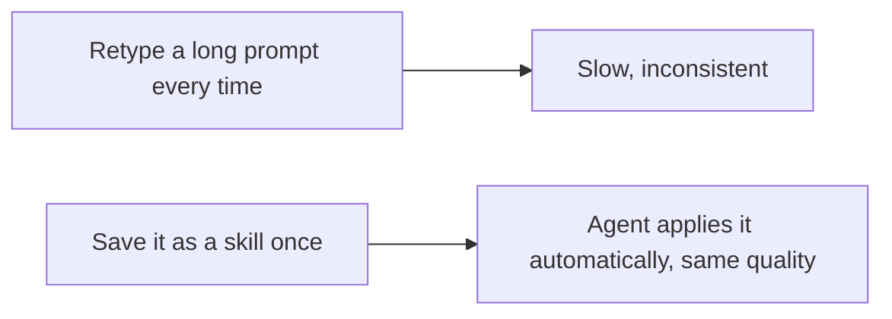

# A06: Agent Skills

You have a few prompts you keep retyping, "summarize this in three bullets for a beginner," "explain this error in plain English." A skill saves that once as a capability the agent picks up on its own, whenever your request matches. (Other tools call these custom commands or agents. Antigravity calls them skills.)
{: .lesson-intro }

## A Skill Is a Saved Capability

A skill is a small folder with a `SKILL.md` file inside. Put it in `.agents/skills/` in the folder you work in:

```
.agents/skills/explain-simply/SKILL.md
```

`SKILL.md` starts with a short header, then the instructions. The **description** is the important part, it tells the agent *when* to reach for this skill:

```
---
name: explain-simply
description: Explain code, errors, or ideas to a complete beginner in plain language with one concrete example. Use whenever the user asks to explain or simplify something.
---
Explain the thing to a complete beginner, in plain language.
Give a three-bullet summary, then one concrete example.
```

Now just ask naturally, "explain this error", and the agent notices your request matches the skill's description and follows it. You do not type a special command; you built a reusable capability and the agent uses it when it fits.

This is different from your `AGENTS.md` (A05): that is always on for everything you do here. A skill loads only when the agent decides it is relevant, so you can build a small library of specialized skills without cluttering every answer.



## One Step Further: MCP (just so you know it exists)

Skills reuse *prompts and instructions*. If you ever need the AI to use a real external *tool*, read a database, call a web service, Antigravity supports **MCP** (Model Context Protocol), a way to plug in extra abilities. That is well beyond this course. For now, just know the word exists so it is not a mystery later.

## This Week's Exercise

1. In the folder where you run `agy`, create `.agents/skills/` if it does not exist.
2. Build one skill that solves a real annoyance for you, for example a "summarize in three bullets" skill or an "explain simply" skill like above. Write a clear description so the agent knows when to use it.
3. Make three real requests this week that should trigger it. Run `agy inspect` to confirm the skill is loaded, and refine the wording until the output is consistently good.
4. Bring your `SKILL.md` and an example run to class.

<div class="takeaways">
<h2>Key Takeaways</h2>
<ul>
<li>A skill is a saved, reusable capability: a SKILL.md in a folder under .agents/skills/</li>
<li>The description tells the agent when to use the skill, so write it clearly</li>
<li>The agent loads a skill automatically when your request matches, no command to type</li>
<li>MCP lets the AI use external tools; know it exists, leave it for later</li>
</ul>
</div>
