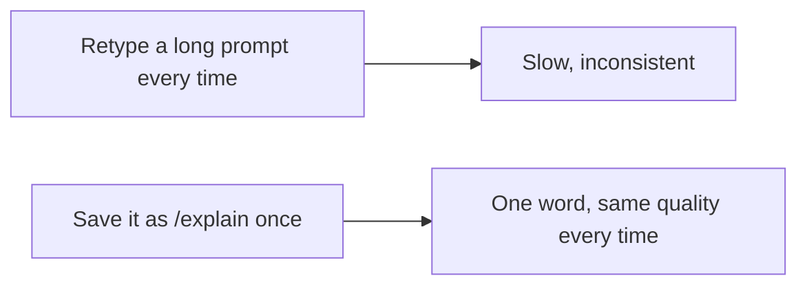

# A06: Comandos Personalizados

Você tem alguns prompts que fica redigitando, "resuma isto em três tópicos para um iniciante", "explique este erro em linguagem simples". Um comando personalizado salva esse prompt uma vez e dá a ele um nome curto que você chama quando quiser. (Você pode ouvir chamarem isso de "skills" ou "agents" em outras ferramentas. No Gemini CLI são comandos personalizados.)
{: .lesson-intro }

## Um Comando é um Prompt Salvo

O Gemini CLI lê arquivos de comando de uma pasta `commands`:

- **Global** - `~/.gemini/commands/` (disponível em todo lugar).
- **Projeto** - `.gemini/commands/` (só naquele projeto).

Cada comando é um pequeno arquivo `.toml`. O **nome do arquivo vira o nome do comando**: `explain.toml` te dá `/explain`. Dentro, o importante é o campo `prompt`.

Crie `~/.gemini/commands/explain.toml`:

```
description = "Explicar algo para um iniciante"
prompt = """
Explique o seguinte para um iniciante total, em linguagem simples,
com um exemplo concreto:

{{args}}
"""
```

Agora no Gemini CLI digite:

```
/explain como funciona o DNS
```

O que você digita depois do comando substitui o `{{args}}` no prompt salvo. Você acabou de transformar um prompt cuidadoso e reutilizável num atalho de uma palavra. Monte uma pequena biblioteca deles e seus bons prompts param de morar na sua memória e passam a morar na sua ferramenta.



## Um Passo Além: MCP (só para você saber que existe)

Comandos personalizados reutilizam *prompts*. Se um dia você precisar que a IA use uma *ferramenta* externa de verdade, ler um banco de dados, chamar um serviço web, o Gemini CLI suporta **MCP** (Model Context Protocol), um jeito de plugar habilidades extras. Isso está bem além deste curso. Por ora, só saiba que a palavra existe para não ser um mistério depois.

## Exercício da Semana

1. Crie `~/.gemini/commands/` se não existir.
2. Monte um comando que resolva um incômodo real seu, por exemplo `/summarize` (resumir texto colado em três tópicos) ou `/explain` (como acima).
3. Use pelo menos três vezes esta semana com entradas reais. Refine o prompt salvo até a saída ficar consistentemente boa.
4. Traga seu arquivo `.toml` e um exemplo de uso para a aula.

<div class="takeaways">
<h2>Pontos-chave</h2>
<ul>
<li>Um comando personalizado é um prompt salvo e reutilizável com um nome curto</li>
<li>Coloque um arquivo .toml em ~/.gemini/commands/; o nome do arquivo vira o comando (explain.toml → /explain)</li>
<li>{{args}} insere o que você digita depois do comando no prompt salvo</li>
<li>MCP deixa a IA usar ferramentas externas; saiba que existe, deixe para depois</li>
</ul>
</div>
