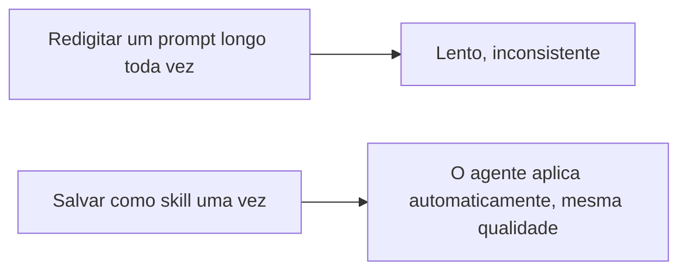

# A06: Agent Skills

Você tem alguns prompts que fica redigitando, "resuma isto em três tópicos para um iniciante", "explique este erro em linguagem simples". Uma skill salva esse prompt uma vez como uma capacidade que o agente busca sozinho, sempre que seu pedido combinar. (Outras ferramentas chamam isso de comandos personalizados ou agents. O Antigravity chama de skills.)
{: .lesson-intro }

## Uma Skill é uma Capacidade Salva

Uma skill é uma pequena pasta com um arquivo `SKILL.md` dentro. Coloque em `.agents/skills/` na pasta onde você trabalha:

```
.agents/skills/explain-simply/SKILL.md
```

O `SKILL.md` começa com um cabeçalho curto, depois as instruções. A **description (descrição)** é a parte importante, ela diz ao agente *quando* buscar esta skill:

```
---
name: explain-simply
description: Explicar código, erros ou ideias para um iniciante total em linguagem simples com um exemplo concreto. Use sempre que o usuário pedir para explicar ou simplificar algo.
---
Explique a coisa para um iniciante total, em linguagem simples.
Dê um resumo em três tópicos, depois um exemplo concreto.
```

Agora é só pedir naturalmente, "explique este erro", e o agente percebe que seu pedido combina com a description da skill e a segue. Você não digita um comando especial; você montou uma capacidade reutilizável e o agente a usa quando encaixa.

Isso é diferente do seu `AGENTS.md` (A05): aquele está sempre ligado para tudo o que você faz aqui. Uma skill carrega só quando o agente decide que é relevante, então você pode montar uma pequena biblioteca de skills especializadas sem entulhar toda resposta.



## Um Passo Além: MCP (só para você saber que existe)

Skills reutilizam *prompts e instruções*. Se um dia você precisar que a IA use uma *ferramenta* externa de verdade, ler um banco de dados, chamar um serviço web, o Antigravity suporta **MCP** (Model Context Protocol), um jeito de plugar habilidades extras. Isso está bem além deste curso. Por ora, só saiba que a palavra existe para não ser um mistério depois.

## Exercício da Semana

1. Na pasta onde você roda o `agy`, crie a pasta da skill: `mkdir -p .agents/skills/explain-simply` (use seu próprio nome).
2. Dentro dela, crie o `SKILL.md` para uma skill que resolva um incômodo real seu (uma de "resumir em três tópicos" ou de "explicar de forma simples" como acima). Escreva uma description clara para o agente saber quando usar.
3. Faça três pedidos reais esta semana que devem acioná-la. Rode `agy inspect` para confirmar que a skill está carregada, e refine o texto até a saída ficar consistentemente boa.
4. Traga seu `SKILL.md` e um exemplo de uso para a aula.

<div class="takeaways">
<h2>Pontos-chave</h2>
<ul>
<li>Uma skill é uma capacidade salva e reutilizável: um SKILL.md numa pasta sob .agents/skills/</li>
<li>A description diz ao agente quando usar a skill, então escreva com clareza</li>
<li>O agente carrega a skill automaticamente quando seu pedido combina, sem comando para digitar</li>
<li>MCP deixa a IA usar ferramentas externas; saiba que existe, deixe para depois</li>
</ul>
</div>
