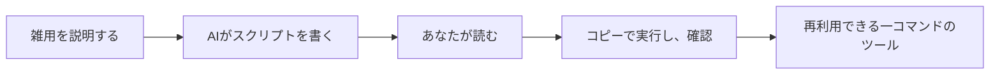

# A07: AIでスクリプトを作って実行する

スクリプトは、コンピュータが順番に実行してくれる、ターミナルコマンドの保存されたリストです。手作業で数回以上やることは何でも候補になります。AIはスクリプトを書くのがとても得意で、スクリプトの*中で*動くこともできます。ここでアシスタントは質問に答えるのをやめ、仕事をし始めます。
{: .lesson-intro }

## AIにスクリプトを書かせる

雑用を説明し、スクリプトを頼む。例えば: *「現在のフォルダのすべての `.jpg` を `photo-1.jpg`、`photo-2.jpg` のように名前変更するシェルスクリプトを書いて。」* 小さなスクリプトが返ってきます。

そしてA01のルールを適用、**実行する前に読む**:

- 各行を読み、わからないところはAIに説明させる。
- **コピー**で実行する、唯一のファイルでは決してやらない。まずテスト用フォルダを作る。
- 実際に何が起きるか見て、`ls` で結果を確認する。

ファイルの名前変更や削除をするスクリプトは、正しかろうと間違っていようと、書いてある通りに実行します。「AIが書いた」を「安全」と扱うのが、このコース全体が防ごうとしている間違いです。

## スクリプトの中からAIを呼ぶ

Antigravity CLIには**ヘッドレス**モードがあります: `agy` に `-p` とプロンプトを渡すと、チャットせず答えをそのままターミナルに出力します。つまりスクリプトが一つのステップとして使えます:

```
cat notes.txt | agy -p "3つの箇条書きで要約して"
```

別のプログラムが結果を読む必要があるときは `--output-format json` を足す。これで「このフォルダの新しいファイルを全部要約する」のようなものが作れます、AIはより大きなレシピの中の一つのコマンドです。



## 付録: 無人で実行する(任意・上級)

スクリプトを自動で走らせるようスケジュールできます、Mac/Linuxでは `cron`、WindowsではTask Scheduler。ただし知っておくべき落とし穴があります: A02のGoogleログインはブラウザに人間がいることを前提とするので、あなたが寝ている間に走るスクリプトはうまくカバーできません。`agy` をスケジュールで自動化するには非対話の認証情報が必要で、これは別の、より上級のセットアップです。

コースでは必要ありません、手で実行するものはすべて無料ログインで動きます。ただ「自分で実行する」と「永久に自動で実行する」は2つの違うセットアップだと知っておいてください。

## 今週の演習

1. 小さな本物の雑用を選ぶ(ファイルの名前変更、フォルダの整理、テキストファイルの要約)。
2. AIにそれ用のスクリプトを書かせる。スクリプトを読み、追えない行はAIに説明させる。
3. コピーを入れたテスト用フォルダを作り、そこでスクリプトを実行する。結果を確認する。
4. スクリプトと、信頼する前に何を確認したかを1文、授業に持ってくる。

<div class="takeaways">
<h2>まとめ</h2>
<ul>
<li>スクリプトは繰り返しの雑用を一つのコマンドに変える、AIはうまく書く</li>
<li>スクリプトは必ず読み、信頼する前にコピーで実行する、「AIが書いた」は「安全」ではない</li>
<li>ヘッドレスモード(agy -p "...")でスクリプトがAIを一ステップとして呼べる</li>
<li>手で実行するなら無料ログイン、無人のスケジュール実行には別の非対話のセットアップが必要</li>
</ul>
</div>
