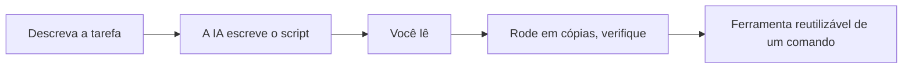

# A07: Criando e Rodando Scripts com IA

Um script é uma lista salva de comandos de terminal que o computador roda para você em ordem. Qualquer coisa que você faz na mão mais de algumas vezes é candidata. A IA é muito boa em escrever scripts, e também pode rodar *dentro* de um. É aqui que o assistente para de responder perguntas e começa a fazer o trabalho.
{: .lesson-intro }

## Deixe a IA Escrever o Script

Descreva a tarefa; peça um script. Por exemplo: *"Escreva um shell script que renomeie todo `.jpg` na pasta atual para `photo-1.jpg`, `photo-2.jpg`, e assim por diante."* Você recebe um script pequeno.

Depois aplique a regra da A01, **leia antes de rodar**:

- Leia cada linha e peça à IA para explicar qualquer coisa que você não entenda.
- Rode em **cópias**, nunca nos seus únicos arquivos. Crie uma pasta de teste primeiro.
- Veja o que realmente acontece e cheque o resultado com `ls`.

Um script que renomeia ou apaga arquivos faz exatamente o que diz, certo ou errado. Tratar "a IA escreveu" como "é seguro" é o erro que este curso inteiro tenta evitar.

## Chame a IA de Dentro de um Script

O Antigravity CLI tem um modo **headless**: dê ao `agy` um `-p` com um prompt e ele imprime a resposta direto no terminal em vez de conversar. Isso significa que um script pode usá-lo como um passo:

```
cat notes.txt | agy -p "Resuma isto em três tópicos"
```

Adicione `--output-format json` quando outro programa precisa ler o resultado. Agora você pode montar coisas como "resuma todo arquivo novo nesta pasta", a IA é um comando dentro de uma receita maior.



## Apêndice: Rodando sem Supervisão (opcional, avançado)

Você pode agendar scripts para rodarem sozinhos, `cron` no Mac/Linux, Task Scheduler no Windows. Mas há uma pegadinha que vale saber: o login do Google da A02 espera um humano no navegador, então ele não cobre bem um script rodando enquanto você dorme. Automatizar o `agy` num agendamento precisa de credenciais não-interativas, uma configuração separada e mais avançada.

Você não precisa disso no curso, tudo o que você roda na mão funciona com o login gratuito. Só saiba que "rodar eu mesmo" e "rodar automaticamente para sempre" são duas configurações diferentes.

## Exercício da Semana

1. Escolha uma tarefa pequena e real (renomear arquivos, arrumar uma pasta, resumir um arquivo de texto).
2. Peça à IA para escrever um script para isso. Leia o script e peça à IA para explicar qualquer linha que você não acompanhe.
3. Crie uma pasta de teste com cópias e rode o script ali. Verifique o resultado.
4. Traga o script, e uma frase sobre o que você checou antes de confiar nele, para a aula.

<div class="takeaways">
<h2>Pontos-chave</h2>
<ul>
<li>Um script transforma uma tarefa repetida em um comando; a IA os escreve bem</li>
<li>Sempre leia um script e rode em cópias antes de confiar, "a IA escreveu" não é "é seguro"</li>
<li>Modo headless (agy -p "...") deixa um script chamar a IA como um passo</li>
<li>Rodar na mão usa o login gratuito; agendamento sem supervisão precisa de uma configuração separada e não-interativa</li>
</ul>
</div>
