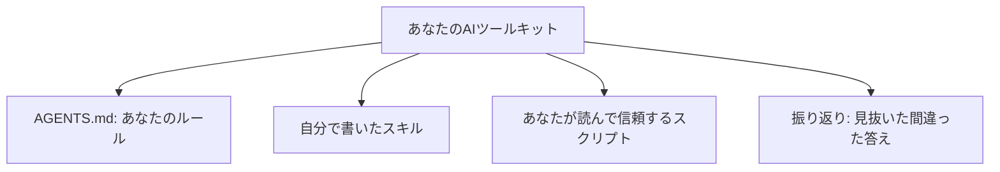

# A08: 集大成: あなたのAIツールキット

アシスタントのインストール、うまく聞くこと、コンテキストを与えること、メモリを持たせること、スキルを保存すること、スクリプトを書くこと、すべて一つのルールの下で学びました: 大いに使い、決して信頼しない。集大成はアプリではありません。あなた自身の調整されたツールキットと、それを安全に使う判断力の証明です。シェフのナイフロールを思い浮かべて: 一番豪華な厨房ではなく、自分の道具を、自分の働き方に合わせて研いだもの。
{: .lesson-intro }

## 作るもの

4つのパーツ、それぞれすでにやったレッスンから:

- **`AGENTS.md`** に常設ルール(A05)。AIがデフォルトで*あなたの*望む答え方をするようにする。
- **本当に使うスキル**を1つ(A06)。デモではなく、本当に時間を節約するもの。
- **AIに手伝ってもらって書いたスクリプト**を1つ(A07)、役に立ち、あなたが読んで理解したもの。手で実行でOK。
- **書いた振り返り**(A01): AIが*自信満々に間違えた*本物の一回、何を主張し、どう見抜いたか。これが最も重要なパーツ。

## 発表のしかた

ツールキットを見せ、各パーツを説明する: 何をするか、なぜ作ったか、どう使うか。それから見抜いた間違いの話をする、その話が肝心です。誰でもツールは動かせる。あなたは、動かせる*と同時に*主導権を握れることを証明しています。

## 次にどこへ

これで基礎ができました。自分での自然な次の一歩:

- 繰り返すプロンプトに気づいたら、スキルライブラリを増やす。
- スクリプトが楽になるよう、ターミナルをもう少し学ぶ。
- AI提供元のデータとプライバシー規約を、一度きちんと読む。
- 数ヶ月後に[R20: AIを決して信頼するな](r20.html)を読み返す。これらのツールに実際に時間を使うと、違って読めます。

## 今週の演習(集大成)

1. `AGENTS.md`、スキル1つ、スクリプト1つを仕上げる。それぞれ動くことを確認する。
2. 振り返りを書く: 間違ったAIの答えと、どう見抜いたか。正直に数文。
3. ツールキットをグループに発表する。答えられるように: 「これを誰かがどう悪用しうるか、どう防ぐか?」

<h2>まとめ</h2>
<ul>
<li>成果物は個人のツールキット: AGENTS.md、スキル、理解しているスクリプト</li>
<li>最も重要なパーツは、AIの間違いを見抜けるという証明</li>
<li>大いに使い、決して信頼しない、その心構えが持ち帰る本当のスキル</li>
<li>作り続ける: スキルを増やし、ターミナルをもっと学び、プライバシー規約を読む</li>
</ul>

