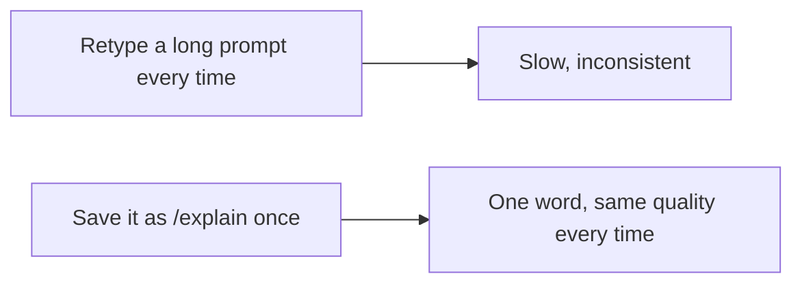

# A08: Custom Commands

You have a few prompts you keep retyping, "summarize this in three bullets for a beginner," "explain this error in plain English." A custom command saves that prompt once and gives it a short name you can call any time. (You may hear these called "skills" or "agents" in other tools. In Gemini CLI they are custom commands.)
{: .lesson-intro }

## A Command Is a Saved Prompt

Gemini CLI reads command files from a `commands` folder:

- **Global** - `~/.gemini/commands/` (available everywhere).
- **Project** - `.gemini/commands/` (only in that project).

Each command is a small `.toml` file. The **filename becomes the command name**: `explain.toml` gives you `/explain`. Inside, the important part is a `prompt` field.

Create `~/.gemini/commands/explain.toml`:

```
description = "Explain something to a beginner"
prompt = """
Explain the following to a complete beginner, in plain language,
with one concrete example:

{{args}}
"""
```

Now in Gemini CLI type:

```
/explain how does DNS work
```

Whatever you type after the command replaces `{{args}}` in the saved prompt. You just turned a careful, reusable prompt into a one-word shortcut. Build a small library of these and your good prompts stop living in your memory and start living in your tool.



## One Step Further: MCP (just so you know it exists)

Custom commands reuse *prompts*. If you ever need the AI to use a real external *tool*, read a database, call a web service, Gemini CLI supports **MCP** (Model Context Protocol), a way to plug in extra abilities. That is well beyond this course. For now, just know the word exists so it is not a mystery later.

## This Week's Exercise

1. Create `~/.gemini/commands/` if it does not exist.
2. Build one command that solves a real annoyance for you, for example `/summarize` (summarize pasted text in three bullets) or `/explain` (like above).
3. Use it at least three times this week on real inputs. Refine the saved prompt until the output is consistently good.
4. Bring your `.toml` file and an example run to class.

<div class="takeaways">
<h2>Key Takeaways</h2>
<ul>
<li>A custom command is a saved, reusable prompt with a short name</li>
<li>Put a .toml file in ~/.gemini/commands/; the filename becomes the command (explain.toml to /explain)</li>
<li>{{args}} inserts whatever you type after the command into the saved prompt</li>
<li>MCP lets the AI use external tools; know it exists, leave it for later</li>
</ul>
</div>
