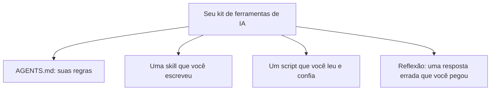

# A08: Projeto Final: Seu Kit de Ferramentas de IA

Você aprendeu a instalar o assistente, perguntar bem, dar contexto, dar memória, salvar skills e programar com ele, tudo sob uma regra: use muito, confie nunca. O projeto final não é um app. É seu próprio kit ajustado mais a prova de que você tem o julgamento para usá-lo com segurança. Pense no estojo de facas de um chef: não a cozinha mais chique, seu próprio conjunto, afiado do jeito que você trabalha.
{: .lesson-intro }

## O Que Você Monta

Quatro peças, cada uma de uma aula que você já fez:

- **Um `AGENTS.md`** com suas regras permanentes (A05). Deve fazer a IA responder do jeito que *você* quer por padrão.
- **Uma skill** que você realmente usa (A06). Não uma demonstração, algo que te economiza tempo de verdade.
- **Um script** que a IA te ajudou a escrever (A07), que faz algo útil e que você leu e entendeu. Rodar na mão está ok.
- **Uma reflexão escrita** (A01): uma vez real em que você pegou a IA *errando com confiança*, o que ela afirmou e como você percebeu. Esta é a peça mais importante.

## Como Apresentar

Mostre seu kit e passe por cada peça: o que faz, por que você fez, como usa. Depois conte a história do erro que você pegou, essa história é o ponto. Qualquer um consegue rodar uma ferramenta. Você está provando que consegue rodá-la *e* continuar no comando dela.

## Para Onde Ir Depois

Agora você tem a base. Próximos passos naturais, por conta própria:

- Aumente sua biblioteca de skills conforme perceber prompts repetidos.
- Aprenda um pouco mais de terminal para scripts ficarem fáceis.
- Leia os termos de dados e privacidade do seu provedor de IA uma vez, direito.
- Releia [R20: Nunca Confie numa IA](r20.html) daqui a alguns meses. Lê-se diferente depois de horas reais com essas ferramentas.

## Exercício da Semana (o projeto final)

1. Finalize seu `AGENTS.md`, uma skill e um script. Garanta que cada um funciona.
2. Escreva sua reflexão: a resposta errada da IA e como você percebeu. Algumas frases honestas.
3. Apresente seu kit para o grupo. Esteja pronto para responder: "como alguém poderia usar isto errado, e como você evita?"

<h2>Pontos-chave</h2>
<ul>
<li>O resultado é um kit pessoal: um AGENTS.md, uma skill e um script que você entende</li>
<li>A peça mais importante é a prova de que você pega a IA errando</li>
<li>Use muito, confie nunca, essa mentalidade é a habilidade real que você leva</li>
<li>Continue construindo: aumente suas skills, aprenda mais terminal, leia os termos de privacidade</li>
</ul>

