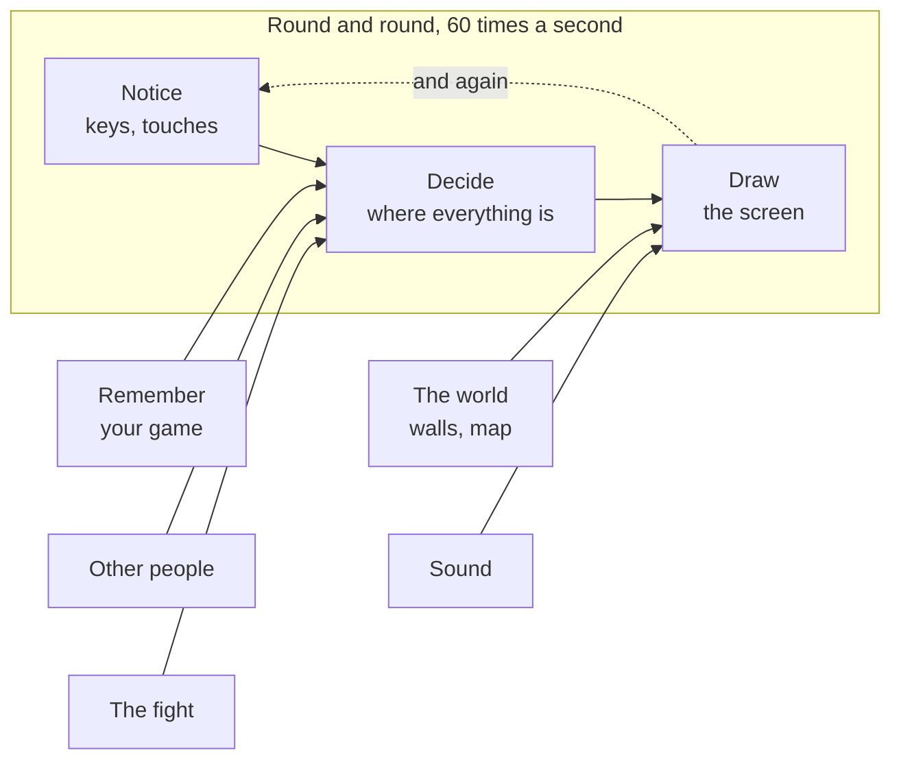

# A09: ツールを準備する

これはゲームの始まりです。このステップの終わりには、あなたのコンピューター上に、あなたに挨拶するウェブページができあがります。そして、それを変更して保存すると、ページは自動的に更新されます。
{: .lesson-intro }

作り始める前に、できあがったゲームで遊んでみましょう。[online.kakkoi.dev](https://online.kakkoi.dev) を開いて、実際に歩き回ってみてください。これから作るのは、あの動きを小さなボックス一つずつで組み立てたものです。中のコードが気になる人へ。完成したコードは GitHub にあります。[KakkoiSchool/kakkoi-online](https://github.com/KakkoiSchool/kakkoi-online)

**前提:** [A01–A08](a08.html)。 **得られるもの:** 動作するセットアップと最初のページ。

## ゲーム全体と今日の部分

この図は、すべてのステップの冒頭に表示されます。ゲームの各部分はこれらのボックスの1つです。今日のボックスはあなたが作業する部分であり、緑色の部分はすでに構築済みです。



まだ何も緑色ではありません。それがこの図のポイントです。あなたはこれからかなり大きなものを作ろうとしていますが、それは小さなボックスで構成されています。それらを一つずつ作っていきます。

## ブロックに分割する

セットアップは3つの要素からなり、それぞれが1つの役割を果たします。

1. **アシスタント** がコードを書く
2. **エディタ** がコードを表示し、読み書きできるようにする
3. **ブラウザ** が結果を表示する

これら3つすべてを同時に開いておく必要があります。これが全体の考え方であり、今後は「質問し、見て、確認する」という方法で作業を進めます。

なぜ少なくないのか？ 何か問題が起きたとき、3つのうちの*どれ*が間違っているのかを知る必要があるからです。アシスタントが何かおかしなものを書いたのか？ エディタで確認します。エディタはそれを保存したのか？ ブラウザで確認します。3つの別々のウィンドウは、3つの別々の確認場所を意味します。

## ブロック1：アシスタント

これは[A02](a02.html)でインストールしました。ターミナルを開いて、まだ動作するか確認してください。

```
agy
```

それでアシスタントが開けば完了です。開かない場合は、[A02](a02.html)に戻ってください。

> どんなAIアシスタントでも、このプロジェクト全体で機能します。これらのステップのすべてのプロンプトは平易な英語です。`agy` を使用するのは、それが無料で、すでに持っているからです。

## ブロック2：エディタ

コードを書くための無料プログラムである **VS Code** をインストールしてください: [code.visualstudio.com](https://code.visualstudio.com/)。

ゲーム用のフォルダを作成します。`kakkoi-online` という名前にしてください。VS Codeでそれを開きます: **ファイル → フォルダを開く**。

## ブロック3：ブラウザのページ

ウェブページは、ただ開くだけでなく、ブラウザに*提供される*必要があります。これには理由があり、[A18](a18.html)で詳しく説明します。今のところ、1つの拡張機能がこれを代行してくれます。

VS Codeで、左側のバーにある**拡張機能**アイコンをクリックし、**Live Server** を検索してインストールしてください。

次に、フォルダ内に2つのファイルを作成します。

`index.html`:

```
<!doctype html>
<html lang="en">
<head>
  <meta charset="utf-8">
  <title>Kakkoi Online</title>
</head>
<body>
  <h1 id="greeting">…</h1>
  <script src="main.js"></script>
</body>
</html>
```

`main.js`:

```
const name = 'Kakkoi';

document.querySelector('#greeting').textContent = `Hello, ${name}!`;
```

`index.html` を右クリックし、**Open with Live Server** を選択します。ブラウザが開き、「**Hello, Kakkoi!**」と表示されます。

次に、`Kakkoi` を自分の名前に変更してファイルを保存してください。**ブラウザは自動的に更新されます。** あなたはリロードしていません。Live Serverがフォルダを監視しているからです。

この「変更し、保存し、確認する」というループが、プロジェクトの残りの部分の基盤となります。

## なぜこの方法をとったのか

エディタとブラウザを並べて表示するのは、考えられる限り最もシンプルなセットアップです。ターミナルでインストールするものも、コンパイルするものも、古くなる可能性のあるものもありません。あなたが書くものはすべて、ブラウザが直接読み取れるファイルです。

## 代わりにできたこと

| これの代わりに | どのような代償があるか |
|---|---|
| `index.html` をダブルクリックするだけ | 今のところは動作しますが、コードが大きくなった瞬間に動作しなくなります。ブラウザは、どこから来たか分からないページ上の一部のものをブロックするためです。正しい方法で始める方が良いでしょう。 |
| コードを別のコードに変換するビルドツール | インストールするプログラムが増え、壊れる可能性のあるものが増え、ブラウザで実行されているコードはもはやあなたが書いたコードではなくなります。このサイズのゲームには価値がありません。 |
| GodotやUnityのようなゲームエンジン | 多くのものを無料で手に入れることができます。しかし、それがどのように機能するかを学ぶ代わりに、そのエンジンを学ぶことになり、ゲームをリンクとして送ることができなくなります。 |

## 大きな変更を行う前にフォルダをコピーする

まだ「元に戻す」機能がありません。アシスタントが5つのファイルを書き換えてめちゃくちゃにしてしまった場合、元に戻る方法がありません。

したがって、当面の間は1つのルールがあります: **アシスタントに大きな変更を依頼する前に、プロジェクトフォルダ全体をコピーし、コピーに日付を付けてください。** `kakkoi-online-aug-16` のように。不格好ですが、機能します。

[A18](a18.html)で、この問題に対する本当の解決策を学びます。それを必要とした後に、より理解できるようになるでしょう。

## プロンプト

```
I have index.html with an <h1 id="greeting"> and main.js that sets its text.
Change main.js so the greeting also shows the time right now, and updates
every second. Explain each new line to me like I have never seen it before.
```

**出力の確認点:** 時刻は本当に毎秒変わるか、それともページが読み込まれたときの時刻を表示するだけか？ 追加された内容を説明したか、それともコードを貼り付けただけか？ もし理解できない行があれば、その行について質問してください。それはごく普通のことであり、あなたが遅れているという兆候ではありません。

## 動作を確認する


次のものが揃っているはずです: ターミナルにアシスタント、VS Codeで開かれた `main.js`、そしてブラウザで表示されたあなたのページ。名前を変更し、保存し、ブラウザが変化するのを確認してください。

## ゲームに取り込む

これこそがゲームです。あなたが作成したフォルダは、すべてのステップで構築を続けるものになります。移動するものはありません。

<div class="takeaways">
<h2>重要なポイント</h2>
<ul>
<li>3つのウィンドウ: アシスタントが書き、エディタが見せ、ブラウザがそれを証明する</li>
<li>3つの別々のウィンドウは、問題が発生したときに確認すべき3つの別々の場所を意味する</li>
<li>Live Serverはフォルダを提供し、保存時にページをリロードする</li>
<li>大きな変更を行う前にフォルダをコピーすること — A18までは「元に戻す」機能がない</li>
<li>すべての行を理解する必要はないが、理解できない行については質問する必要がある</li>
</ul>
</div>

## あなたの番

ページで2つの言語で同時に挨拶するようにしてください。アシスタントを使わずに自分でやってみましょう。これは小さな変更ですが、手作業で行うことで、どの部分を実際に理解したかを知ることができます。
