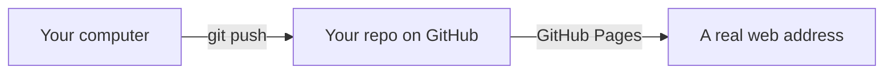

# A09: ゲームを構築する: ツールを入手する

あなたはAIアシスタントと会話できるようになり（[A02](a02.html)）、盲目的に信用してはいけないことも知っています（[A01](a01.html)）。さあ、それを使って本物のもの、つまり他の人が実際にプレイできる小さなオンラインゲームを1つ作りましょう。今日は設定のみです。新しいアカウントを1つ作成し、空のフォルダーを用意するだけです。他には何もありません。
{: .lesson-intro }

## 何を構築するのか

**カッコー・オンライン**というゲームです。あなたはモンスターとして小さな世界を歩き回ります。他のプレイヤーも同じ世界を歩き回ります。彼らと話したり、決闘したりできます。火、水、土の属性があり、水は火に勝ち、火は土に勝ち、土は水に勝ちます。

奇妙な点、そしてこのプロジェクトに時間を費やす価値がある理由：**サーバーがありません。** あなたのブラウザは他のプレイヤーのブラウザと直接通信します。支払うものも、実行するものも、維持するものもありません。永遠にゼロコストです。

これらのレッスンで構築するバージョンはこちらです: [online.kakkoi.dev](https://online.kakkoi.dev)

次のレッスンの終わりまでに、**あなた自身のコピーが独自のウェブアドレスを持ち**、誰にでも送れるようになります。

## プログラマーに必要な2つのこと

1つは記述を助けるもの、もう1つは他の人が見られる場所に作業を保存するものです。

| もの | 用途 |
|---|---|
| AIアシスタント（A02の`agy`） | あなたと一緒にコードを書き、コードを説明し、壊れたものを修正します |
| GitHubアカウント | 作業の全バージョンを保持し、無料でインターネット上に公開します |

1つ目はA02で既に持っています。今日、2つ目を追加します。

## あなたのアシスタント

あなたはすでに1つ持っています: [A02](a02.html)でインストールしたAntigravity CLI、**`agy`**です。それは無料で、ログイン済みであり、これらのレッスンで使用するものです。新しくインストールするものはありません。

それがまだ動作するか確認してください:

```
agy --version
```

このプロジェクトの新しい習慣の1つ: ホームフォルダーではなく、**プロジェクトフォルダー内で起動してください**。ファイルを見ることができるアシスタントは、コードを変更する前にそれを読み取ることができ、それが助けと当て推量の違いです。

> 他のものを使っていますか？問題ありません。このプロジェクトのすべてのプロンプトは平易な英語であり、Claude Code、Copilotなど、お好きなどのアシスタントでも動作します。レッスンで「アシスタントに尋ねる」と指示されたら、お持ちのアシスタントを使用してください。有料のアシスタントは多数のファイルにわたる大きな変更をより良く処理しますが、このゲームを完成させるのにそれらは必要ありません。

## あなたのGitHubアカウント

GitHubはコードが存在する場所です。共有の棚と考えてください。あなたの作業のすべてのバージョンが保存され、何も失われず、棚に置いたものはすべて無料でウェブサイトとして公開できます。

1. [github.com](https://github.com)にアクセスしてサインアップしてください。**13歳以上である必要があります** — これはGitHubの利用規約にあるルールです。
2. 雇用主が見ても問題ないようなユーザー名を選んでください。それがあなたのゲームのウェブアドレスの一部になります。
3. GitHubコマンドラインツールをインストールし、ログインしてください:

```
sudo apt install gh          # WSL / Ubuntu, from A01
brew install gh              # macOS
```

```
gh auth login
```

**GitHub.com**を選択し、次に**SSH**、そして**Login with a web browser**を選択し、表示されたコードを貼り付けてください。

gitにあなたが誰であるかを伝え、あなたの作業にあなたの名前が記されるようにします:

```
git config --global user.name "Your Name"
git config --global user.email "you@example.com"
```

> **あなたのリポジトリは公開されます。** GitHubでの無料ウェブサイトホスティングは公開コードでのみ機能するため、誰でもそれを読むことができます。これは、人々にあなたのゲームを見せるのに良いことです。また、ニックネームを使用し、本名をフルで使わないこと、そしてあなたの住所、学校、電話番号をコードに決して入れないことを意味します。

## あなたの空のリポジトリ

**リポジトリ**とは、あるプロジェクトのフォルダーで、その完全な履歴が含まれます。作成しましょう:

```
gh repo create kakkoi-online --public --clone
cd kakkoi-online
```

これで終わりです。インターネット上に存在する空のフォルダーです。

**なぜ空なのか？** 私たちの完成したゲームを1つのコマンドでコピーすることもできます。しかし、それでは説明できないゲームを所有することになり、それは何の価値もありません。あなたはそれを少しずつ構築し、*あなたの*リポジトリが*あなたの*コードを保持します。

後で詰まったら？私たちのバージョンは公開されています: [github.com/KakkoiSchool/kakkoi-online](https://github.com/KakkoiSchool/kakkoi-online)。各レッスンにはブラウザで読めるスナップショットが残されているので、私たちのファイルとあなたのファイルを比較できます。試した後で見てください、その前ではありません。



## アシスタントに尋ねる

初めての実際のプロンプトです。行動だけでなく、説明も求めている点に注目してください:

```
I just created an empty git repo called kakkoi-online. Add a README.md that says
in two sentences what the project will be: a small top-down multiplayer browser
game with no server, where players duel with fire, water and earth. Then show me
the exact git commands to commit and push it, and explain what each one does.
```

**出力を確認してください:** READMEは実際に後で存在しますか（`ls`）？アシスタントが示したコマンドは、それがすると言ったことと一致しますか？もし存在しないコマンドを発明した場合、あなたは初日に[A01](a01.html)で警告されたことを見たばかりです。

## 今週の演習

1. `agy --version`が動作することを確認し、プロジェクトフォルダー内で起動してください。
2. GitHubアカウントを作成し、`gh auth login`を実行してください。
3. 空の`kakkoi-online`リポジトリを作成してください。
4. 上記のプロンプトを使用してREADMEを作成し、プッシュしてください。
5. リポジトリのリンクをチャンネルに投稿してください。来週、それがライブウェブサイトになります。

**動作確認:** `gh repo view --web`でブラウザでリポジトリが開き、READMEが存在することを確認してください。

<div class="takeaways">
<h2>重要なポイント</h2>
<ul>
<li>プログラマーは、コードを書くためのものと、作業を保存するための場所が必要です</li>
<li>GitHubは13歳以上である必要があります。これはこのプロジェクトにおける唯一のアカウントルールです</li>
<li>無料ホスティングは公開リポジトリを意味します: ニックネームを使用し、個人情報をコードに入れないでください</li>
<li>空のリポジトリから始めましょう。完成したゲームをコピーしても、説明できないコードしか手に入りません</li>
<li>詰まった場合は私たちのバージョンが公開されています。試した後で読んでください、その前ではありません</li>
</ul>
</div>
