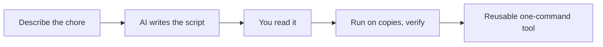

# A09: Making & Running Scripts with AI

A script is a saved list of terminal commands the computer runs for you in order. Anything you do by hand more than a few times is a candidate. The AI is very good at writing scripts, and it can also run *inside* one. This is where the assistant stops answering questions and starts doing work.
{: .lesson-intro }

## Let the AI Write the Script

Describe the chore; ask for a script. For example: *"Write a shell script that renames every `.jpg` in the current folder to `photo-1.jpg`, `photo-2.jpg`, and so on."* You get back a small script.

Then apply the A01 rule, **read it before you run it**:

- Read each line and ask the AI to explain anything you do not understand.
- Run it on **copies**, never your only files. Make a test folder first.
- Watch what actually happens and check the result with `ls`.

A script that renames or deletes files does exactly what it says, correct or not. Treating "the AI wrote it" as "it is safe" is the mistake this whole course is trying to prevent.

## Call the AI From a Script

Gemini CLI has a **headless** mode: give it `-p` with a prompt and it prints the answer straight to the terminal instead of chatting. That means a script can use it as a step:

```
cat notes.txt | gemini -p "Summarize this in three bullets"
```

Add `--output-format json` when another program needs to read the result. Now you can build things like "summarize every new file in this folder", the AI is one command in a larger recipe.



## Appendix: Running Unattended (optional, advanced)

You can schedule scripts to run on their own, `cron` on Mac/Linux, Task Scheduler on Windows. But there is a catch worth knowing: the free Google login from A04 needs a human at the browser, so it does **not** work for a script running while you are asleep. Unattended runs need an **API key** (`GOOGLE_API_KEY`, from Google AI Studio) set as an environment variable so the AI can authenticate on its own.

You do not need this for the course, everything you run by hand works with the free login. Just know that "run it by myself" and "run it automatically forever" use two different keys to the kitchen.

## This Week's Exercise

1. Pick a small real chore (renaming files, tidying a folder, summarizing a text file).
2. Ask the AI to write a script for it. Read the script and have the AI explain any line you do not follow.
3. Make a test folder with copies and run the script there. Verify the result.
4. Bring the script, and one sentence on what you checked before trusting it, to class.

<div class="takeaways">
<h2>Key Takeaways</h2>
<ul>
<li>A script turns a repeated chore into one command; the AI writes them well</li>
<li>Always read a script and run it on copies before trusting it, "the AI wrote it" is not "it is safe"</li>
<li>Headless mode (gemini -p "...") lets a script call the AI as a step</li>
<li>Running by hand uses the free login; unattended scheduling needs an API key</li>
</ul>
</div>
