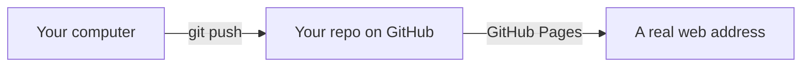

# A09: Build a Game: Get Your Tools

You can talk to an AI assistant now ([A02](a02.html)) and you know not to trust it blindly ([A01](a01.html)). Time to build one real thing with it: a small online game other people can actually play. Today is only setup: one new account and an empty folder, nothing else.
{: .lesson-intro }

## What You Are Going to Build

A game called **Kakkoi Online**. You walk around a small world as a monster. Other players walk around the same world. You can talk to them, and you can duel them: fire, water, earth, where water beats fire, fire beats earth, earth beats water.

The strange part, and the reason this project is worth your time: **there is no server.** Your browser talks straight to the other players' browsers. Nothing to pay for, nothing to run, nothing to keep alive. It costs zero forever.

Here is the version we build in these lessons: [online.kakkoi.dev](https://online.kakkoi.dev)

By the end of next lesson, **your own copy will have its own web address** that you can send to anyone.

## A Programmer Needs Two Things

One that helps you write, and one that holds your work where others can see it.

| Thing | What it is for |
|---|---|
| An AI assistant (`agy`, from A02) | Writes code with you, explains code to you, fixes what it broke |
| A GitHub account | Keeps every version of your work, and puts it on the internet for free |

You have the first one already, from A02. Today you add the second.

## Your Assistant

You already have one: **`agy`**, the Antigravity CLI you installed in [A02](a02.html). It is free, you are logged in, and it is what these lessons use. Nothing new to install.

Check it still runs:

```
agy --version
```

One new habit for this project: **start it inside your project folder**, not in your home folder. An assistant that can see your files can read your code before it changes it, and that is the difference between help and guesswork.

> Using something else? Fine. Every prompt in this project is plain English and works with any assistant — Claude Code, Copilot, whatever you like. Where a lesson says "ask your assistant", use whichever one you have. The paid ones handle big changes across many files better; you do not need that to finish this game.

## Your GitHub Account

GitHub is where code lives. Think of it as a shared shelf: every version of your work is kept, nothing is lost, and anything you put on the shelf can be published as a website for free.

1. Go to [github.com](https://github.com) and sign up. **You must be 13 or older** — that is GitHub's rule, in their terms of service.
2. Pick a username you would not mind an employer reading. It becomes part of your game's web address.
3. Install the GitHub command line tool, then log in:

```
sudo apt install gh          # WSL / Ubuntu, from A01
brew install gh              # macOS
```

```
gh auth login
```

Choose **GitHub.com**, then **SSH**, then **Login with a web browser**, and paste the code it gives you.

Tell git who you are, so your work has your name on it:

```
git config --global user.name "Your Name"
git config --global user.email "you@example.com"
```

> **Your repo will be public.** Free website hosting on GitHub only works for public code, so anyone can read it. That is good for showing people your game. It also means: use a nickname, not your full real name, and never put your address, school, or phone number in your code.

## Your Empty Repo

A **repo** (repository) is one project's folder, with its full history. Make one:

```
gh repo create kakkoi-online --public --clone
cd kakkoi-online
```

That is it. An empty folder that exists on the internet.

**Why empty?** You could copy our finished game in one command. Then you would own a game you cannot explain, which is worth nothing. You build it a piece at a time, and *your* repo holds *your* code.

Stuck later? Our version is public: [github.com/KakkoiSchool/kakkoi-online](https://github.com/KakkoiSchool/kakkoi-online). Every lesson leaves a snapshot you can read in your browser, so you can compare our file with yours. Look *after* you have tried, not before.


```mermaid
flowchart LR
    A[Your computer] -->|git push| B[Your repo on GitHub]
    B -->|GitHub Pages| C[A real web address]
```

## Ask Your Assistant

A first real prompt. Notice it asks for an explanation, not just an action:

```
I just created an empty git repo called kakkoi-online. Add a README.md that says
in two sentences what the project will be: a small top-down multiplayer browser
game with no server, where players duel with fire, water and earth. Then show me
the exact git commands to commit and push it, and explain what each one does.
```

**Check the output for:** does the README actually exist afterwards (`ls`)? Do the commands it gave you match what it said they do? If it invented a command that does not exist, you have just seen the thing [A01](a01.html) warned you about, on day one.

## This Week's Exercise

1. Check `agy --version` works, and start it inside your project folder.
2. Create your GitHub account and run `gh auth login`.
3. Create your empty `kakkoi-online` repo.
4. Use the prompt above to write and push a README.
5. Post your repo link in the channel. Next week it becomes a live website.

**Check it worked:** `gh repo view --web` opens your repo in a browser and your README is there.

<div class="takeaways">
<h2>Key Takeaways</h2>
<ul>
<li>A programmer needs something to write with and somewhere to keep the work</li>
<li>GitHub requires you to be 13 or older; that is the only account rule in this project</li>
<li>Free hosting means a public repo: use a nickname and keep personal details out of your code</li>
<li>Start from an empty repo. Copying a finished game gives you code you cannot explain</li>
<li>Our version is public if you get stuck; read it after you have tried, not before</li>
</ul>
</div>
