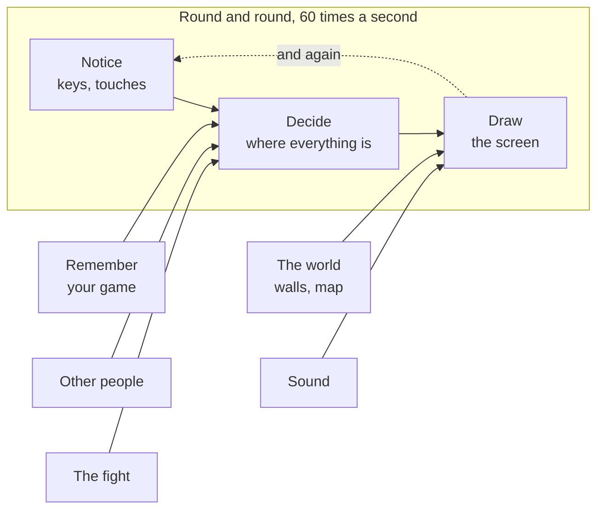

# A09: Get Your Tools

This is the start of the game. By the end of this step you will have a web page, on your own computer, that says hello to you — and when you change it and save, the page updates by itself.
{: .lesson-intro }

Before you build it, go play the finished game: [online.kakkoi.dev](https://online.kakkoi.dev). Walk around and see what it does. That is what you are about to make, one small box at a time. Curious how it is built? The finished code is on GitHub: [KakkoiSchool/kakkoi-online](https://github.com/KakkoiSchool/kakkoi-online).

**Needs:** [A01–A08](a08.html). **Gives you:** a working setup and your first page.

## The whole game, and today's piece

This picture will be at the top of every step. Every part of the game is one of these boxes. Today's box is the one you are working on, and the green ones are already built.


```mermaid
flowchart LR
    subgraph loop["Round and round, 60 times a second"]
        direction LR
        N["Notice<br/>keys, touches"] --> D["Decide<br/>where everything is"] --> R["Draw<br/>the screen"]
    end
    R -. "and again" .-> N

    S["Remember<br/>your game"] --> D
    O["Other people"] --> D
    F["The fight"] --> D
    W["The world<br/>walls, map"] --> R
    A["Sound"] --> R
```

Nothing is green yet. That is the point of the picture: you are about to build a fairly big thing, and it is made of small boxes. You will build them one at a time.

## Cutting it into blocks

Setting up is three things, and they each do one job:

1. **The assistant** writes the code
2. **The editor** shows you the code, so you can read and change it
3. **The browser** shows you the result

You need all three open at once. That is the whole idea, and it is how you will work from now on: ask, look, check.

Why not fewer? Because if something goes wrong, you need to know *which* of the three is wrong. Did the assistant write something odd? You look in the editor. Did the editor save it? You look at the browser. Three separate windows means three separate places to check.

## Block 1: The assistant

You installed this in [A02](a02.html). Open a terminal and check it still works:

```
agy
```

If that opens the assistant, you are done. If it does not, go back to [A02](a02.html).

> Any AI assistant works for this whole project. Every prompt in these steps is plain English. We use `agy` because it is free and you already have it.

## Block 2: The editor

Install **VS Code**, a free program for writing code: [code.visualstudio.com](https://code.visualstudio.com/).

Make a folder for your game. Call it `kakkoi-online`. Open it in VS Code: **File → Open Folder**.

## Block 3: The page in the browser

A web page needs to be *served* to the browser, not just opened. There is a reason for this and you will meet it properly in [A18](a18.html). For now, one extension does it for you.

In VS Code, click the **Extensions** icon in the left bar, search for **Live Server**, and install it.

Now make two files in your folder.

`index.html`:

```
<!doctype html>
<html lang="en">
<head>
  <meta charset="utf-8">
  <title>Kakkoi Online</title>
</head>
<body>
  <h1 id="greeting">…</h1>
  <script src="main.js"></script>
</body>
</html>
```

`main.js`:

```
const name = 'Kakkoi';

document.querySelector('#greeting').textContent = `Hello, ${name}!`;
```

Right-click `index.html` and choose **Open with Live Server**. Your browser opens and says **Hello, Kakkoi!**

Now change `Kakkoi` to your own name and save the file. **The browser updates on its own.** You did not refresh it. Live Server is watching the folder.

That loop — change, save, look — is what the rest of the project is made of.

## Why we did it this way

An editor and a browser side by side is the plainest possible setup. There is nothing to install with a terminal, nothing to compile, and nothing that can be out of date. Everything you write is a file the browser can read directly.

## What we could have done instead

| Instead of this | What it would cost |
|---|---|
| Just double-clicking `index.html` | It works for now, but it stops working the moment the code gets bigger — the browser blocks some things on a page it thinks came from nowhere. Better to start the right way |
| A build tool that turns your code into other code | Another program to install, another thing that breaks, and the code running in the browser is no longer the code you wrote. Not worth it for a game this size |
| A game engine like Godot or Unity | You would get a lot for free. You would also learn that engine instead of learning how any of it works — and you could not send your game as a link |

## Copy your folder before big changes

You have no undo yet. If the assistant rewrites five files and makes a mess, there is nothing to go back to.

So, one rule for now: **before you ask the assistant to make a big change, copy the whole project folder and put the date on the copy.** `kakkoi-online-aug-16`. It is clumsy, and it works.

In [A18](a18.html) you will learn the real answer to this problem. It will make much more sense once you have needed it.

## The prompt

```
I have index.html with an <h1 id="greeting"> and main.js that sets its text.
Change main.js so the greeting also shows the time right now, and updates
every second. Explain each new line to me like I have never seen it before.
```

**Check the output for:** does the time actually change every second, or does it just show the time the page loaded? Did it explain what it added, or only paste code? If you do not understand a line, ask about that line — that is a normal thing to do, not a sign you are behind.

## See it work


You should have: the assistant in a terminal, `main.js` open in VS Code, and your page in a browser. Change the name, save, and watch the browser change.

## Put it in the game

This *is* the game — the folder you just made is the one you will keep building in for every step. Nothing to move.

<div class="takeaways">
<h2>Key Takeaways</h2>
<ul>
<li>Three windows: the assistant writes, the editor shows, the browser proves it</li>
<li>Three separate windows means three separate places to look when something is wrong</li>
<li>Live Server serves your folder and reloads the page when you save</li>
<li>Copy the folder before a big change — you have no undo until A18</li>
<li>You do not have to understand every line, but you do have to ask about the ones you do not</li>
</ul>
</div>

## Your turn

Make the page say hello in two languages at once. Do it yourself, without the assistant. It is a small change and doing it by hand is how you find out which parts you actually understood.
