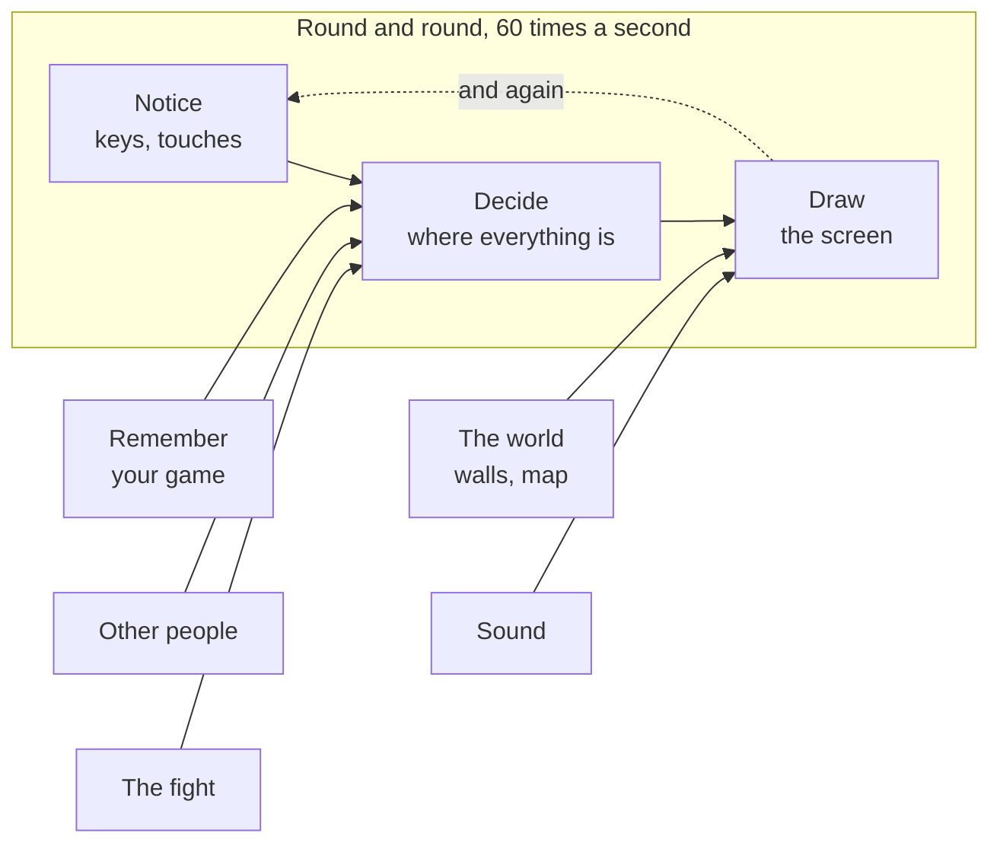

# A09: Pegue Suas Ferramentas

Este é o início do jogo. Ao final desta etapa, você terá uma página da web, em seu próprio computador, que lhe dará as boas-vindas — e quando você a alterar e salvar, a página se atualizará sozinha.
{: .lesson-intro }

**Necessário:** [A01–A08](a08.html). **Oferece:** uma configuração funcional e sua primeira página.

## O jogo completo e a parte de hoje

Esta imagem estará no topo de cada etapa. Cada parte do jogo é uma dessas caixas. A caixa de hoje é aquela em que você está trabalhando, e as verdes já estão construídas.



Nada está verde ainda. Esse é o objetivo da imagem: você está prestes a construir algo bastante grande, e é feito de pequenas caixas. Você as construirá uma de cada vez.

## Dividindo em blocos

A configuração consiste em três coisas, e cada uma faz um trabalho:

1. **O assistente** escreve o código
2. **O editor** mostra o código, para que você possa lê-lo e alterá-lo
3. **O navegador** mostra o resultado

Você precisa dos três abertos ao mesmo tempo. Essa é a ideia principal, e é assim que você trabalhará a partir de agora: pergunte, olhe, verifique.

Por que não menos? Porque se algo der errado, você precisa saber *qual* dos três está errado. O assistente escreveu algo estranho? Você verifica no editor. O editor salvou? Você verifica no navegador. Três janelas separadas significam três lugares separados para verificar.

## Bloco 1: O assistente

Você instalou isso em [A02](a02.html). Abra um terminal e verifique se ainda funciona:

```
agy
```

Se isso abrir o assistente, você terminou. Se não, volte para [A02](a02.html).

> Qualquer assistente de IA funciona para todo este projeto. Cada prompt nestas etapas está em inglês simples. Usamos `agy` porque é gratuito e você já o tem.

## Bloco 2: O editor

Instale o **VS Code**, um programa gratuito para escrever código: [code.visualstudio.com](https://code.visualstudio.com/).

Crie uma pasta para o seu jogo. Chame-a de `kakkoi-online`. Abra-a no VS Code: **Arquivo → Abrir Pasta**.

## Bloco 3: A página no navegador

Uma página da web precisa ser *servida* ao navegador, não apenas aberta. Há uma razão para isso e você a entenderá corretamente em [A18](a18.html). Por enquanto, uma extensão faz isso por você.

No VS Code, clique no ícone **Extensões** na barra esquerda, pesquise por **Live Server** e instale-o.

Agora crie dois arquivos em sua pasta.

`index.html`:

```
<!doctype html>
<html lang="en">
<head>
  <meta charset="utf-8">
  <title>Kakkoi Online</title>
</head>
<body>
  <h1 id="greeting">…</h1>
  <script src="main.js"></script>
</body>
</html>
```

`main.js`:

```
const name = 'Kakkoi';

document.querySelector('#greeting').textContent = `Hello, ${name}!`;
```

Clique com o botão direito em `index.html` e escolha **Abrir com Live Server**. Seu navegador abrirá e dirá **Hello, Kakkoi!**

Agora, mude `Kakkoi` para o seu próprio nome e salve o arquivo. **O navegador se atualiza sozinho.** Você não o recarregou. O Live Server está monitorando a pasta.

Esse ciclo — mudar, salvar, olhar — é do que o resto do projeto é feito.

## Por que fizemos desta forma

Um editor e um navegador lado a lado é a configuração mais simples possível. Não há nada para instalar com um terminal, nada para compilar e nada que possa estar desatualizado. Tudo o que você escreve é um arquivo que o navegador pode ler diretamente.

## O que poderíamos ter feito em vez disso

| Em vez disso | Qual seria o custo |
|---|---|
| Apenas clicar duas vezes em `index.html` | Funciona por enquanto, mas para de funcionar no momento em que o código fica maior — o navegador bloqueia algumas coisas em uma página que ele pensa que veio do nada. Melhor começar da maneira certa |
| Uma ferramenta de build que transforma seu código em outro código | Outro programa para instalar, outra coisa que quebra, e o código rodando no navegador não é mais o código que você escreveu. Não vale a pena para um jogo deste tamanho |
| Um motor de jogo como Godot ou Unity | Você ganharia muito de graça. Você também aprenderia aquele motor em vez de aprender como tudo funciona — e você não poderia enviar seu jogo como um link |

## Copie sua pasta antes de grandes mudanças

Você ainda não tem desfazer. Se o assistente reescrever cinco arquivos e fizer uma bagunça, não há como voltar atrás.

Então, uma regra por enquanto: **antes de pedir ao assistente para fazer uma grande mudança, copie toda a pasta do projeto e coloque a data na cópia.** `kakkoi-online-aug-16`. É desajeitado, e funciona.

Em [A18](a18.html) você aprenderá a verdadeira solução para este problema. Fará muito mais sentido depois que você precisar dela.

## O prompt

```
I have index.html with an <h1 id="greeting"> and main.js that sets its text.
Change main.js so the greeting also shows the time right now, and updates
every second. Explain each new line to me like I have never seen it before.
```

**Verifique a saída para:** a hora realmente muda a cada segundo, ou apenas mostra a hora em que a página foi carregada? Ele explicou o que adicionou, ou apenas colou o código? Se você não entender uma linha, pergunte sobre essa linha — isso é algo normal a fazer, não um sinal de que você está atrasado.

## Veja funcionar


Você deve ter: o assistente em um terminal, `main.js` aberto no VS Code e sua página em um navegador. Mude o nome, salve e observe o navegador mudar.

## Coloque no jogo

Este *é* o jogo — a pasta que você acabou de criar é aquela em que você continuará construindo a cada etapa. Nada para mover.

<div class="takeaways">
<h2>Principais Pontos</h2>
<ul>
<li>Três janelas: o assistente escreve, o editor mostra, o navegador comprova</li>
<li>Três janelas separadas significam três lugares separados para verificar quando algo está errado</li>
<li>O Live Server serve sua pasta e recarrega a página quando você salva</li>
<li>Copie a pasta antes de uma grande mudança — você não tem desfazer até A18</li>
<li>Você não precisa entender cada linha, mas precisa perguntar sobre aquelas que não entende</li>
</ul>
</div>

## Sua vez

Faça a página dizer olá em dois idiomas ao mesmo tempo. Faça você mesmo, sem o assistente. É uma pequena mudança e fazê-la à mão é como você descobre quais partes realmente entendeu.
