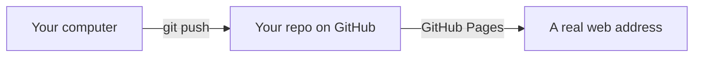

# A09: Construa um Jogo: Prepare Suas Ferramentas

Você já pode conversar com um assistente de IA ([A02](a02.html)) e sabe que não deve confiar cegamente nele ([A01](a01.html)). É hora de construir algo real com ele: um pequeno jogo online que outras pessoas podem realmente jogar. Hoje é apenas a configuração: uma nova conta e uma pasta vazia, nada mais.
{: .lesson-intro }

## O Que Você Vai Construir

Um jogo chamado **Kakkoi Online**. Você anda por um pequeno mundo como um monstro. Outros jogadores andam pelo mesmo mundo. Você pode conversar com eles e duelar com eles: fogo, água, terra, onde água vence fogo, fogo vence terra, terra vence água.

A parte estranha, e a razão pela qual este projeto vale o seu tempo: **não há servidor.** Seu navegador se comunica diretamente com os navegadores de outros jogadores. Nada para pagar, nada para executar, nada para manter ativo. Custa zero para sempre.

Aqui está a versão que construímos nestas lições: [online.kakkoi.dev](https://online.kakkoi.dev)

Ao final da próxima lição, **sua própria cópia terá seu próprio endereço web** que você poderá enviar a qualquer pessoa.

## Um Programador Precisa de Duas Coisas

Um que te ajude a escrever, e outro que guarde seu trabalho onde outros possam vê-lo.

| Coisa | Para que serve |
|---|---|
| Um assistente de IA (`agy`, do A02) | Escreve código com você, explica código para você, conserta o que quebrou |
| Uma conta GitHub | Mantém todas as versões do seu trabalho e o coloca na internet gratuitamente |

Você já tem o primeiro, do A02. Hoje você adiciona o segundo.

## Seu Assistente

Você já tem um: **`agy`**, a CLI Antigravity que você instalou em [A02](a02.html). É gratuito, você está logado, e é o que estas lições usam. Nada de novo para instalar.

Verifique se ainda funciona:

```
agy --version
```

Um novo hábito para este projeto: **inicie-o dentro da pasta do seu projeto**, não na sua pasta pessoal. Um assistente que pode ver seus arquivos pode ler seu código antes de alterá-lo, e essa é a diferença entre ajuda e adivinhação.

> Usando outra coisa? Tudo bem. Cada prompt neste projeto está em inglês simples e funciona com qualquer assistente — Claude Code, Copilot, o que você preferir. Onde uma lição diz "pergunte ao seu assistente", use o que você tiver. Os pagos lidam melhor com grandes mudanças em muitos arquivos; você não precisa disso para terminar este jogo.

## Sua Conta GitHub

GitHub é onde o código vive. Pense nisso como uma estante compartilhada: cada versão do seu trabalho é mantida, nada é perdido, e qualquer coisa que você coloque na estante pode ser publicada como um site gratuitamente.

1. Vá para [github.com](https://github.com) e inscreva-se. **Você deve ter 13 anos ou mais** — essa é a regra do GitHub, em seus termos de serviço.
2. Escolha um nome de usuário que você não se importaria que um empregador lesse. Ele se tornará parte do endereço web do seu jogo.
3. Instale a ferramenta de linha de comando do GitHub e, em seguida, faça login:

```
sudo apt install gh          # WSL / Ubuntu, do A01
brew install gh              # macOS
```

```
gh auth login
```

Escolha **GitHub.com**, depois **SSH**, depois **Login with a web browser**, e cole o código que ele te der.

Diga ao git quem você é, para que seu trabalho tenha seu nome nele:

```
git config --global user.name "Your Name"
git config --global user.email "you@example.com"
```

> **Seu repositório será público.** A hospedagem gratuita de sites no GitHub só funciona para código público, então qualquer um pode lê-lo. Isso é bom para mostrar seu jogo às pessoas. Também significa: use um apelido, não seu nome real completo, e nunca coloque seu endereço, escola ou número de telefone em seu código.

## Seu Repositório Vazio

Um **repo** (repositório) é a pasta de um projeto, com seu histórico completo. Crie um:

```
gh repo create kakkoi-online --public --clone
cd kakkoi-online
```

É isso. Uma pasta vazia que existe na internet.

**Por que vazio?** Você poderia copiar nosso jogo finalizado em um comando. Então você seria dono de um jogo que não consegue explicar, o que não vale nada. Você o constrói pedaço por pedaço, e *seu* repositório contém *seu* código.

Travou depois? Nossa versão é pública: [github.com/KakkoiSchool/kakkoi-online](https://github.com/KakkoiSchool/kakkoi-online). Cada lição deixa um instantâneo que você pode ler no seu navegador, para que você possa comparar nosso arquivo com o seu. Olhe *depois* de ter tentado, não antes.



## Pergunte ao Seu Assistente

Um primeiro prompt real. Observe que ele pede uma explicação, não apenas uma ação:

```
I just created an empty git repo called kakkoi-online. Add a README.md that says
in two sentences what the project will be: a small top-down multiplayer browser
game with no server, where players duel with fire, water and earth. Then show me
the exact git commands to commit and push it, and explain what each one does.
```

**Verifique na saída se:** o README realmente existe depois (`ls`)? Os comandos que ele te deu correspondem ao que ele disse que fazem? Se ele inventou um comando que não existe, você acabou de ver a coisa sobre a qual [A01](a01.html) te avisou, no primeiro dia.

## Exercício desta Semana

1. Verifique se `agy --version` funciona e inicie-o dentro da pasta do seu projeto.
2. Crie sua conta GitHub e execute `gh auth login`.
3. Crie seu repositório `kakkoi-online` vazio.
4. Use o prompt acima para escrever e enviar um README.
5. Publique o link do seu repositório no canal. Na próxima semana ele se tornará um site ao vivo.

**Verifique se funcionou:** `gh repo view --web` abre seu repositório em um navegador e seu README estará lá.

<div class="takeaways">
<h2>Principais Pontos</h2>
<ul>
<li>Um programador precisa de algo para escrever e de um lugar para guardar o trabalho</li>
<li>O GitHub exige que você tenha 13 anos ou mais; essa é a única regra de conta neste projeto</li>
<li>Hospedagem gratuita significa um repositório público: use um apelido e mantenha detalhes pessoais fora do seu código</li>
<li>Comece com um repositório vazio. Copiar um jogo pronto lhe dá um código que você não consegue explicar</li>
<li>Nossa versão é pública se você ficar preso; leia-a depois de ter tentado, não antes</li>
</ul>
</div>
