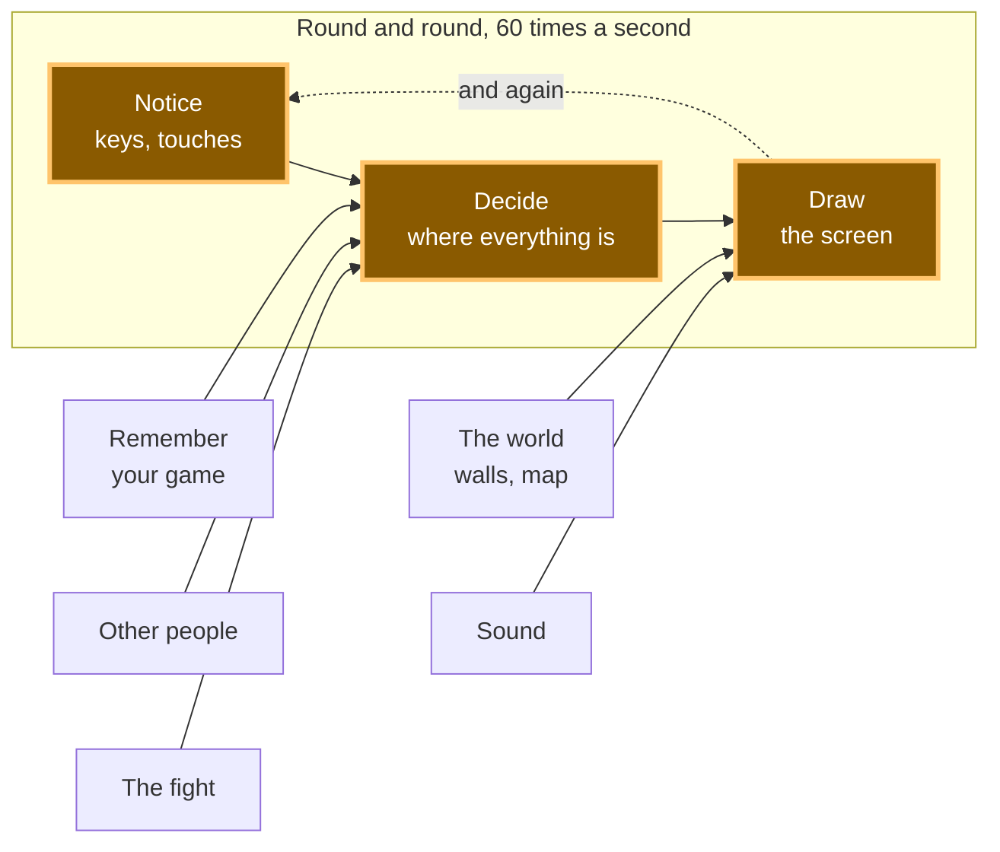

# A10: プレイヤーを作成する

このステップの終わりには、画面に四角形が表示され、それを操作できるようになります。これは小さなことですが、その構築方法は小さくありません。これが、今後すべてのものを構築する方法になります。
{: .lesson-intro }

**必要なもの:** [A09](a09.html)。 **得られるもの:** 矢印キーまたは指で動かせる四角形。

## ゲーム全体と本日の作業



これがゲーム全体です。今日は、中央の3つのボックスを構築します。これら3つがゲームの心臓部です。追加する他のすべての要素は、これら3つのいずれかにぶら下がることになります。

## ブロックに分割する

「動かせる四角形」と聞くと一つのことのように聞こえますが、実際には3つのことです。

1.  **感知する** — どのキーが押されているか、指がどこにあるか
2.  **決定する** — 四角形がどこにあるべきか
3.  **描画する** — それを画面に表示する

そして、この3つをもう一度繰り返します。そしてまた繰り返します。1秒間に約60回です。

**なぜ分割する手間をかけるのか？** 四角形が動かない場合、3つのうちどれが壊れているのかを知る必要があるからです。キーを感知していないのか？ 感知しているが数値が変わらないのか？ 数値は変わっているが古い場所に描画されているのか？ 3つのブロックに分けることで、それぞれを個別に確認できます。

もしそれが一つのコードの塊だったら、「*なぜ動かないんだ？*」という一つの疑問しかなく、原因を絞り込む方法がありません。これこそがこのコース全体のテーマであり、今回がそれを初めて使う機会です。

この部分は、初めての人にとってはほとんど全員が混乱します。しかし、すぐに慣れます。

## キャンバスを設定する

**キャンバス**は、コードで描画できるピクセルの長方形です。`index.html`にキャンバスを配置します。

```
<canvas id="world" width="640" height="480"></canvas>
<script src="main.js"></script>
```

## ブロック1: 感知する

2種類の入力、1つの仕事: 今何が起こっているかを覚える。

```
const held = new Set();
addEventListener('keydown', (e) => held.add(e.key));
addEventListener('keyup', (e) => held.delete(e.key));
```

**Set**は、各要素を一度だけ保持する入れ物です。左矢印を押すと`ArrowLeft`が入れ物に入り、離すと出てきます。いつでも、その入れ物は「何が押されているか？」の答えになります。

次に、指の場合も同様です。

```
let pointer = null;
canvas.addEventListener('pointerdown', (e) => { canvas.setPointerCapture(e.pointerId); pointer = at(e); });
canvas.addEventListener('pointermove', (e) => { if (pointer) pointer = at(e); });
canvas.addEventListener('pointerup', () => { pointer = null; });

function at(e) {
  const box = canvas.getBoundingClientRect();
  return { x: e.clientX - box.left, y: e.clientY - box.top };
}
```

**ポインター**イベントは、マウス、指、ペンを同じコードで扱えます。そのためこれらを使用します。これにより、コードを二度書かなくてもゲームが電話で動作します。

このブロックが*しない*ことに注目してください。何も動かしません。ただ何が起こっているかを記録するだけです。

## ブロック2: 決定する

```
const SIZE = 32;
const SPEED = 220;
const player = { x: 100, y: 100 };

function update(dt) {
  let dx = 0;
  let dy = 0;

  if (held.has('ArrowLeft')  || held.has('a')) dx -= 1;
  if (held.has('ArrowRight') || held.has('d')) dx += 1;
  if (held.has('ArrowUp')    || held.has('w')) dy -= 1;
  if (held.has('ArrowDown')  || held.has('s')) dy += 1;

  if (pointer) {
    const toX = pointer.x - (player.x + SIZE / 2);
    const toY = pointer.y - (player.y + SIZE / 2);
    const distance = Math.hypot(toX, toY);
    if (distance > 1) { dx = toX / distance; dy = toY / distance; }
  }

  player.x += dx * SPEED * dt;
  player.y += dy * SPEED * dt;

  player.x = Math.max(0, Math.min(canvas.width - SIZE, player.x));
  player.y = Math.max(0, Math.min(canvas.height - SIZE, player.y));
}
```

このブロックは入れ物を読み取り、2つの数値を変更します。画面には一切触れません。

**`dt`は前回のフレームにかかった時間（秒単位）です。** `SPEED`は1秒あたり220ピクセルなので、`dt`を掛けることで、このフレームでどれだけ移動すべきかがわかります。これは見た目以上に重要です。

> **すべての画面が同じ速度で動くわけではありません。** 通常の画面は1秒間に60回再描画しますが、ゲーミング画面では144回行うことができます。もし`player.x += 2`と書いたら、速い画面では四角形が2倍以上速く動いてしまい、同じコードでも別のゲームになってしまいます。`dt`を掛けることで、四角形はどちらの画面でも1秒あたり220ピクセル移動します。*熟練したプログラマーはこれをフレームレート独立と呼びます。これであなたもそのフレーズを知ったわけです。*

最後の2行は、四角形がキャンバス内に留まるようにします。

## ブロック3: 描画する

```
function draw() {
  ctx.fillStyle = '#1b1b22';
  ctx.fillRect(0, 0, canvas.width, canvas.height);
  ctx.fillStyle = '#7ee081';
  ctx.fillRect(player.x, player.y, SIZE, SIZE);
}
```

`ctx`は**コンテキスト**の略で、描画命令を与える対象です。`fillRect`は長方形を描画します。

最初の2行はキャンバス全体を塗りつぶします。これらがないと、キャンバスは以前に描画されたものすべてを保持し、四角形が画面に軌跡を残してしまいます。一度削除して試してみてください — 見る価値があります。

四角形の色は好きなものを選んでください。それがあなたのプレイヤーです。

## 繰り返し、繰り返し行う

```
let previous = performance.now();
function frame(now) {
  const dt = Math.min((now - previous) / 1000, 0.25);
  previous = now;
  update(dt);
  draw();
  requestAnimationFrame(frame);
}
requestAnimationFrame(frame);
```

`requestAnimationFrame`は、「次に画面を描画する直前に私をもう一度呼び出して」という意味です。つまり、感知し、決定し、描画し、また繰り返す — 1秒間に約60回、永遠に。

## なぜこの方法をとったのか

3つのブロックが分離されているのは、それらが常に一緒にあるわけではないからです。[A12](a12.html)では、別のプレイヤーが画面に表示されます。そのプレイヤーは位置を持っていますが、あなたのコンピュータにキーボードはありません。「決定する」は数値を読み取るだけで、キーボード自体に触れないため、別のプレイヤーの四角形もあなたの四角形を動かすのと同じコードで動かすことができます。

これが分割の報いであり、余分なことをしなくてもそれを得られます。

## 代わりにできたこと

| これを行う代わりに | その代償 |
|:---|:---|
| 3つすべてを1つのブロックとして書く | 短くなる。しかし、問題が発生した瞬間に、大きな疑問が一つあるだけで、原因を特定する方法がなく、他のプレイヤーを追加することがほとんど不可能になる。 |
| キーハンドラー内で四角形を動かす | キーを押すたびに一方向にしか動かせないので、斜め移動ができない。また、移動速度はOSのキーリピートに依存し、それは制御できない。 |
| タッチとマウスを別々のコードで処理する | 同じ仕事をするコードが二重になり、1回のタップが2回カウントされるという典型的なバグが発生する。ポインターイベントは、マウス、指、ペンに対応する一つのAPIである。 |
| キャンバスの代わりにHTML要素を使用する | 数個の四角形であれば問題なく、スタイリングも自由。しかし、ゲームは毎フレーム何百ものものを描画し、ブラウザに1秒間に何百回もページをレイアウトさせるのは、その仕事には向いていない。 |

## プロンプト

```
I have a canvas game with three parts in main.js: a Set of held keys, an
update(dt) that changes the player's x and y, and a draw() that paints the
canvas. Add a second square that moves on its own, bouncing off the edges.
Keep my three parts separate — put the new movement in update() and the new
painting in draw(). Explain which lines you put where, and why.
```

**出力の確認点:** 3つのブロックを分離したか、または描画コードを`update`内に配置したか？ 跳ねる四角形は`dt`を使用しているか、それとも毎フレーム固定量だけ移動しているか？ アシスタントは、2つ目の要素を追加する際に`dt`を忘れがちですが、彼らの架空の画面上ではページが問題なく見えるためです。

## 動作を確認する


Live Serverでページを開き、以下を確認してください。

1.  矢印キーを押し続ける。四角形が段階的ではなく滑らかに動く。
2.  2つの矢印キーを同時に押し続ける。斜めに動く。
3.  キャンバス上でプレス＆ドラッグする。四角形が指についてくる。
4.  それを隅に押し込む。画面外に出ずに停止する。

これらのいずれかが失敗した場合、どこを見るべきかがわかります。全く動かない？ ブロック1か2。動くが軌跡が残る？ ブロック3。

## これを行った際に何がうまくいかなかったか

あなたが作ったばかりの四角形を構築する際の実践的な2つの間違い。

**テストがそれ自体を壊した。** ページがリッスンしていることを確認するために、最初にキャンバスをクリックしてから右矢印を押すチェックを作成しました。四角形は斜めに動きました。私たちはしばらく矢印キーのコードを見ていましたが、それは問題ありませんでした。**クリックがバグでした。** クリックはポインターダウンであるため、テストが始まる前に、テスト自体が四角形にマウスに向かって移動するように指示していたのです。四角形の上下位置が変わったこと、そして右矢印ではそれができないことから、私たちはそれに気づきました。*教訓：何かが奇妙な動作をする場合は、テストをしているものが問題の一部になっていないか確認する。*

**機能していたものが壊れているように見えた。** コンピュータにキャンバスをドラッグするように指示したところ、四角形が7ピクセル移動しました。指のコードが壊れているように見えました。しかし、そうではありませんでした。ドラッグは数ミリ秒で完了し、四角形は1秒全体で220ピクセルしか移動しないため、7ピクセルはまさに正しい数値でした。*教訓：「ほとんど動かなかった」と「壊れている」は異なる主張であり、それは以前の`dt`のアイデアを別の側面から見たものです。*

## ゲームに組み込む

これがこれまでのあなたのゲームです — [A09](a09.html)のフォルダにある、1つのファイル、3つのブロックです。ここからすべての要素がこれら3つに追加されます。

<div class="takeaways">
<h2>重要なポイント</h2>
<ul>
<li>一つのことのように聞こえる機能は、通常、感知、決定、描画の3つからなる</li>
<li>分割することで、壊れたときにどこを見るべきかがわかる</li>
<li>「感知する」は起こっていることを記録するだけで、それに基づいて行動しない</li>
<li>移動量に経過時間を掛けること。そうしないと、別の画面ではゲームが異なる速度で動作する</li>
<li>ポインターイベントは、マウス、指、ペンを一度に提供するため、ゲームが電話で動作する</li>
</ul>
</div>

## あなたの番です

上矢印と左矢印を同時に押し、注意深く観察してください。四角形は斜めに動きますが、直線的に動くよりも斜めに動く方が*速く*なります。コードを見て、その理由を解明してください。そして、それを修正してください。

これは実際のバグであり、上記のコードに意図的に含まれています。ほとんどすべての最初のゲームにこのバグがあります。
