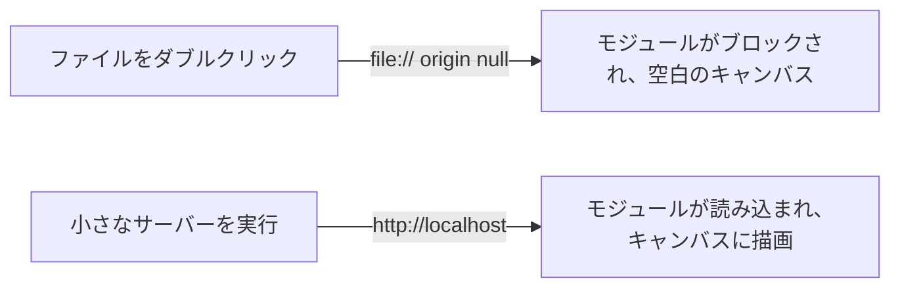

# A10: ゲームを作る：インターネットに公開する

空のリポジトリを持っていますね（[A09](a09.html)）。今日は、それが自分のアドレスを持つ実際のウェブページになり、友達に送ることもできるようになります。まだほとんどゲームはありませんが、それは意図的なものです。今、公開を済ませておくことで、この後のすべてのレッスンがプッシュした瞬間に公開されるようになります。
{: .lesson-intro }

## キャンバス

キャンバスとは、コードで絵を描くことができるピクセルでできた長方形のことです。私たちのゲームの世界のすべてがそこに描かれます。

`index.html` を作成します。

```
<!doctype html>
<html lang="en">
<head>
  <meta charset="utf-8">
  <title>Kakkoi Online</title>
</head>
<body>
  <canvas id="world" width="640" height="480"></canvas>
  <script type="module" src="./main.js"></script>
</body>
</html>
```

そして `main.js`：

```
const canvas = document.querySelector('#world');
const ctx = canvas.getContext('2d');

ctx.fillStyle = '#1b1b22';
ctx.fillRect(0, 0, canvas.width, canvas.height);

ctx.fillStyle = '#e8e8ef';
ctx.font = '20px monospace';
ctx.fillText('Kakkoi Online', 20, 40);
```

`ctx` は **context（コンテキスト）** の略で、描画命令を与える対象です。`fillRect` は長方形を描画し、`fillText` は文字を描画します。今のところ、これが描画ツールキットのすべてです。

## さて、一般的な方法で開いてみましょう

`index.html` をダブルクリックします。ブラウザが開きますが、キャンバスは**空白**です。

開発者コンソールを開きます（**F12**を押し、Consoleタブ）。次のようなエラーが表示されます。

```
Access to script at 'file:///.../main.js' from origin 'null'
has been blocked by CORS policy
```

何も壊れていません。あなたはキャリア全体にわたって付きまとうことになるルールに出会っただけです。

## 自分のコンピューター上でもページにサーバーが必要な理由

ファイルをダブルクリックすると、ブラウザは **`file://`** から、つまり直接ディスクからファイルを読み込みます。ウェブサイトは関与していないため、ブラウザはどのウェブサイトにページが属しているかを判断できません。その場合の名称は **origin `null`** です。アドレスもIDもありません。

ブラウザは、オリジンがないページにJavaScriptモジュールを読み込むことを拒否します。もし許可していたら、ダウンロードしたファイルがあなたのコンピューター上の他のファイルを密かに読み取ることができ、責任を負うべきウェブサイトも存在しないことになります。

同じフォルダを **`http://`** で提供すると、ページには `localhost` というオリジンが与えられ、ルールが満たされます。



このプロジェクトの後半で、さらに2つのものが実際のオリジンを必要としますので、これは覚えておく価値があります。ブラウザでの**データの保存**と、決闘を公平にするために使用する**スクランブル関数**です（[A25](a25.html)）。

## サーバーを実行する

ファイルを提供し、後にはTypeScriptを理解するツールである **Bun** をインストールします。

```
curl -fsSL https://bun.com/install | bash
```

ターミナルを閉じて再度開き、プロジェクトフォルダ内で次を実行します。

```
bun ./index.html
```

`http://localhost:3000` のようなアドレスが表示されます。開いてみてください。**今、キャンバスに描画されます。** 同じファイルですが、違う入り口です。

作業中はそのまま実行し続けてください。`main.js` を編集して保存し、リフレッシュすると、変更が反映されます。

## 公開する

コミットしてプッシュします。

```
git add .
git commit -m "A canvas that draws"
git push
```

次に無料ホスティングを有効にします。リポジトリページで、**Settings → Pages** に進み、*Build and deployment* の下で、**Source: Deploy from a branch**、ブランチ **main**、フォルダ **/ (root)** を設定します。保存します。

1分ほど待ってから、次を開きます。

```
https://YOUR-USERNAME.github.io/kakkoi-online/
```

それがあなたのゲームです。インターネット上に、あなた自身のアドレスで、無料で、永遠に公開されます。誰かに送ってみましょう。

> 私たちのバージョンは `github.io` アドレスではなく、[online.kakkoi.dev](https://online.kakkoi.dev) にあります。これはカスタムドメインで、ドメイン名とDNS設定が必要です。これは別のトピックであり、あなたが知る必要はありません。`github.io` アドレスでもまったく同じように機能します。

## アシスタントに質問する

```
My repo has index.html with a <canvas id="world"> and main.js loaded as a module.
Change main.js to also draw a red circle in the middle of the canvas, whatever
the canvas size is. Explain what each new line does, and tell me which numbers
would change if the canvas were a different size.
```

**出力で確認してください:** `index.html` でキャンバスのサイズを変更したとき、円は本当に中央にありますか？ `canvas.width / 2` を使いましたか、それとも `320` をハードコードしましたか？ ハードコードされた数値は、アシスタントがよくやってしまうことの最も一般的なもので、ページは正しく見えていても、何かが変更されるまではそうではありません。

## これをやった時に何が問題だったか

あなたがプレイできるバージョンを構築する際に犯した、認識しておくべき2つの本当の間違いです。

*   **設定ファイルのように見えたファイル。** リポジトリ内にサイトのアドレスを設定するはずのファイルがありました。しかし、それはまったく機能しませんでした。そのファイルは、私たちが使用した公開方法とは異なる方法でしか動作しません。GitHub側では、アドレスがずっと空でした。**教訓：何かが公開されるべきなのに公開されていない場合、途中に目を向けるのではなく、それぞれの端を別々に確認する** — ページは公開されているか？アドレスはそれを指しているか？

*   **一度も実行されなかった公開ロボット。** 後に自動公開を設定しましたが、私たちのコードが `main` ブランチにあったのに、`master` というブランチを監視していました。エラーも警告もなく、ただ何も起こりませんでした。**教訓：一度も実行されないロボットは、まるで動作しているロボットのように見えます。** 実行の様子を見に行きなさい。推測してはいけません。

## 今週の演習

1.  `index.html` と `main.js` を作成し、`file://` からの空白のキャンバスとコンソールエラーを確認します。
2.  Bun をインストールし、`bun ./index.html` を実行して、同じページが `localhost` で動作することを確認します。
3.  プッシュし、GitHub Pages を有効にし、ライブアドレスを開きます。
4.  上記のプロンプトを使用して円を追加し、中央がハードコードされていないか確認します。
5.  チャネルにライブリンクを投稿します。

**動作確認:** ライブアドレスが、電話や他の人のコンピューターで、あなたのプロジェクトフォルダが閉じられた状態で開くこと。

<div class="takeaways">
<h2>主なポイント</h2>
<ul>
<li>キャンバスはピクセルの長方形であり、`ctx` が描画命令を受け取ります</li>
<li>ファイルを直接開くとページにオリジンがないため、モジュールがブロックされます — 代わりに HTTP 経由で提供します</li>
<li>`bun ./index.html` は作業中にフォルダを提供します</li>
<li>GitHub Pages はあなたのリポジトリをあなた自身のアドレスで無料で公開します</li>
<li>早めに公開することで、後のすべてのレッスンがプッシュした瞬間に公開されます</li>
</ul>
</div>
