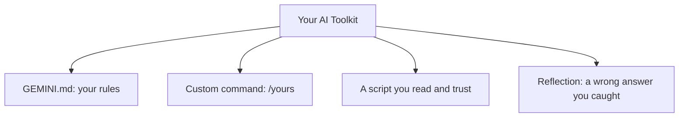

# A10: Capstone: Your AI Toolkit

You have learned to install the assistant, ask it well, feed it context, give it memory, save commands, and script with it, all under one rule: use it heavily, trust it never. The capstone is not an app. It is your own tuned toolkit plus proof that you have the judgment to use it safely. Think of a chef's knife roll: not the fanciest kitchen, your own set, sharpened the way you work.
{: .lesson-intro }

## What You Build

Four pieces, each from a lesson you have already done:

- **A `GEMINI.md`** with your standing rules (A07). It should make the AI answer the way *you* want by default.
- **One custom command** you genuinely use (A08). Not a demo, something that saves you real time.
- **One script** the AI helped you write (A09), that does something useful and that you have read and understood. Run by hand is fine.
- **A written reflection** (A01): one real time you caught the AI being *confidently wrong*, what it claimed, and how you caught it. This is the most important piece.

## How You Present It

Show your toolkit and walk through each piece: what it does, why you made it, how you use it. Then tell the story of the error you caught, that story is the point. Anyone can run a tool. You are proving you can run it *and* stay in charge of it.

## Where to Go Next

You now have the foundation. Natural next steps, on your own:

- Grow your command library as you spot repeated prompts.
- Learn a little more terminal so scripts feel easy.
- Read your AI provider's data and privacy terms once, properly.
- Revisit [R20: Never Trust an AI](r20.html) in a few months. It reads differently once you have real hours with these tools.

## This Week's Exercise (the capstone)

1. Finalize your `GEMINI.md`, one custom command, and one script. Make sure each works.
2. Write your reflection: the wrong AI answer, and how you caught it. A few honest sentences.
3. Present your toolkit to the group. Be ready to answer: "how would someone misuse this, and how do you avoid that?"

<h2>Key Takeaways</h2>
<ul>
<li>The deliverable is a personal toolkit: a GEMINI.md, a custom command, and a script you understand</li>
<li>The most important piece is proof you can catch the AI being wrong</li>
<li>Use it heavily, trust it never, that mindset is the real skill you leave with</li>
<li>Keep building: grow your commands, learn more terminal, read the privacy terms</li>
</ul>

