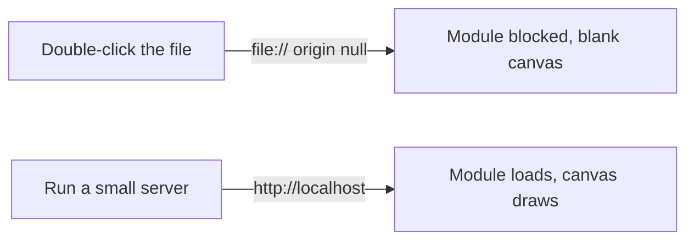

# A10: Build a Game: Put It on the Internet

You have an empty repo ([A09](a09.html)). Today it becomes a real web page with your own address, one you can send to a friend. There is almost no game in it yet, and that is on purpose: getting the publishing out of the way now means every lesson after this one goes live the moment you push it.
{: .lesson-intro }

## The Canvas

A canvas is a rectangle of pixels you can draw on with code. Everything in our game world will be drawn there.

Create `index.html`:

```
<!doctype html>
<html lang="en">
<head>
  <meta charset="utf-8">
  <title>Kakkoi Online</title>
</head>
<body>
  <canvas id="world" width="640" height="480"></canvas>
  <script type="module" src="./main.js"></script>
</body>
</html>
```

And `main.js`:

```
const canvas = document.querySelector('#world');
const ctx = canvas.getContext('2d');

ctx.fillStyle = '#1b1b22';
ctx.fillRect(0, 0, canvas.width, canvas.height);

ctx.fillStyle = '#e8e8ef';
ctx.font = '20px monospace';
ctx.fillText('Kakkoi Online', 20, 40);
```

`ctx` is short for **context**: the thing you give drawing orders to. `fillRect` paints a rectangle, `fillText` paints words. That is the whole drawing toolkit for now.

## Now Try to Open It the Obvious Way

Double-click `index.html`. Your browser opens it, and the canvas is **blank**.

Open the developer console (**F12**, then the Console tab). There is an error, something like:

```
Access to script at 'file:///.../main.js' from origin 'null'
has been blocked by CORS policy
```

Nothing is broken. You have just met a rule that will follow you for your whole career.

## Why a Page Needs a Server, Even on Your Own Computer

When you double-click a file, the browser loads it from **`file://`** — straight off your disk. There is no website involved, so the browser cannot tell which website the page belongs to. Its name for that is **origin `null`**: no address, no identity.

Browsers refuse to load JavaScript modules into a page with no origin. If they allowed it, a file you downloaded could quietly read other files on your computer, and there would be no website to blame.

Serve the same folder over **`http://`** and the page has an origin — `localhost` — so the rule is satisfied.


```mermaid
flowchart LR
    A[Double-click the file] -->|file:// origin null| B[Module blocked, blank canvas]
    C[Run a small server] -->|http://localhost| D[Module loads, canvas draws]
```

Two more things need a real origin later in this project, so this is worth remembering: **saving data** in the browser, and the **scrambling function** we use to make duels fair ([A25](a25.html)).

## Run a Server

Install **Bun**, a tool that both serves your files and, later, understands TypeScript:

```
curl -fsSL https://bun.com/install | bash
```

Close and reopen the terminal, then, inside your project folder:

```
bun ./index.html
```

It prints an address like `http://localhost:3000`. Open it. **Now the canvas draws.** Same files, different door.

Leave it running while you work. Edit `main.js`, save, refresh: your change is there.

## Publish It

Commit and push:

```
git add .
git commit -m "A canvas that draws"
git push
```

Now switch on the free hosting. On your repo page: **Settings → Pages**, and under *Build and deployment* set **Source: Deploy from a branch**, branch **main**, folder **/ (root)**. Save.

Wait a minute, then open:

```
https://YOUR-USERNAME.github.io/kakkoi-online/
```

That is your game, on the internet, at your own address, for free, forever. Send it to someone.

> Our version lives at [online.kakkoi.dev](https://online.kakkoi.dev) instead of a `github.io` address. That is a custom domain, which needs a domain name and some DNS setup — a separate topic you do not need. A `github.io` address works exactly as well.

## Ask Your Assistant

```
My repo has index.html with a <canvas id="world"> and main.js loaded as a module.
Change main.js to also draw a red circle in the middle of the canvas, whatever
the canvas size is. Explain what each new line does, and tell me which numbers
would change if the canvas were a different size.
```

**Check the output for:** is the circle actually in the middle when you resize the canvas in `index.html`? Did it use `canvas.width / 2` or did it hardcode `320`? Hardcoded numbers are the most common thing an assistant gets away with, because the page still looks right — until something changes.

## What Went Wrong When We Did This

Two real mistakes from building the version you can play, both worth recognising:

**A file that looked like configuration.** We had a file in the repo that was supposed to set the site's address. It did nothing at all — that file only works for a different way of publishing than the one we used. The address was empty on GitHub's side the whole time. **Lesson: when something should be live and isn't, check each end separately** — is the page published? is the address pointing at it? — instead of staring at the middle.

**A publishing robot that never ran.** Later we set up automatic publishing, and it was watching a branch called `master` while our code was on `main`. No error, no warning, just nothing happening. **Lesson: a robot that never runs looks exactly like a robot that works.** Go and look at the run; do not assume.

## This Week's Exercise

1. Create `index.html` and `main.js`, and see the blank canvas from `file://` plus the console error.
2. Install Bun, run `bun ./index.html`, and see the same page work on `localhost`.
3. Push, turn on GitHub Pages, and open your live address.
4. Use the prompt above to add the circle, and check whether it hardcoded the middle.
5. Post your live link in the channel.

**Check it worked:** the live address opens on a phone, on someone else's computer, with your project folder closed.

<div class="takeaways">
<h2>Key Takeaways</h2>
<ul>
<li>A canvas is a rectangle of pixels; `ctx` takes your drawing orders</li>
<li>Opening a file directly gives the page no origin, so modules are blocked — serve it over http instead</li>
<li>`bun ./index.html` serves your folder while you work</li>
<li>GitHub Pages publishes your repo for free at your own address</li>
<li>Publishing early means every later lesson goes live the moment you push</li>
</ul>
</div>
