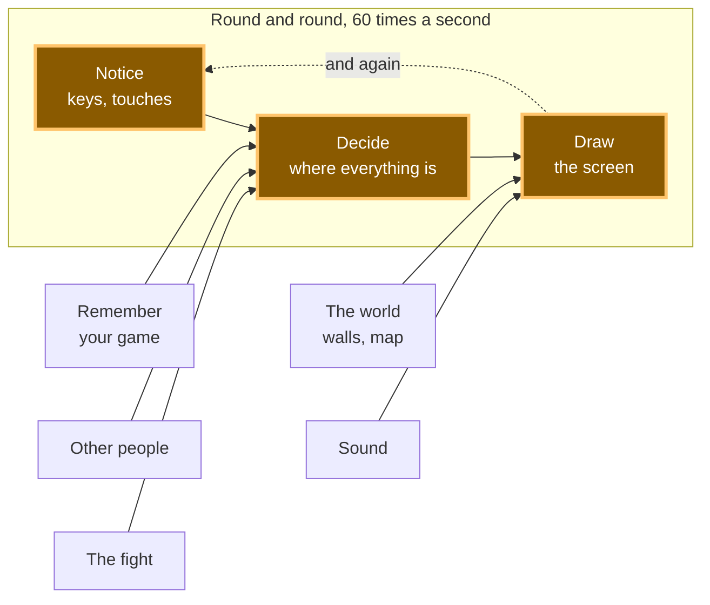

# A10: Create the Player

By the end of this step there is a square on the screen and you can drive it around. That is a small thing. The way we build it is not small — it is the way you will build everything else.
{: .lesson-intro }

**Needs:** [A09](a09.html). **Gives you:** a square you can move with the arrow keys or your finger.

## The whole game, and today's piece


```mermaid
flowchart LR
    subgraph loop["Round and round, 60 times a second"]
        direction LR
        N["Notice<br/>keys, touches"] --> D["Decide<br/>where everything is"] --> R["Draw<br/>the screen"]
    end
    R -. "and again" .-> N

    S["Remember<br/>your game"] --> D
    O["Other people"] --> D
    F["The fight"] --> D
    W["The world<br/>walls, map"] --> R
    A["Sound"] --> R

    classDef now fill:#8a5a00,stroke:#ffc46b,color:#fff,stroke-width:3px
    class N,D,R now
```

This is the whole game. Today you build the three boxes in the middle — and those three are the heart of it. Everything else you ever add will hang off one of them.

## Cutting it into blocks

"A square you can move" sounds like one thing. It is three:

1. **Notice** — which keys are being held down, and where a finger is
2. **Decide** — where the square should now be
3. **Draw** — put it on the screen

Then do all three again. And again. About sixty times a second.

**Why bother splitting it?** Because when the square does not move, you need to know which of the three is broken. Is it not noticing the key? Is it noticing but not changing the number? Is it changing the number but drawing in the old place? Three separate blocks means you can check each one on its own.

If it were one lump of code, you would have one question — *"why doesn't it work?"* — and no way to narrow it down. That is the difference this whole course is about, and this is the first time you use it.

This part is confusing for almost everyone the first time. It gets easy quickly.

## Set up the canvas

A **canvas** is a rectangle of pixels you can draw on with code. Put one in `index.html`:

```
<canvas id="world" width="640" height="480"></canvas>
<script src="main.js"></script>
```

## Block 1: Notice

Two kinds of input, one job: remember what is happening right now.

```
const held = new Set();
addEventListener('keydown', (e) => held.add(e.key));
addEventListener('keyup', (e) => held.delete(e.key));
```

A **Set** is a bag that holds each thing only once. Press the left arrow and `ArrowLeft` goes in the bag. Let go and it comes out. At any moment, the bag is the answer to "what is being held down?"

Now the same for a finger:

```
let pointer = null;
canvas.addEventListener('pointerdown', (e) => { canvas.setPointerCapture(e.pointerId); pointer = at(e); });
canvas.addEventListener('pointermove', (e) => { if (pointer) pointer = at(e); });
canvas.addEventListener('pointerup', () => { pointer = null; });

function at(e) {
  const box = canvas.getBoundingClientRect();
  return { x: e.clientX - box.left, y: e.clientY - box.top };
}
```

**Pointer** events cover a mouse, a finger and a pen with the same code. That is why we use them: your game works on a phone without you writing it twice.

Notice what this block does *not* do. It does not move anything. It only writes down what is happening.

## Block 2: Decide

```
const SIZE = 32;
const SPEED = 220;
const player = { x: 100, y: 100 };

function update(dt) {
  let dx = 0;
  let dy = 0;

  if (held.has('ArrowLeft')  || held.has('a')) dx -= 1;
  if (held.has('ArrowRight') || held.has('d')) dx += 1;
  if (held.has('ArrowUp')    || held.has('w')) dy -= 1;
  if (held.has('ArrowDown')  || held.has('s')) dy += 1;

  if (pointer) {
    const toX = pointer.x - (player.x + SIZE / 2);
    const toY = pointer.y - (player.y + SIZE / 2);
    const distance = Math.hypot(toX, toY);
    if (distance > 1) { dx = toX / distance; dy = toY / distance; }
  }

  player.x += dx * SPEED * dt;
  player.y += dy * SPEED * dt;

  player.x = Math.max(0, Math.min(canvas.width - SIZE, player.x));
  player.y = Math.max(0, Math.min(canvas.height - SIZE, player.y));
}
```

This block reads the bag and changes two numbers. It never touches the screen.

**`dt` is how long the last frame took, in seconds.** `SPEED` is 220 pixels *per second*, so multiplying by `dt` gives you how far to move this frame. This matters more than it looks:

> **Not every screen goes at the same speed.** A normal screen redraws 60 times a second. A gaming screen can do 144. If you wrote `player.x += 2`, your square would move more than twice as fast on the fast screen — the same code, a different game. Multiplying by `dt` means the square covers 220 pixels every second on both. *Grown-up programmers call this being frame-rate independent, so now you know that phrase too.*

The last two lines keep the square inside the canvas.

## Block 3: Draw

```
function draw() {
  ctx.fillStyle = '#1b1b22';
  ctx.fillRect(0, 0, canvas.width, canvas.height);
  ctx.fillStyle = '#7ee081';
  ctx.fillRect(player.x, player.y, SIZE, SIZE);
}
```

`ctx` is short for **context** — the thing you give drawing orders to. `fillRect` paints a rectangle.

The first two lines paint over the whole canvas. Without them, the canvas keeps everything drawn before, and your square smears a trail across the screen. Try deleting them once — it is worth seeing.

Pick your own colour for the square. It is your player.

## Doing it again, and again

```
let previous = performance.now();
function frame(now) {
  const dt = Math.min((now - previous) / 1000, 0.25);
  previous = now;
  update(dt);
  draw();
  requestAnimationFrame(frame);
}
requestAnimationFrame(frame);
```

`requestAnimationFrame` means "call me again just before you next paint the screen". So: notice, decide, draw, round again — about sixty times a second, forever.

## Why we did it this way

The three blocks are separate because they will not stay together. In [A12](a12.html) another player appears on your screen. That player has a position, but no keyboard on your computer. Because "decide" only reads numbers and does not reach for the keyboard itself, another player's square can be moved by the same code that moves yours.

That is the reward for the split, and you get it without doing anything extra.

## What we could have done instead

| Instead of this | What it would cost |
|---|---|
| Writing all three as one block | Shorter. But the moment it goes wrong you have one big question and no way to break it down — and other players become almost impossible to add |
| Moving the square inside the key handler | You can only move one direction per key press, so no diagonals. And how fast you move depends on how your operating system repeats keys, which you do not control |
| Handling touch and mouse with separate code | Two lots of code doing the same job, and a classic bug where one tap counts twice. Pointer events are one API for mouse, finger and pen |
| Using HTML elements instead of a canvas | Fine for a few squares, and you get styling for free. But a game draws hundreds of things every frame, and asking the browser to lay out a page hundreds of times a second is the wrong job for it |

## The prompt

```
I have a canvas game with three parts in main.js: a Set of held keys, an
update(dt) that changes the player's x and y, and a draw() that paints the
canvas. Add a second square that moves on its own, bouncing off the edges.
Keep my three parts separate — put the new movement in update() and the new
painting in draw(). Explain which lines you put where, and why.
```

**Check the output for:** did it keep the three blocks separate, or did it put drawing code inside `update`? Does the bouncing square use `dt`, or does it move a fixed amount each frame? Assistants very often forget `dt` for the second thing they add, because the page still looks fine on their imaginary screen.

## See it work


Open the page with Live Server and:

1. Hold an arrow key. The square moves smoothly, not in steps.
2. Hold two arrow keys. It moves diagonally.
3. Press and drag on the canvas. The square comes to your finger.
4. Push it into a corner. It stops instead of leaving the screen.

If any of those fail, you now know where to look. Not moving at all? Block 1 or 2. Moving but leaving a trail? Block 3.

## What went wrong when we did this

Two real mistakes from building the square you just built.

**Our test broke itself.** We wrote a check that clicked on the canvas first, to make sure the page was listening, and then pressed the right arrow. The square moved diagonally. We spent a while looking at the arrow key code — which was fine. **The click was the bug.** A click *is* a pointerdown, so our own test had told the square to walk to the mouse before the test began. We spotted it because the square's up-down position had changed, and the right arrow cannot do that. *Lesson: when something behaves oddly, check whether the thing doing the testing is part of the problem.*

**Something that worked looked broken.** We told the computer to drag across the canvas, and the square moved seven pixels. It looked like the finger code was broken. It was not. The drag finished in a few thousandths of a second, and the square only travels 220 pixels in a whole second — so seven pixels was exactly right. *Lesson: "it barely moved" and "it is broken" are different claims, and it is the same `dt` idea from earlier seen from the other side.*

## Put it in the game

This *is* your game so far — one file, three blocks, in the folder from [A09](a09.html). Everything from here is added to these three.

<div class="takeaways">
<h2>Key Takeaways</h2>
<ul>
<li>A feature that sounds like one thing is usually three: notice, decide, draw</li>
<li>Splitting it means that when it breaks you know where to look</li>
<li>"Notice" writes down what is happening; it does not act on it</li>
<li>Multiply movement by how much time passed, or your game runs at a different speed on a different screen</li>
<li>Pointer events give you mouse, finger and pen in one go — your game works on a phone</li>
</ul>
</div>

## Your turn

Hold the up arrow and the left arrow at the same time, and watch carefully. The square moves diagonally — but it moves *faster* diagonally than it does straight. Look at the code and work out why. Then fix it.

This is a real bug and it is in the code above on purpose. Nearly every first game has it.
