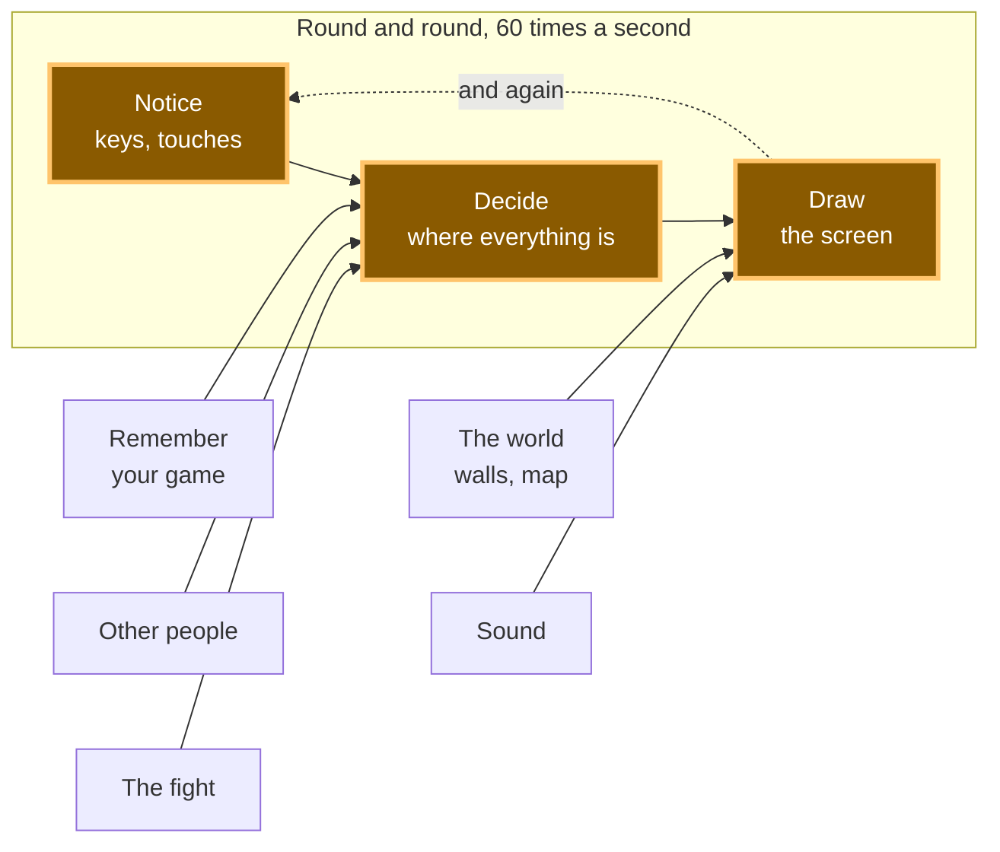

# A10: Criar o Jogador

Ao final deste passo, haverá um quadrado na tela e você poderá movê-lo. Isso é algo pequeno. A forma como o construímos não é pequena — é a forma como você construirá todo o resto.
{: .lesson-intro }

**Requisitos:** [A09](a09.html). **Oferece:** um quadrado que você pode mover com as teclas de seta ou com o dedo.

## O jogo completo, e a parte de hoje



Este é o jogo completo. Hoje você construirá as três caixas do meio — e essas três são o coração dele. Tudo o mais que você adicionar estará ligado a uma delas.

## Dividindo em blocos

"Um quadrado que você pode mover" parece uma coisa só. São três:

1. **Perceber** — quais teclas estão sendo pressionadas e onde o dedo está
2. **Decidir** — onde o quadrado deve estar agora
3. **Desenhar** — colocá-lo na tela

Em seguida, faça os três novamente. E novamente. Cerca de sessenta vezes por segundo.

**Por que se preocupar em dividir?** Porque quando o quadrado não se move, você precisa saber qual dos três está quebrado. Ele não está percebendo a tecla? Está percebendo, mas não mudando o número? Está mudando o número, mas desenhando no lugar antigo? Três blocos separados significam que você pode verificar cada um por si.

Se fosse um bloco de código único, você teria uma única pergunta — *"por que não funciona?"* — e nenhuma maneira de restringir a busca. Essa é a diferença sobre a qual este curso inteiro se trata, e esta é a primeira vez que você a usa.

Esta parte é confusa para quase todo mundo na primeira vez. Fica fácil rapidamente.

## Configurar o canvas

Um **canvas** é um retângulo de pixels no qual você pode desenhar com código. Coloque um em `index.html`:

```html
<canvas id="world" width="640" height="480"></canvas>
<script src="main.js"></script>
```

## Bloco 1: Perceber

Dois tipos de entrada, uma tarefa: lembrar o que está acontecendo agora.

```javascript
const held = new Set();
addEventListener('keydown', (e) => held.add(e.key));
addEventListener('keyup', (e) => held.delete(e.key));
```

Um **Set** é uma "sacola" que contém cada item apenas uma vez. Pressione a seta para a esquerda e `ArrowLeft` entra na sacola. Solte e ela sai. A qualquer momento, a sacola é a resposta para "o que está sendo pressionado?"

Agora o mesmo para um dedo:

```javascript
let pointer = null;
canvas.addEventListener('pointerdown', (e) => { canvas.setPointerCapture(e.pointerId); pointer = at(e); });
canvas.addEventListener('pointermove', (e) => { if (pointer) pointer = at(e); });
canvas.addEventListener('pointerup', () => { pointer = null; });

function at(e) {
  const box = canvas.getBoundingClientRect();
  return { x: e.clientX - box.left, y: e.clientY - box.top };
}
```

Eventos de **Ponteiro** cobrem mouse, dedo e caneta com o mesmo código. É por isso que os usamos: seu jogo funciona em um telefone sem que você precise escrevê-lo duas vezes.

Observe o que este bloco *não* faz. Ele não move nada. Ele apenas anota o que está acontecendo.

## Bloco 2: Decidir

```javascript
const SIZE = 32;
const SPEED = 220;
const player = { x: 100, y: 100 };

function update(dt) {
  let dx = 0;
  let dy = 0;

  if (held.has('ArrowLeft')  || held.has('a')) dx -= 1;
  if (held.has('ArrowRight') || held.has('d')) dx += 1;
  if (held.has('ArrowUp')    || held.has('w')) dy -= 1;
  if (held.has('ArrowDown')  || held.has('s')) dy += 1;

  if (pointer) {
    const toX = pointer.x - (player.x + SIZE / 2);
    const toY = pointer.y - (player.y + SIZE / 2);
    const distance = Math.hypot(toX, toY);
    if (distance > 1) { dx = toX / distance; dy = toY / distance; }
  }

  player.x += dx * SPEED * dt;
  player.y += dy * SPEED * dt;

  player.x = Math.max(0, Math.min(canvas.width - SIZE, player.x));
  player.y = Math.max(0, Math.min(canvas.height - SIZE, player.y));
}
```

Este bloco lê a sacola e altera dois números. Ele nunca toca a tela.

**`dt` é o tempo que o último frame levou, em segundos.** `SPEED` é 220 pixels *por segundo*, então multiplicar por `dt` te dá o quanto mover neste frame. Isso é mais importante do que parece:

> **Nem toda tela funciona na mesma velocidade.** Uma tela normal redesenha 60 vezes por segundo. Uma tela de jogo pode fazer 144. Se você escrevesse `player.x += 2`, seu quadrado se moveria mais de duas vezes mais rápido na tela mais rápida — o mesmo código, um jogo diferente. Multiplicar por `dt` significa que o quadrado percorre 220 pixels a cada segundo em ambas. *Programadores experientes chamam isso de ser independente da taxa de quadros, então agora você também conhece essa frase.*

As duas últimas linhas mantêm o quadrado dentro do canvas.

## Bloco 3: Desenhar

```javascript
function draw() {
  ctx.fillStyle = '#1b1b22';
  ctx.fillRect(0, 0, canvas.width, canvas.height);
  ctx.fillStyle = '#7ee081';
  ctx.fillRect(player.x, player.y, SIZE, SIZE);
}
```

`ctx` é a abreviação de **contexto** — a coisa para a qual você dá ordens de desenho. `fillRect` pinta um retângulo.

As duas primeiras linhas pintam sobre todo o canvas. Sem elas, o canvas mantém tudo o que foi desenhado antes, e seu quadrado deixa um rastro na tela. Tente excluí-las uma vez — vale a pena ver.

Escolha sua própria cor para o quadrado. Ele é seu jogador.

## Fazendo isso de novo, e de novo

```javascript
let previous = performance.now();
function frame(now) {
  const dt = Math.min((now - previous) / 1000, 0.25);
  previous = now;
  update(dt);
  draw();
  requestAnimationFrame(frame);
}
requestAnimationFrame(frame);
```

`requestAnimationFrame` significa "chame-me novamente pouco antes de você pintar a tela da próxima vez". Então: perceber, decidir, desenhar, e de novo — cerca de sessenta vezes por segundo, para sempre.

## Por que fizemos isso desta forma

Os três blocos são separados porque não ficarão juntos. Em [A12](a12.html) outro jogador aparecerá na sua tela. Esse jogador tem uma posição, mas não um teclado no seu computador. Como "decidir" apenas lê números e não acessa o teclado em si, o quadrado de outro jogador pode ser movido pelo mesmo código que move o seu.

Essa é a recompensa pela divisão, e você a obtém sem fazer nada extra.

## O que poderíamos ter feito em vez disso

| Em vez disto | Qual seria o custo |
|---|---|
| Escrever os três como um único bloco | Mais curto. Mas no momento em que algo der errado, você terá uma grande questão e nenhuma forma de dividi-la — e outros jogadores se tornariam quase impossíveis de adicionar |
| Mover o quadrado dentro do manipulador de teclas | Você só pode mover uma direção por pressionamento de tecla, então sem diagonais. E a velocidade com que você se move depende de como seu sistema operacional repete as teclas, o que você não controla |
| Lidar com toque e mouse com código separado | Dois conjuntos de código fazendo o mesmo trabalho, e um bug clássico onde um toque conta duas vezes. Eventos de ponteiro são uma API para mouse, dedo e caneta |
| Usar elementos HTML em vez de um canvas | Bom para alguns quadrados, e você obtém estilização gratuitamente. Mas um jogo desenha centenas de coisas a cada quadro, e pedir ao navegador para organizar uma página centenas de vezes por segundo é a tarefa errada para ele |

## A solicitação

```
I have a canvas game with three parts in main.js: a Set of held keys, an
update(dt) that changes the player's x and y, and a draw() that paints the
canvas. Add a second square that moves on its own, bouncing off the edges.
Keep my three parts separate — put the new movement in update() and the new
painting in draw(). Explain which lines you put where, and why.
```

**Verifique a saída para:** ele manteve os três blocos separados, ou colocou código de desenho dentro de `update`? O quadrado quicante usa `dt`, ou ele se move uma quantidade fixa a cada quadro? Os assistentes muitas vezes esquecem o `dt` para a segunda coisa que adicionam, porque a página ainda parece bem na tela imaginária deles.

## Veja funcionar


Abra a página com o Live Server e:

1. Mantenha uma tecla de seta pressionada. O quadrado se move suavemente, não em passos.
2. Mantenha duas teclas de seta pressionadas. Ele se move diagonalmente.
3. Pressione e arraste no canvas. O quadrado segue seu dedo.
4. Empurre-o para um canto. Ele para em vez de sair da tela.

Se algum deles falhar, você agora sabe onde procurar. Não se movendo de forma alguma? Bloco 1 ou 2. Movendo, mas deixando um rastro? Bloco 3.

## O que deu errado quando fizemos isso

Dois erros reais da construção do quadrado que você acabou de fazer.

**Nosso teste quebrou a si mesmo.** Escrevemos uma verificação que primeiro clicava no canvas, para garantir que a página estivesse ouvindo, e depois pressionava a seta para a direita. O quadrado se moveu diagonalmente. Gastamos um tempo procurando no código da tecla de seta — que estava bom. **O clique era o bug.** Um clique *é* um `pointerdown`, então nosso próprio teste havia dito ao quadrado para ir até o mouse antes do teste começar. Percebemos isso porque a posição vertical do quadrado havia mudado, e a seta para a direita não pode fazer isso. *Lição: quando algo se comporta de forma estranha, verifique se o que está fazendo o teste faz parte do problema.*

**Algo que funcionava parecia quebrado.** Dissemos ao computador para arrastar pelo canvas, e o quadrado se moveu sete pixels. Parecia que o código do dedo estava quebrado. Não estava. O arrasto terminou em alguns milésimos de segundo, e o quadrado só percorre 220 pixels em um segundo inteiro — então sete pixels estava exatamente certo. *Lição: "mal se moveu" e "está quebrado" são afirmações diferentes, e é a mesma ideia de `dt` de antes vista pelo outro lado.*

## Coloque no jogo

Este *é* o seu jogo até agora — um arquivo, três blocos, na pasta de [A09](a09.html). Tudo a partir daqui é adicionado a esses três.

<div class="takeaways">
<h2>Principais Conclusões</h2>
<ul>
<li>Uma funcionalidade que parece ser uma coisa só geralmente são três: perceber, decidir, desenhar</li>
<li>Dividir significa que, quando algo quebrar, você sabe onde procurar</li>
<li>"Perceber" anota o que está acontecendo; não age sobre isso</li>
<li>Multiplique o movimento pelo tempo que passou, ou seu jogo rodará em uma velocidade diferente em uma tela diferente</li>
<li>Eventos de ponteiro oferecem mouse, dedo e caneta de uma só vez — seu jogo funciona em um telefone</li>
</ul>
</div>

## Sua vez

Mantenha a seta para cima e a seta para a esquerda pressionadas ao mesmo tempo, e observe cuidadosamente. O quadrado se move diagonalmente — mas ele se move *mais rápido* na diagonal do que em linha reta. Olhe o código e descubra o porquê. Depois, corrija-o.

Este é um bug real e está no código acima de propósito. Quase todo primeiro jogo tem isso.
