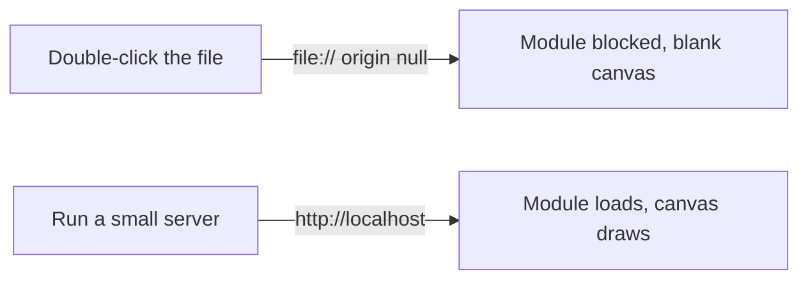

# A10: Construa um Jogo: Coloque-o na Internet

Você tem um repositório vazio ([A09](a09.html)). Hoje ele se torna uma página web real com seu próprio endereço, um que você pode enviar para um amigo. Quase não há jogo nele ainda, e isso é de propósito: resolver a publicação agora significa que cada lição depois desta estará online no momento em que você a enviar.
{: .lesson-intro }

## A Tela

Uma tela (canvas) é um retângulo de pixels no qual você pode desenhar com código. Tudo em nosso mundo de jogo será desenhado ali.

Crie `index.html`:

```
<!doctype html>
<html lang="en">
<head>
  <meta charset="utf-8">
  <title>Kakkoi Online</title>
</head>
<body>
  <canvas id="world" width="640" height="480"></canvas>
  <script type="module" src="./main.js"></script>
</body>
</html>
```

E `main.js`:

```
const canvas = document.querySelector('#world');
const ctx = canvas.getContext('2d');

ctx.fillStyle = '#1b1b22';
ctx.fillRect(0, 0, canvas.width, canvas.height);

ctx.fillStyle = '#e8e8ef';
ctx.font = '20px monospace';
ctx.fillText('Kakkoi Online', 20, 40);
```

`ctx` é a abreviação de **contexto**: a coisa a que você dá ordens de desenho. `fillRect` pinta um retângulo, `fillText` pinta palavras. Esse é todo o kit de ferramentas de desenho por enquanto.

## Agora Tente Abrir do Jeito Óbvio

Dê um duplo clique em `index.html`. Seu navegador o abre, e a tela (canvas) está **em branco**.

Abra o console do desenvolvedor (**F12**, depois a aba Console). Há um erro, algo como:

```
Access to script at 'file:///.../main.js' from origin 'null'
has been blocked by CORS policy
```

Nada está quebrado. Você acabou de conhecer uma regra que o acompanhará por toda a sua carreira.

## Por Que Uma Página Precisa de Um Servidor, Mesmo no Seu Próprio Computador

Quando você clica duas vezes em um arquivo, o navegador o carrega de **`file://`** — diretamente do seu disco. Não há nenhum site envolvido, então o navegador não consegue dizer a qual site a página pertence. O nome que ele dá para isso é **origem `null`**: sem endereço, sem identidade.

Os navegadores se recusam a carregar módulos JavaScript em uma página sem origem. Se permitissem, um arquivo que você baixou poderia ler silenciosamente outros arquivos em seu computador, e não haveria nenhum site para culpar.

Sirva a mesma pasta via **`http://`** e a página terá uma origem — `localhost` — então a regra é satisfeita.



Mais duas coisas precisarão de uma origem real mais adiante neste projeto, então vale a pena lembrar: **salvar dados** no navegador e a **função de embaralhamento** que usamos para tornar os duelos justos ([A25](a25.html)).

## Execute um Servidor

Instale **Bun**, uma ferramenta que tanto serve seus arquivos quanto, mais tarde, entende TypeScript:

```
curl -fsSL https://bun.com/install | bash
```

Feche e reabra o terminal, então, dentro da sua pasta de projeto:

```
bun ./index.html
```

Ele imprime um endereço como `http://localhost:3000`. Abra-o. **Agora a tela (canvas) desenha.** Mesmos arquivos, porta diferente.

Deixe-o rodando enquanto trabalha. Edite `main.js`, salve, atualize: sua alteração estará lá.

## Publique-o

Commit e push:

```
git add .
git commit -m "A canvas that draws"
git push
```

Agora ative a hospedagem gratuita. Na página do seu repositório: **Settings → Pages**, e em *Build and deployment* defina **Source: Deploy from a branch**, branch **main**, folder **/ (root)**. Salve.

Espere um minuto, então abra:

```
https://YOUR-USERNAME.github.io/kakkoi-online/
```

Esse é o seu jogo, na internet, no seu próprio endereço, de graça, para sempre. Envie-o para alguém.

> Nossa versão reside em [online.kakkoi.dev](https://online.kakkoi.dev) em vez de um endereço `github.io`. Isso é um domínio personalizado, que requer um nome de domínio e alguma configuração de DNS — um tópico separado que você não precisa. Um endereço `github.io` funciona exatamente tão bem.

## Pergunte ao Seu Assistente

```
My repo has index.html with a <canvas id="world"> and main.js loaded as a module.
Change main.js to also draw a red circle in the middle of the canvas, whatever
the canvas size is. Explain what each new line does, and tell me which numbers
would change if the canvas were a different size.
```

**Verifique a saída para:** o círculo está realmente no meio quando você redimensiona a tela (canvas) em `index.html`? Ele usou `canvas.width / 2` ou codificou `320`? Números codificados são a coisa mais comum com que um assistente se safa, porque a página ainda parece correta — até que algo mude.

## O Que Deu Errado Quando Fizemos Isso

Dois erros reais da construção da versão que você pode jogar, ambos dignos de reconhecimento:

**Um arquivo que parecia configuração.** Tínhamos um arquivo no repositório que deveria definir o endereço do site. Ele não fez absolutamente nada — esse arquivo só funciona para uma forma diferente de publicação da que usamos. O endereço estava vazio no lado do GitHub o tempo todo. **Lição: quando algo deveria estar online e não está, verifique cada ponta separadamente** — a página está publicada? o endereço está apontando para ela? — em vez de ficar olhando para o meio.

**Um robô de publicação que nunca rodou.** Mais tarde, configuramos a publicação automática, e ele estava monitorando uma branch chamada `master` enquanto nosso código estava na `main`. Nenhum erro, nenhum aviso, apenas nada acontecendo. **Lição: um robô que nunca roda parece exatamente com um robô que funciona.** Vá e veja a execução; não presuma.

## Exercício Desta Semana

1. Crie `index.html` e `main.js`, e veja a tela (canvas) em branco de `file://` mais o erro no console.
2. Instale o Bun, execute `bun ./index.html`, e veja a mesma página funcionando em `localhost`.
3. Faça push, ative o GitHub Pages e abra seu endereço ao vivo.
4. Use o prompt acima para adicionar o círculo e verifique se ele codificou o meio.
5. Publique seu link ao vivo no canal.

**Verifique se funcionou:** o endereço ao vivo abre em um telefone, no computador de outra pessoa, com a pasta do seu projeto fechada.

<div class="takeaways">
<h2>Principais Pontos</h2>
<ul>
<li>Uma tela (canvas) é um retângulo de pixels; `ctx` recebe suas ordens de desenho</li>
<li>Abrir um arquivo diretamente não dá origem à página, então os módulos são bloqueados — sirva-o via http em vez disso</li>
<li>`bun ./index.html` serve sua pasta enquanto você trabalha</li>
<li>GitHub Pages publica seu repositório gratuitamente em seu próprio endereço</li>
<li>Publicar cedo significa que cada lição posterior estará online no momento em que você fizer push</li>
</ul>
</div>
